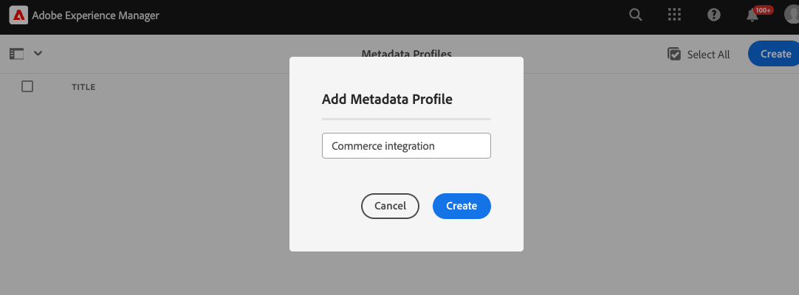

# Experience Manager Assetsの設定

Commerce環境の設定を更新し、AEM as a Cloud Service オーサリング環境でメタデータを設定することで、AEM Assets アセットを管理するAEM Assetsを設定します。

Adobeは、名前空間およびメタデータスキーマリソースをAEM as a Cloud Service環境設定に追加するAEM Assets プロジェクトテンプレートを提供します。 テンプレートは次の情報を追加します。

- Commerce関連のプロパティを識別するた `Commerce` の [ カスタム名前空間 ](https://github.com/ankumalh/assets-commerce/blob/main/ui.config/jcr_root/apps/commerce/config/org.apache.sling.jcr.repoinit.RepositoryInitializer~commerce-namespaces.cfg.json)。

- Adobe Commerce プロジェクトに関連付けられたCommerce アセットにタグ付けするた `Eligible for Commerce` のラベルが付いたカスタムメタデータタイプ `commerce:isCommerce`。

- カスタムメタデータタイプ `commerce:productmetadata` と、*[!UICONTROL Product Data]* スタムプロパティを追加するための対応する UI コンポーネント。 商品データには、Commerce アセットを商品 SKU に関連付けたり、アセットの画像 `role` と `position` 属性を指定したりするためのメタデータプロパティが含まれています。

  {width="600" zoomable="yes"}

- Commerce アセットにタグ付けするための `Does it exist in Adobe Commerce?` フィールドと `Product Data` フィールドを含む、Commerce タブを持つメタデータスキーマフォーム このフォームには、AEM Assets UI の `roles` および `order` （位置）フィールドを表示または非表示にするオプションも用意されています。

  {width="600" zoomable="yes"}

- 最初のアセットの同期をサポートするための [ タグ付けされた承認済みCommerce アセット ](https://github.com/ankumalh/assets-commerce/blob/main/ui.content/src/main/content/jcr_root/content/dam/wknd/en/activities/hiking/equipment_6.jpg/.content.xml) サンプル `equipment_6.jpg`。 AEM AssetsからAdobe Commerceに同期できるのは、承認済みのCommerce アセットのみです。

>[!NOTE]
>CommerceとAssetsのAEM プロジェクトテンプレートについて詳しくは、[Readme](https://github.com/ankumalh/assets-commerce) を参照してください。

このAEM プロジェクトを使用して環境設定を更新するには、次のリソースと権限が必要です。

- プログラムおよびデプロイメントマネージャーの役割を使用して [AEM Assets Cloud Manager プログラムおよび環境にアクセス ](https://experienceleague.adobe.com/en/docs/experience-manager-cloud-service/content/onboarding/journey/cloud-manager#access-sysadmin-bo) します。

- [ ローカル AEMローカル開発環境 ](https://experienceleague.adobe.com/en/docs/experience-manager-learn/cloud-service/local-development-environment-set-up/overview) およびAEM開発プロセスに精通していること。

- [AEM プロジェクト構造 ](https://experienceleague.adobe.com/ja/docs/experience-manager-cloud-service/content/implementing/developing/aem-project-content-package-structure) およびCloud Managerを使用してカスタムコンテンツパッケージをデプロイする方法を理解します。

## AEM Assets環境設定の更新とデプロイ

1. 必要に応じて、Cloud Managerから、AEM Assets プロジェクトの実稼動環境とステージング環境を作成します。

1. 必要に応じて、デプロイメントパイプラインを設定します。

1. GitHub で、[Commerce - Assets AEM プロジェクト ](https://github.com/ankumalh/assets-commerce) からボイラープレートコードをダウンロードします。

1. [ ローカル AEM開発環境 ](https://experienceleague.adobe.com/en/docs/experience-manager-learn/cloud-service/local-development-environment-set-up/overview) から、カスタムコードをAEM Assets環境設定に Maven パッケージとしてインストールするか、既存のプロジェクト設定に手動でコードをコピーします。

1. 変更をコミットし、ローカル開発ブランチをCloud Manager Git リポジトリにプッシュします。

1. Cloud Managerから [ コードをデプロイしてAEM環境を更新します ](https://experienceleague.adobe.com/en/docs/experience-manager-cloud-service/content/implementing/using-cloud-manager/deploy-code#deploying-code-with-cloud-manager)。

## メタデータプロファイルの設定

AEM Assets オーサリング環境で、メタデータプロファイルを作成して、Commerce アセットメタデータのデフォルト値を設定します。 次に、新しいプロファイルをに適用します。
これらのデフォルトを自動的に使用するには、AEM アセットフォルダーを参照してください。 この設定により、手動の手順が減ることでアセット処理が合理化されます。

1. Adobe Experience Manager ワークスペースから、Adobe Experience Manager アイコンをクリックして、AEM Assetsのオーサーコンテンツ管理ワークスペースに移動します。

   {width="600" zoomable="yes"}

1. ハンマーアイコンを選択して、管理者ツールを開きます。

   {width="600" zoomable="yes"}

1. 「**[!UICONTROL Metadata Profiles]**」をクリックして、プロファイル設定ページを開きます。

1. Commerce統合用のメタデータプロファイルを **[!UICONTROL Create]** 定します。

   {width="600" zoomable="yes"}

1. Commerce メタデータ用のタブを追加します。

   1. 左側で、「**[!UICONTROL Settings]**」をクリックします。

   1. タブ セクションの [**[!UICONTROL +]**] をクリックし、**[!UICONTROL Tab Name]**、`Commerce` を指定します。

1. `Does it exist in Commerce?` フィールドをフォームに追加し、デフォルト値を `yes` に設定します。

   {width="600" zoomable="yes"}

1. 更新を保存します。

1. Commerce アセットが保存されているフォルダーに `Commerce integration` メタデータプロファイルを適用します。

   1. [!UICONTROL  Metadata Profiles] ページで、「Commerce統合」プロファイルを選択します。

   1. アクションメニューから「**[!UICONTROL Apply Metadata Profiles to Folder(s)]**」を選択します。

   1. Commerce アセットを含むフォルダーを選択します。

      Commerce フォルダーが存在しない場合は作成します。

   1. 「**[!UICONTROL Apply]**」をクリックします。

>[!TIP]
>
>メタデータプロファイルを更新して _[!UICONTROL Review Status]_フィールドのデフォルト値を `Approved` に設定すると、AEM Assets環境にアップロードされたCommerce アセットを自動的に同期できます。 `Review Status` フィールドのプロパティタイプは `./jcr:content/metadata/dam:status` です。

## 次の手順

[Adobe Commerce用のAEM Assets統合のインストールと設定](aem-assets-configure-commerce.md)
