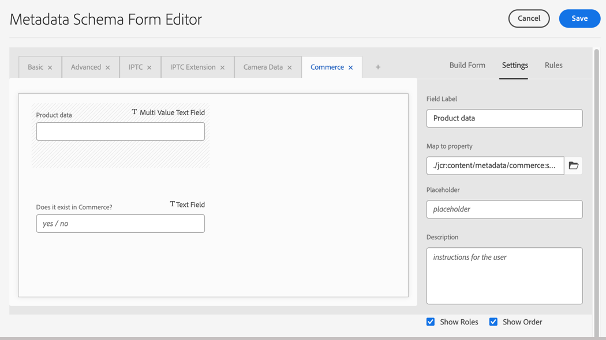
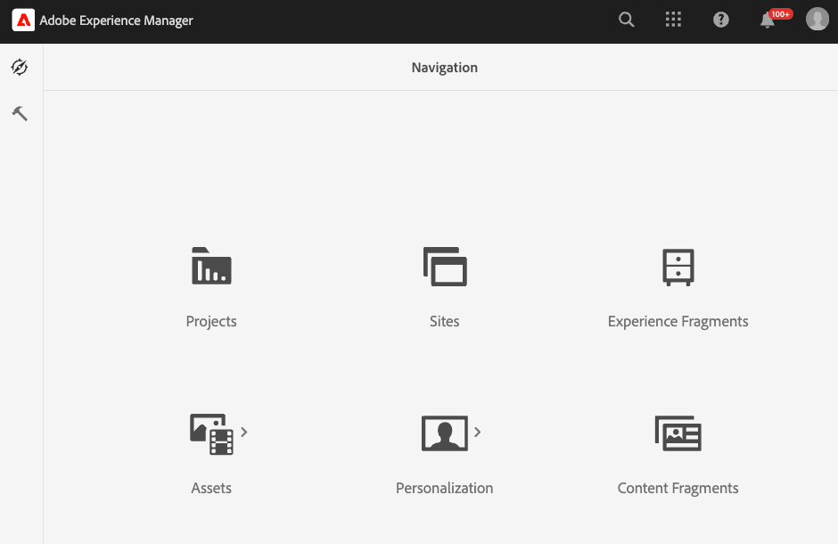
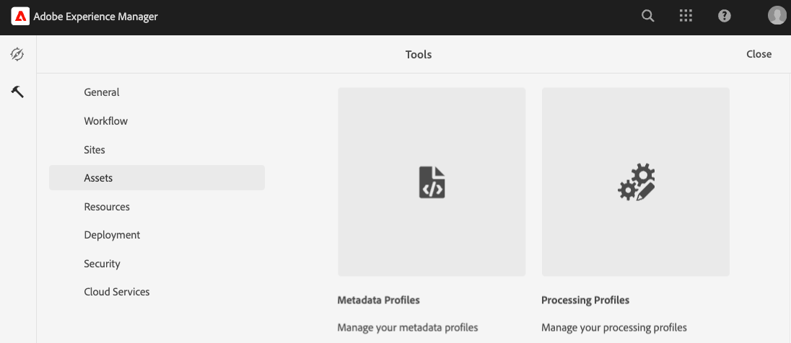

# AEM Assets パッケージのインストール

Adobeには、Commerce名前空間およびメタデータスキーマリソースをExperience Manager Assets as a Cloud Service環境設定に追加するためのプロジェクトテンプレート `commerce-assets`が用意されています。 このテンプレートをMaven パッケージとして環境にデプロイします。 次に、AEM Assets オーサリング環境でCommerce メタデータを設定して、設定を完了します。

このテンプレートは、次のリソースをAEM Assets オーサリング環境に追加します。

- Commerce関連のプロパティを識別するための[ カスタム名前空間](https://github.com/ankumalh/assets-commerce/blob/main/ui.config/jcr_root/apps/commerce/config/org.apache.sling.jcr.repoinit.RepositoryInitializer~commerce-namespaces.cfg.json)、`Commerce`。

- Adobe Commerce プロジェクトに関連付けられたCommerce アセットにタグ付けするためのラベル `Eligible for Commerce`を持つカスタムメタデータタイプ `commerce:isCommerce`。

- カスタムメタデータタイプ `commerce:productmetadata`と、対応するUI コンポーネントを使用して&#x200B;*[!UICONTROL Product Data]* プロパティを追加します。 商品データには、Commerce アセットを商品SKUに関連付け、アセットに画像`role`と`position`属性を指定するためのメタデータプロパティが含まれています。

  {width="600" zoomable="yes"}

- Commerce アセットのタグ付け用の`Eligible for Commerce?`および`Product Data` フィールドを含むCommerce タブを持つメタデータスキーマフォーム。 このフォームには、AEM Assets UIから`roles`および`order` （position）フィールドを表示または非表示にするオプションも用意されています。

  {width="600" zoomable="yes"}

- 最初のアセットの同期をサポートするために、[ サンプルにタグ付けして承認されたCommerce アセット ](https://github.com/ankumalh/assets-commerce/blob/main/ui.content/src/main/content/jcr_root/content/dam/wknd/en/activities/hiking/equipment_6.jpg/.content.xml) `equipment_6.jpg`が含まれています。 AEM AssetsからAdobe Commerceに同期できるのは、承認済みのCommerce アセットのみです。

>[!NOTE]
>`commerce-assets` AEM プロジェクト テンプレートについて詳しくは、[Readme](https://github.com/ankumalh/assets-commerce)を参照してください。

このAEM プロジェクトを使用して環境設定を更新するには、次のリソースと権限が必要です。

- プログラムおよびデプロイメント マネージャーの役割を持つ[AEM Assets Cloud Manager プログラムおよび環境](https://experienceleague.adobe.com/en/docs/experience-manager-cloud-service/content/onboarding/journey/cloud-manager#access-sysadmin-bo)へのアクセス。

- [ ローカル ローカル開発環境](https://experienceleague.adobe.com/en/docs/experience-manager-learn/cloud-service/local-development-environment-set-up/overview)と、AEM開発プロセスに関する知識。

- [AEM プロジェクト構造](https://experienceleague.adobe.com/ja/docs/experience-manager-cloud-service/content/implementing/developing/aem-project-content-package-structure)と、Cloud Managerを使用してカスタムコンテンツパッケージをデプロイする方法について説明します。

## `commerce-assets` パッケージのインストール

1. Cloud Managerから、必要に応じて、AEM Assets プロジェクトの実稼動環境とステージング環境を作成します。

1. 必要に応じて、デプロイメントパイプラインを設定します。

1. GitHubから、[Commerce-Assets AEM プロジェクト ](https://github.com/ankumalh/assets-commerce)からボイラープレートコードをダウンロードします。

1. [ ローカル AEM開発環境](https://experienceleague.adobe.com/en/docs/experience-manager-learn/cloud-service/local-development-environment-set-up/overview)から、カスタムコードをAEM Assets環境設定にMaven パッケージとしてインストールするか、コードを既存のプロジェクト設定に手動でコピーします。

1. 変更を確定し、ローカル開発ブランチをCloud Manager Git リポジトリにプッシュします。

1. Cloud Managerから、[ コードをデプロイしてAEM環境を更新します](https://experienceleague.adobe.com/en/docs/experience-manager-cloud-service/content/implementing/using-cloud-manager/deploy-code#deploying-code-with-cloud-manager)。

## メタデータプロファイルの設定

AEM Assets オーサー環境で、メタデータプロファイルを作成して、Commerce アセットメタデータのデフォルト値を設定します。 次に、新しいプロファイルをAEM Asset フォルダーに適用して、これらのデフォルトを自動的に使用します。 この設定により、手作業を削減してアセット処理が合理化されます。

メタデータプロファイルを設定する場合、次のコンポーネントのみを設定する必要があります。

- 「Commerce」タブを追加します。 このタブでは、テンプレートによって追加されたCommerce固有の設定を有効にします
- 「`Eligible for Commerce`」フィールドを「Commerce」タブに追加します。

製品データ UI コンポーネントは、テンプレートに基づいて自動的に追加されます。

### メタデータプロファイルの設定

1. Adobe Experience Manager オーサー環境にログインします。

1. Adobe Experience Manager ワークスペースから、「Adobe Experience Manager」アイコンをクリックして、AEM Assetsのコンテンツ管理ワークスペースを作成します。

   {width="600" zoomable="yes"}

1. ハンマーアイコンを選択して、管理者ツールを開きます。

   {width="600" zoomable="yes"}

1. **[!UICONTROL Metadata Profiles]**&#x200B;をクリックして、プロファイル設定ページを開きます。

1. Commerce統合用のメタデータプロファイル **[!UICONTROL Create]**。

   {width="600" zoomable="yes"}

1. Commerce メタデータのタブを追加します。

   1. 左側で、**[!UICONTROL Settings]**&#x200B;をクリックします。

   1. タブ セクションの&#x200B;**[!UICONTROL +]**&#x200B;をクリックし、**[!UICONTROL Tab Name]**、`Commerce`を指定します。

1. フォームに`Eligible for Commerce` フィールドを追加します。

   {width="600" zoomable="yes"}

   - **[!UICONTROL Build form]**&#x200B;をクリックします。

   - `Single Line text` フィールドをフォームにドラッグします。

   - **[!UICONTROL Field Label]**&#x200B;をクリックして、ラベルの`Eligible for Commerce` テキストを追加します。

   - 「設定」タブで、「**フィールドラベル**」にラベルテキストを追加します。

   - プレースホルダーテキストを`yes`に設定します。

   - **[!UICONTROL Map to Property]** フィールドに、次の値をコピーして貼り付けます

     ```terminal
     ./jcr:content/metadata/commerce:isCommerce
     ```

1. オプション。 承認済みのCommerce アセットをAEM Assets環境にアップロードするときに自動的に同期させるには、`Basic` タブの&#x200B;_[!UICONTROL Review Status]_フィールドのデフォルト値を`approved`に設定します。

1. アップデートを保存します。

#### メタデータプロファイルをCommerce assets ソースフォルダーに適用する

1. 「[!UICONTROL  Metadata Profiles]」ページで、「Commerce統合プロファイル」を選択します。

1. アクションメニューから、**[!UICONTROL Apply Metadata Profiles to Folders]**&#x200B;を選択します。

1. Commerce アセットを含むフォルダーを選択します。

   Commerce フォルダーが存在しない場合は作成します。

1. **[!UICONTROL Apply]**&#x200B;をクリックします。

## 次のステップ

[Adobe Commerce パッケージのインストール](aem-assets-configure-commerce.md)
