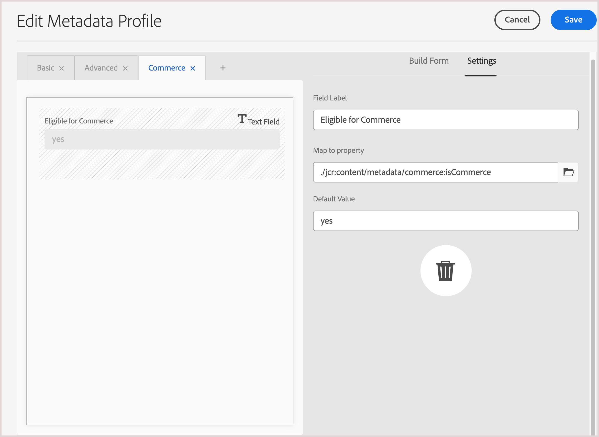

# Experience Manager Assetsの設定

{{$include /help/_includes/aem-assets-integration-beta-note.md}}

CommerceのAEM AssetsCommerce統合を使用してストアのメディアアセットを管理するには、AEM Assets アセットを簡単に検索および管理できるように、特定のメタデータを追加する必要があります。 また、このメタデータは、Adobe CommerceとExperience Manager Assets間のアセットの同期も容易にします。 メタデータフィールドを定義した後、Commerce アセットをExperience Manager Assetsと初めて共有すると、これらのフィールドの最初のマッピングが自動的に行われます。

統合には、次の 2 種類のメタデータを設定します。

- **[メタデータプロファイル ](https://experienceleague.adobe.com/en/docs/experience-manager-cloud-service/content/assets/manage/metadata-profiles)**：フォルダー内のアセットにデフォルトのメタデータを適用できます。 フォルダー内のすべてのアセットは、プロファイルに設定されたデフォルトのメタデータを継承します。

- **[メタデータスキーマ ](https://experienceleague.adobe.com/en/docs/experience-manager-cloud-service/content/assets/manage/metadata-schemas)** は、プロパティページのレイアウトと、AEM アセットでメタデータプロパティとして使用できる一連のフィールドを定義します。

## メタデータの設定

初回のオンボーディングでは、次のCommerce メタデータをAEM Assets メタデータプロファイルとメタデータスキーマの両方に追加します。

| フィールドタイプ | ラベル | プロパティ | デフォルト値 |
|------ | ------- | ---------- | ------------- |
| テキスト | **Adobe Commerceに存在しますか？** | `./jcr:content/metadata/commerce:isCommerce` | はい |
| 複数値テキスト | **SKU** | `./jcr:content/metadata/commerce:skus` | なし |
| 複数値テキスト | **職階** | `./jcr:content/metadata/commerce:positions` | なし |
| 複数値テキスト | **役割** | `./jcr:content/metadata/commerce:roles` | なし |

### メタデータプロファイルへのCommerce フィールドの追加

1. Adobe Experience Manager ワークスペースから、Adobe Experience Manager アイコンをクリックして、AEM Assetsのオーサーコンテンツ管理ワークスペースに移動します。

   {width="600" zoomable="yes"}

1. ハンマーアイコンを選択して、管理者ツールを開きます。

   {width="600" zoomable="yes"} 管理

1. 「**[!UICONTROL Metadata Profiles]**」をクリックして、プロファイル設定ページを開きます。

1. Commerce統合用のメタデータプロファイルを **[!UICONTROL Create]** 定します。

   {width="600" zoomable="yes"}

1. Commerce メタデータ用のタブを追加します。

   1. 左側で、「**[!UICONTROL Settings]**」をクリックします。

   1. タブ セクションの [**[!UICONTROL +]**] をクリックし、**[!UICONTROL Tab Name]**、`Commerce` を指定します。

1. [ メタデータフィールド ](#configure-metadata) をフォームに追加します。

   {width="600" zoomable="yes"}

1. 更新を保存します。

1. Commerce アセットが保存されているフォルダーに `Commerce integration` メタデータプロファイルを適用します。

   1. [!UICONTROL  Metadata Profiles] ページで、「Commerce統合」プロファイルを選択します。

   1. アクションメニューから「**[!UICONTROL Apply Metadata Profiles to Folder(s)]**」を選択します。

   1. Commerce アセットを含むフォルダーを選択します。

      Commerce フォルダーが存在しない場合は作成します。

   1. 「**[!UICONTROL Apply]**」をクリックします。

### Commerce フィールドをメタデータスキーマフォームに追加する

1. AssetsのAEM オーサーコンテンツ管理パネルで、**[!UICONTROL Metadata Schemas]** （[!UICONTROL Manage metadata schema forms]）を開きます。

   {width="600" zoomable="yes"}

1. Commerceのメタデータスキーマを **[!UICONTROL Create]** 成します。

   {width="600" zoomable="yes"}

1. [!UICONTROL Metadata Schema Form] で、`Does Commerce exist?` フィールドと `Commerce mappings` フィールドを作成し、プロパティをマッピングします。

1. 「**[!UICONTROL Save]**」をクリックします。

## アセットのPublish

Commerce Assets 用にAEM メタデータとスキーマプロファイルを設定したら、最初のCommerce アセットを作成して、Commerce メタデータフィールドをマッピングします。

1. Experience Managerから、に移動 [!UICONTROL Assets > Files]、**Commerce** フォルダーを選択します。

1. Commerce プロジェクトの画像をアップロードするには、ファイルをフォルダーにドラッグするか、「**[!UICONTROL Add Assets]**」をクリックします。

1. メタデータ設定 **isCommerce** が `true` に設定されていること、および `commerce:skus` プロパティが、画像に関連付けられているCommerce商品の SKU に設定されていることを確認します。

1. アセットを承認。

## Commerce フォルダーへのアセットの追加

Commerce メタデータ属性が割り当てられているAEM Assets Commerce フォルダー内に、少なくとも 1 つのアセットを作成します。

このアセットは、Commerce インスタンスとAEM Assets間の同期を設定するために必要です。

## アセットのメタデータのマッピング

Commerce アセットが初めて公開される際のメタデータのマッピング。  初めてCommerceから。 組み込みフィールドまたはカスタムフィールドがあるメディアアセットは、アセットがExperience Manager Assetsに初めて送信されたときに、指定したフィールドに自動的にマッピングされます。

アセットマッピングを開始する前に、次のタスクを実行します。

- [Commerce用のAEM Assets統合のインストールと設定](aem-assets-configure-commerce.md)
- [アセット同期を有効にして、Adobe Commerce プロジェクト環境とAEM Assets プロジェクト環境の間でアセットを転送します](aem-assets-setup-synchronization.md)
