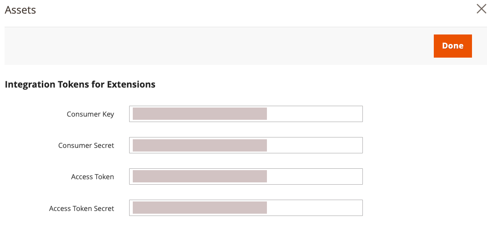

# Commerce用のAEM Assets統合のインストールと設定

{{$include /help/_includes/aem-assets-integration-beta-note.md}}

拡張機能をCommerce アプリケーションに追加し、AEM Assets SaaS サービスに接続し、Adobe I/Oイベントサービスに接続して、Commerce SaaS に接続することで、Commerce integration for Commerceをインストールして設定します。

## 必要システム構成

**ソフトウェア要件**

- Adobe Commerce 2.4.5 以降
- PHP 8.1、8.2、8.3
- コンポーザー：2.x

**設定要件**

- Adobe Commerceは、[Adobe IMS認証 ](/help/getting-started/adobe-ims-config.md) を使用するように設定する必要があります。
- アカウントのプロビジョニングと権限
   - [Commerce クラウドプロジェクト管理者 ](https://experienceleague.adobe.com/en/docs/commerce-cloud-service/user-guide/project/user-access) – 必要な拡張機能をインストールして、管理者またはコマンドラインからCommerce アプリケーションサーバーを設定します
   - [Commerce管理者 ](https://experienceleague.adobe.com/en/docs/commerce-admin/start/guide-overview) - ストア設定を更新し、Commerce ユーザーアカウントを管理します

## 設定の概要

統合を有効にするには、次のタスクを実行します。

1. [AEM Assets integration extension （`aem-assets-integration`）をインストールします ](#install-the-aem-assets-integration-extension)。
1. [Commerce サービスコネクタを設定 ](#configure-the-commerce-services-connector) して、Adobe Commerce インスタンスと、Adobe CommerceとAEM Assets間でデータを転送できるサービスを接続します。
1. [Commerce用のAdobe I/Oイベントの設定](#configure-adobe-io-events-for-commerce)
1. [API アクセスの認証資格情報の取得](#get-authentication-credentials-for-api-access)

## AEM Assets Integration 拡張機能のインストール

>[!BEGINSHADEBOX]

**前提条件**

- [repo.magento.com](https://repo.magento.com/admin/dashboard) にアクセスして、拡張機能をインストールします。 キーの生成と必要な権限の取得については、[ 認証キーの取得 ](https://experienceleague.adobe.com/en/docs/commerce-operations/installation-guide/prerequisites/authentication-keys) を参照してください。 クラウドインストールについては、[Commerce on Cloud Infrastructure ガイドを参照してください ](https://experienceleague.adobe.com/en/docs/commerce-cloud-service/user-guide/develop/authentication-keys)

- Adobe Commerce アプリケーションサーバーのコマンドラインにアクセスします。

>[!ENDSHADEBOX]

Adobe Commerce 2.4.4 以降が稼働しているAdobe Commerceに、最新バージョンのAEM Assets Integration Extension （`aem-assets-integration`）をインストールします。 AEM Asset Integration は、[repo.magento.com](https://repo.magento.com/admin/dashboard) リポジトリから composer メタパッケージとして提供されます。

>[!BEGINTABS]

>[!TAB  クラウドインフラストラクチャ ]

Commerce Cloudインスタンスの [!DNL AEM Assets Integration] 拡張機能をインストールするには、このメソッドを使用します。

1. ローカルワークステーションで、Adobe Commerce on cloud infrastructure プロジェクトのプロジェクトディレクトリに移動します。

   >[!NOTE]
   >
   >Commerce Adobe Commerce プロジェクト環境のローカル管理について詳しくは、_クラウドインフラストラクチャユーザーガイドの [CLI を使用したブランチの管理 ](https://experienceleague.adobe.com/en/docs/commerce-cloud-service/user-guide/develop/cli-branches) を参照してください_。

1. Adobe Commerce Cloud CLI を使用して更新する環境ブランチを確認します。

   ```shell
   magento-cloud environment:checkout <environment-id>
   ```

1. AEM Assets Integration for Commerce拡張機能を追加します。

   ```shell
   composer require "magento/aem-assets-integration" "<version-tbd>" --no-update
   ```

1. パッケージの依存関係を更新します。

   ```shell
   composer update "magento/aem-assets-integration"
   ```

1. `composer.json` ファイルと `composer.lock` ファイルのコード変更をコミットしプッシュします。

1. `composer.json` ファイルと `composer.lock` ファイルのコード変更を追加、コミットし、クラウド環境にプッシュします。

   ```shell
   git add -A
   git commit -m "Install AEM Assets Integration extension for Adobe Commerce"
   git push origin <branch-name>
   ```

   更新をプッシュすると、[Commerce クラウドデプロイメントプロセス ](https://experienceleague.adobe.com/en/docs/commerce-cloud-service/user-guide/develop/deploy/process) が開始され、変更が適用されます。 [ デプロイメントログ ](https://experienceleague.adobe.com/en/docs/commerce-cloud-service/user-guide/develop/test/log-locations#deploy-log) からデプロイメントステータスを確認します。

>[!TAB  オンプレミス ]

オンプレミスのインスタンスに [!DNL AEM Assets Integration] 拡張機能をインストールするには、この方法を使用します。

1. Composer を使用して、AEM Assets Integration for Commerce拡張機能をプロジェクトに追加します。

   ```shell
   composer require "magento/aem-assets-integration" --no-update
   ```

1. 依存関係を更新し、拡張機能をインストールします。

   ```shell
   composer update  "magento/aem-assets-integration"
   ```

1. Adobe Commerceをアップグレード :

   ```shell
   bin/magento setup:upgrade
   ```

1. キャッシュをクリアする：

   ```shell
   bin/magento cache:clean
   ```

   >[!TIP]
   >
   >場合によっては（特に実稼動環境にデプロイする場合）、コンパイル済みのコードは時間がかかるので、クリアしないようにしたい場合があります。 変更を加える前に、システムを必ずバックアップしてください。

>[!ENDTABS]

## Commerce サービスコネクタの設定

Commerce サービスコネクタを使用すると、Commerce インスタンス、Asset Rule Engine サービスおよびその他のサポートサービス間でデータの同期と通信を行えます。

>[!NOTE]
>
>Commerce Services Connector のセットアップは、[Adobe Commerce SaaS サービス ](https://experienceleague.adobe.com/en/docs/commerce-merchant-services/user-guides/integration-services/saas#availableservices) を使用するために必要な 1 回限りのプロセスです。 別のサービス用にコネクタを既に設定している場合は、Commerce管理で **[!UICONTROL Systems]** > [!UICONTROL Services] > **[!UICONTROL Commerce Services Connector]** を選択すると、既存の設定を表示できます。

Adobe Commerce インスタンスとAEM Assets統合を有効にするサービスとの間でデータを転送するには、以下を使用してCommerce サービスコネクタを設定します。

- 認証用の実稼動およびサンドボックス API キーを使用して、Commerce インスタンスを設定します。
- セキュリティで保護されたクラウド ストレージのデータ領域（SaaS 識別子）を指定します。
- データセットとAdobe Experience Platform間の接続を確立するためにAEM Assetsへのアクセスに使用する IMS 組織にログインします。

手順について詳しくは、[Commerce サービスコネクタ ](https://experienceleague.adobe.com/en/docs/commerce-merchant-services/user-guides/integration-services/saas#organizationid) を参照してください。

Commerce サービスコネクタを設定すると、SaaS プロジェクトとデータベース ID が生成されます。 これらの ID は、テナントのオンボーディングプロセス中に必要になります。

{width="600" zoomable="yes"}

## Commerce用のAdobe I/Oイベントの設定

AEM Assets統合では、Adobe I/Oイベントサービスを使用して、Commerce インスタンスとExperience Cloudの間でカスタムイベントデータを送信します。 イベントデータは、AEM Assets統合のワークフローを調整するために使用されます。

>[!BEGINSHADEBOX]

**前提条件**

- RabbitMQが有効になっていて、イベントをリッスンしていることを確認します。
   - [ オンプレミスのAdobe CommerceのRabbitMQ設定 ](https://experienceleague.adobe.com/en/docs/commerce-cloud-service/user-guide/configure/service/rabbitmq)
   - [ クラウドインフラストラクチャー上のAdobe CommerceのRabbitMQ設定 ](https://experienceleague.adobe.com/en/docs/commerce-cloud-service/user-guide/configure/service/rabbitmq)

>[!ENDSHADEBOX]

>[!NOTE]
>
>Adobe DeveloperのAdobe I/Oイベントについて詳しくは、Commerce サイトにある [CommerceのAdobe I/Oイベント ](https://developer.adobe.com/commerce/extensibility/events/) ドキュメントを参照してください。

セットアップには、次の手順が必要です。

1. アプリケーションサーバーと管理者でAdobe I/Oイベントを設定して、Commerce イベントフレームワークを有効にします。
1. Assets Rules Engine サービス API を使用してAEM Assetsを設定することにより、Adobe Commerceと Connection の間でデータ同期を有効にします。
1. 管理者でAEM Assets統合を有効にします。

### Commerce イベントフレームワークの有効化

Commerce プロジェクトがデプロイされている環境の手順を使用して、Commerce イベントフレームワークを有効にします。

>[!BEGINTABS]

>[!TAB  クラウドインフラストラクチャ ]

1. [!DNL Store Settings Configuration] メニューからAdobe I/Oイベントサービスを有効にします。

   1. 管理者から、**[!UICONTROL Stores]**/[!UICONTROL Settings]/**[!UICONTROL Configuration]**/**[!UICONTROL Adobe Services]**/**Adobe I/Oイベント** に移動します。

   1. **[!UICONTROL Commerce events]** を展開します。

   1. **[!UICONTROL Enabled]** を `Yes` に設定します。

      {width="600" zoomable="yes"}

      >[!NOTE]
      >
      >[cron を有効化 ](https://developer.adobe.com/commerce/extensibility/events/configure-commerce/#check-cron-and-message-queue-configuration) して、Commerceが API エンドポイントにイベントを送信し、統合の通信とワークフローを管理できるようにします。

1. クラウドプロジェクト設定を更新します。

   1. `app/etc/config.php` ファイルを作業用リポジトリに追加します。

   ```shell
   git add app/etc/config.php
   ```

   1. `composer info magento/ece-tools` コマンドを実行して、ece-tools のバージョンを確認します。 バージョンが `2002.1.13` 未満の場合は、[ 最新バージョンに更新 ](https://experienceleague.adobe.com/en/docs/commerce-cloud-service/user-guide/dev-tools/ece-tools/update-package) します。

   1. `.magento.env.yaml` ファイルでイベントを有効にする：

      ```yaml
      stage:
         global:
            ENABLE_EVENTING: true
      ```

   1. 更新されたファイルをコミットしてクラウド環境にプッシュします。

>[!TAB  オンプレミス ]

1. [!DNL Store Settings Configuration] メニューからAdobe I/Oイベントサービスを有効にします。

   1. 管理者から、**[!UICONTROL Stores]**/[!UICONTROL Settings]/**[!UICONTROL Configuration]**/**[!UICONTROL Adobe Services]**/**Adobe I/Oイベント** に移動します。

   1. **[!UICONTROL Commerce events]** を展開します。

   1. **[!UICONTROL Enabled]** を `Yes` に設定します。

      {width="600" zoomable="yes"}

      >[!NOTE]
      >
      >[cron ジョブを有効にする ](https://developer.adobe.com/commerce/extensibility/events/configure-commerce/#check-cron-and-message-queue-configuration) これにより、Commerceは、AEM assets とCommerceの間の通信およびワークフローを管理するイベントを送信できます。

>[!ENDTABS]

## API アクセスの認証資格情報の取得

CommerceのAEM Assets統合では、Commerce インスタンスへの API アクセスを許可するために、OAuth 認証資格情報が必要です。 テナントのオンボーディング中にCommerce プロジェクトをAssets ルールエンジンサービスに登録し、Adobe CommerceとAEM Assetsの間でアセットを管理するための API リクエストを送信するには、これらの資格情報が必要です。

資格情報を生成するには、統合をCommerce インスタンスに追加し、インスタンスをアクティベートします。

### Commerce環境への統合の追加

1. 管理者で、**システム**/拡張機能/**統合** に移動し、「**新規統合を追加**」をクリックします。

1. 統合に関する情報を入力します。

   「**一般**」セクションでは、統合 **名前** と **メール** のみを指定します。 CommerceとExperience Manager Assetsがデプロイされている組織にアクセスできるAdobe IMSアカウントのメールを使用します。

   {width="600" zoomable="yes"}

1. **ID を確認** をクリックして ID を確認します。

   AdobeID を使用してExperience Cloudの認証を行うことで、ID が検証されます。

1. API リソースを設定します。

   1. 左側のパネルから、「**[!UICONTROL API]**」をクリックします。
E
   1. 外部メディア リソース **[!UICONTROL Catalog > Inventory > Products > External Media]** を選択します。

   {width="600" zoomable="yes"}

1. 「**[!UICONTROL Save]**」をクリックします。

### 資格情報を生成

統合ページで、Assets統合の「**アクティブ化**」をクリックして、OAuth 認証資格情報を生成します。 Commerce プロジェクトをAssets Rule Engine サービスに登録し、Adobe CommerceとAEM Assetsの間でアセットを管理するための API リクエストを送信するには、これらの資格情報が必要です。

1. 統合ページで、「**[!UICONTROL Activate]**」をクリックして資格情報を生成します。

   {width="600" zoomable="yes"}

1. 後で使用するために、コンシューマーキーの資格情報とアクセストークンを保存します。

{width="600" zoomable="yes"}

1. 「**[!UICONTROL Done]**」をクリックします。

>[!NOTE]
>
>また、Adobe Commerce API を使用して認証資格情報を生成することもできます。 このプロセスの詳細と、Adobe Developerの OAuth ベースの認証の詳細については、Adobe Commerce ドキュメントの [OAuth ベースの認証 ](https://developer.adobe.com/commerce/webapi/get-started/authentication/gs-authentication-oauth/) を参照してください。
