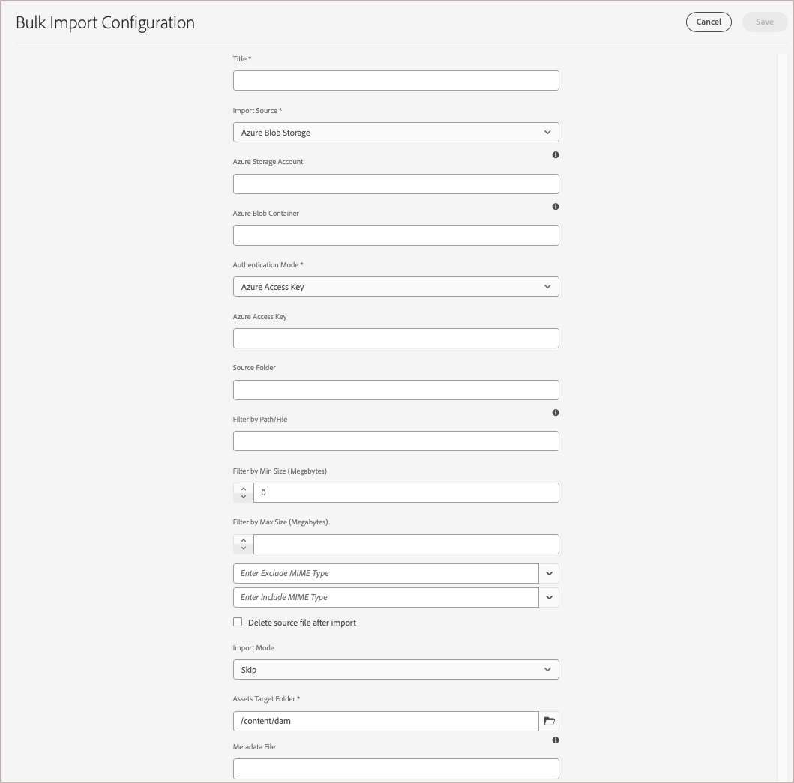

# Migrate media files to the AEM Assets DAM

Adobe CommerceとAdobe Experience Manager（AEM）には、CommerceからAEM Assets Digital Asset Management System （DAM）へのメディアファイル移行を効率化する組み込み機能が用意されています。 他のソースからメディア ファイルをマイグレーションすることもできます。

## 前提条件

| カテゴリ | 要件 |
|----------|-------------|
| **必要システム構成** | <ul><li>AEM AssetsでプロビジョニングされたAEM as a Cloud Service環境</li><li>十分なストレージ容量</li><li>大きなファイル転送のネットワーク帯域幅</li></ul> |
| **必要なアクセスと権限** | <ul><li>AEM Assets as a Cloud Serviceへの管理者アクセス</li><li>メディアファイルが格納されているソースシステム（Adobe Commerceまたは外部システム）へのアクセス</li><li>Appropriate permissions to access cloud storage services</li></ul> |
| **Cloud Storage Account** | <ul><li>AWS S3 または Azure Blob Storage アカウント</li><li>プライベートコンテナ / バケット設定</li><li>認証資格情報</li></ul> |
| **Source Content** | <ul><li>Organized media files ready for migration</li><li>Image and video files in <a href="https://experienceleague.adobe.com/ja/docs/experience-manager-cloud-service/content/assets/file-format-support#image-formats">formats supported by AEM Assets</a>.</li><li>Clean, deduplicated assets</li></li> |
| **Metadata Preparation** | <ul><li><a href="https://experienceleague.adobe.com/ja/docs/commerce-admin/content-design/aem-asset-management/getting-started/aem-assets-configure-aem">Commerce アセット用に設定されたAEM Assets メタデータプロファイル </a></li><li>各アセットのマッピングされたメタデータ値</li><li>CSV ファイルエディター（Microsoft Excel など）</li></ul> |

## 移行のベストプラクティス

1. 未使用および重複したコンテンツを削除することで、移行前にアセットをキュレーションできます。
1. サイズ、形式、ユースケース別にアセットを論理的に整理する。
1. 大きな移行は小さなバッチに分割することを検討してください。
1. ピーク以外の時間帯に、リソースを大量に消費する読み込みをスケジュールします。
1. 完全に読み込む前にメタデータマッピングを検証します。

## 移行ワークフロー

Follow the migration workflow to export media files from Adobe Commerce or another external system and import them into the AEM Assets DAM.

### 手順 1：既存のデータソースからのコンテンツのエクスポート

Adobe Commerceのマーチャントにとっては、リモートストレージモジュールは、CommerceからメディアファイルをエクスポートしてAEM Assetsにインポートするための合理化された方法を提供します。 AWS S3 などのリモートストレージサービスでメディアファイルを保存および管理できるため、移行プロセスの効率が向上します。 Commerce インスタンスにリモートストレージを設定するには、*Commerce設定ガイド [&#128279;](https://experienceleague.adobe.com/ja/docs/commerce-operations/configuration-guide/storage/remote-storage/remote-storage-aws-s3) の  リモートストレージの設定* を参照してください。

メディアファイルがAdobe Commerce以外に保存されている場合は、AEM as a Cloud Serviceでサポートされている [ データソース ](https://experienceleague.adobe.com/ja/docs/experience-manager-cloud-service/content/assets/assets-view/bulk-import-assets-view#prerequisites) の 1 つに直接アップロードします。

### Step 2: Build a CSV file for metadata mapping

CSV 形式のメタデータマッピングファイルを作成し、メディアファイルを含むソースフォルダーにアップロードします。 このファイルは、各アセットに不可欠なメタデータを次の場所にマッピングします。

- DAM 内のアセットを整理および分類して、見つけやすくします
- Adobe CommerceとAEM Assets間の適切な同期の有効化
- 移行後にアセットと製品間の関係を維持

次の表に示すように、Commerce アセットの [AEM Assets メタデータプロファイルに含まれるメタデータフィールドの値を ](aem-assets-configure-aem.md) 移行するメディアファイルごとに指定します。

| メタデータ | 説明 | 値 |
|-------|-------------|--------|
| assetPath | AEM Assets リポジトリー内でアセットが保存されるフルパス。<br><br>Use the path to create sub-folders to organize Commerce assets, for example `content/dam/commerce/<brand>/<type>`. | `/content/dam/commerce/<sub-folder>/..<filename>` |
| dc:title | AEM Assetsでのアセットの表示タイトル | 文字列値（例：`Sample 1`） |
| dam:status | AEM Assetsでのアセットの承認ステータス | `approved` |
| commerce:positions | The position/order of the asset in product galleries | Numeric value (e.g., &quot;1&quot;) |
| commerce:isCommerce | Flag indicating if the asset is used in commerce | `Yes` |
| commerce:sku | このアセットに関連付けられている製品 SKU | 文字列値（例：`sample1`） |
| コマース：ロール | アセットの画像の役割またはタイプ（`thumbnail`、`main image`、`swatch` など） | セミコロンで区切られた複数の値（例：&quot;thumbnail; image; swatch_image; small_image&quot;） |

+++CSV コード

このサンプルの CSV コードを使用して、Microsoft Excel などのコードエディターまたはスプレッドシートアプリケーションでファイルを作成します。

```csv
assetPath,dc:title{{String}},dam:status{{String}},commerce:positions{{String: multi}},commerce:isCommerce{{String}},commerce:skus{{String: multi}},commerce:roles{{String: multi}}
/content/dam/commerce/sample1.jpg,Sample 1,approved,1,Yes,sample1,thumbnail; image; swatch_image; small_image
/content/dam/commerce/sample2.jpg,Sample 2,approved,1,Yes,sample2,thumbnail; image; swatch_image; small_image
/content/dam/commerce/sample3.jpg,Sample 3,approved,1,Yes,sample3,thumbnail; image; swatch_image; small_image
```

+++

### 手順 3:AEM AssetsへのAssetsの一括読み込み

メタデータマッピングファイルを作成した後、AEM Assets一括読み込みツールを使用してアセットを読み込みます。

以下は、このツールの使用の概要です。

1. [Log in to your AEM Assets as a Cloud Service author environment](https://experienceleague.adobe.com/ja/docs/experience-manager-cloud-service/content/onboarding/journey/aem-users#login-aem).

1. Experience Managerのツール ビューで、**[!UICONTROL Assets]** / **[!UICONTROL Bulk Import]** を選択します。

   {width="600" zoomable="yes"}

1. 一括読み込み設定で「**[!UICONTROL Create]**」を選択して、設定フォームを開きます。

   {width="600" zoomable="yes"}

1. 設定を行い、設定を保存します。

   You&#39;ll need:

   - Authentication credentials for your data source
   - The target folder in AEM Assets where imported files will be stored
   - Information about the MIME types, file size, and other parameters to customize the import configuration (optional)
   - The path to the metadata mapping CSV file you uploaded to the Cloud storage instance.

   手順について詳しくは、*AEM Assets as a Cloud Service ユーザーガイド [&#128279;](https://experienceleague.adobe.com/ja/docs/experience-manager-cloud-service/content/assets/manage/add-assets#configure-bulk-ingestor-tool) 一括読み込みツールの設定  を参照してください*。

1. 設定を保存したら、一括読み込みツールを使用して、読み込み操作をテストおよび実行します。

>[!MORELIKETHIS]
>
>[ 一括読み込みツールのビデオデモ ](https://experienceleague.adobe.com/ja/docs/experience-manager-cloud-service/content/assets/manage/add-assets#asset-bulk-ingestor)
>[ヒント、ベストプラクティス、制限事項 ](https://experienceleague.adobe.com/ja/docs/experience-manager-cloud-service/content/assets/manage/add-assets#tips-limitations)
>[API を使用したアセットのアップロードまたは取り込み ](https://experienceleague.adobe.com/ja/docs/experience-manager-cloud-service/content/assets/admin/developer-reference-material-apis#asset-upload)

