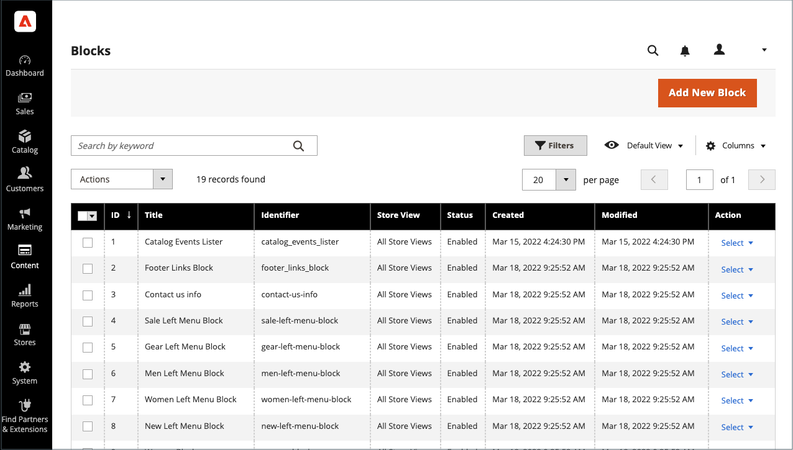

# コンテンツブロックを追加

コンテンツのカスタムブロックを作成して、任意のページ、ページのグループ、または別のブロックに追加できます。 たとえば、ブロックに画像スライダーを配置し、そのブロックをホーム ページに配置できます。 ブロック ワークスペースでは、[ ページ ](pages-workspace.md) ワークスペースと同じ _基本コントロール_ を使用して、使用可能なブロックを検索し、日常のメンテナンスを実行するのに役立ちます。 ブロックが完了したら、[ ウィジェット ](widget-static-block.md) ツールを使用して、ストアの特定のページに配置できます。

{width="700" zoomable="yes"}

## ブロックの作成

1. _管理者_ サイドバーで、**[!UICONTROL Content]**/_[!UICONTROL Elements]_/**[!UICONTROL Blocks]**に移動します。

1. 右上隅の「**新しいブロックを追加**」をクリックします。

   {width="500" zoomable="yes"}

1. 新しいブロックのデフォルト有効ステータスを変更する場合は、「**ブロックを有効にする** を `No` に設定します。

1. 内部参照に **ブロック タイトル** を割り当てます。

1. ブロックに一意の **識別子** を割り当てます。

   スペースの代わりにアンダースコアを含む小文字をすべて使用します。

1. ブロックを使用する各 **[!UICONTROL Store View]** を選択します。

1. 表示されたコンテンツツールセットを使用してブロックのコンテンツを追加します。

   - [ ページビルダー ](../page-builder/introduction.md) が有効な場合、コンテンツ **[!UICONTROL Edit with Page Builder]** ワークスペース [ のページビルダーツールを使用するには ](../page-builder/workspace.md) を選択します。

     {width="500" zoomable="yes"}

     >[!NOTE]
     >
     >ページビルダーを使用してブロックを追加する方法については、[ チュートリアル 2：ブロック ](../page-builder/2-blocks.md) を参照してください。

   - [ エディター ](editor.md) を使用して、テキストの書式設定や、リンクの作成、表、画像、ビデオおよびオーディオの追加を行います。

     HTML コードを使用する場合は、「**エディターを表示/非表示**」をクリックします。

     {width="500" zoomable="yes"}

1. 完了したら、**[!UICONTROL Save]** 矢印をクリックして「**[!UICONTROL Save & Close]**」を選択します。

   新しいブロックが、[ ブロック ] グリッドのリストの一番下に表示されます。

1. [ ウィジェット ](widget-static-block.md) ツールを使用して、完成したブロックをストアの特定のページに配置します。

## ブロックの削除

カスタムブロックを削除する方法は 2 つあります。 _ブロック_ グリッド、またはブロックを編集ページから削除できます。

### 方法 1: ブロック グリッドからブロックを削除する

1. _管理者_ サイドバーで、**[!UICONTROL Content]**/_[!UICONTROL Elements]_/**[!UICONTROL Blocks]**に移動します。
1. グリッドの上でフィルタを使用してブロックを見つけ、削除する 1 つまたは複数のブロックのチェックボックスをオンにします。
1. リストの左上隅にある **[!UICONTROL Actions]** を `Delete` に設定します。
1. アクションを確定するには、「**[!UICONTROL OK]**」をクリックします。

### 方法 2：編集ページからブロックを削除する

1. _管理者_ サイドバーで、**[!UICONTROL Content]**/_[!UICONTROL Elements]_/**[!UICONTROL Blocks]**に移動します。
1. 削除するブロックを検索します。
1. ブロックの _アクション_ 列で、「**[!UICONTROL Select]**」をクリックし、「**[!UICONTROL Edit]**」を選択します。
1. メニューバーで、「**[!UICONTROL Delete Block]**」をクリックします。
1. アクションを確定するには、「**[!UICONTROL OK]**」をクリックします。

## 保存メニュー

| コマンド | 説明 |
|----------|----------- |
| [!UICONTROL Save] | 現在のブロックを保存し、作業を続行します。 |
| [!UICONTROL Save & Duplicate] | 現在のブロックを保存して閉じ、新しい複製コピーを開きます。 |
| [!UICONTROL Save & Close] | 現在のブロックを保存して閉じ、[ ブロック ] グリッドに戻ります。 |

{style="table-layout:auto"}

## ライトボックスまたはスライダーの追加

- [ を使用すると、ストアに ](../page-builder/slider.md) スライダー [[!DNL Page Builder]](../page-builder/introduction.md) を簡単に追加できます。 スライダーは、自動的に再生するように設定することも、ナビゲーションボタンを使用して手動で制御することもできます。

  {width="600" zoomable="yes"}

  また、[[!DNL Commerce Marketplace]](https://marketplace.magento.com/extensions.html?q=lightbox) で利用できる jQuery ベースの画像ライトボックスの幅広い品揃えもあり、無料のものもあります。

- また、[!DNL Commerce Marketplace] から拡張機能をダウンロードすることもできます。 その他のヘルプについては、拡張機能開発者が提供するドキュメントを参照してください。
