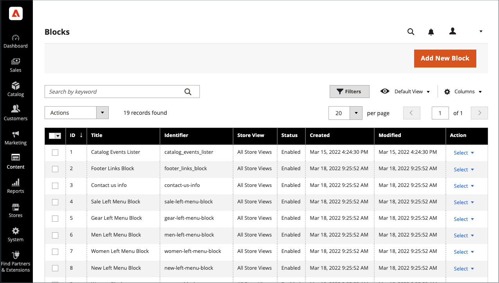
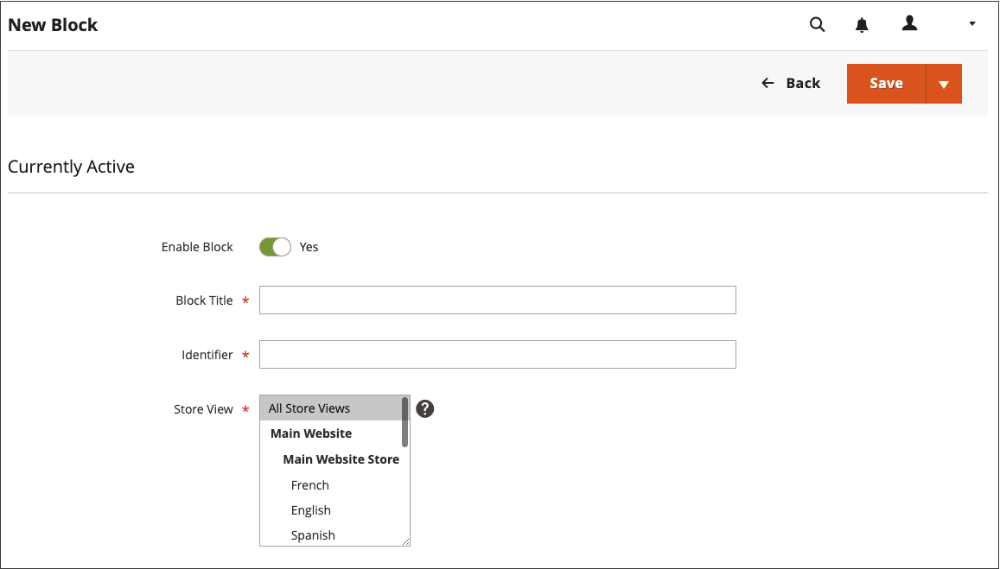
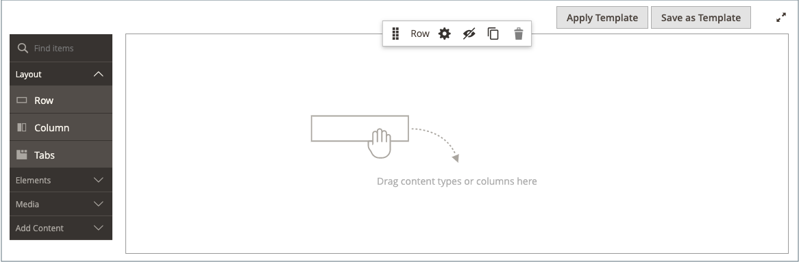
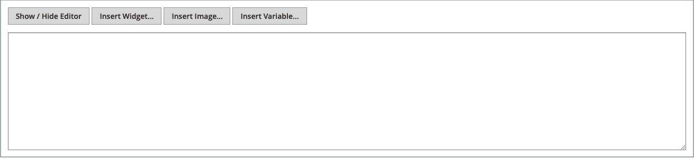
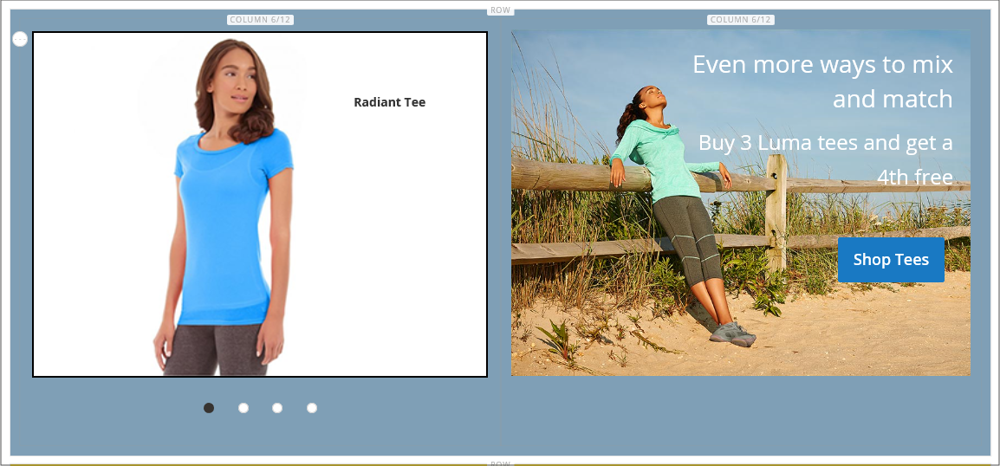

# コンテンツブロックを追加

コンテンツのカスタムブロックを作成し、任意のページ、ページのグループ、さらには別のブロックに追加できます。 例えば、画像スライダーをブロックに配置し、そのブロックをホームページに配置します。 ブロック ワークスペースでは、_ページ_ ワークスペースと同じ[基本コントロール &#x200B;](pages-workspace.md)を使用して、使用可能なブロックの検索と日常的なメンテナンスの実行を支援します。 ブロックが完了したら、[Widget](widget-static-block.md) ツールを使用して、ストア内の特定のページに配置できます。

{width="700" zoomable="yes"}

## ブロックを作成

1. _管理者_ サイドバーで、**[!UICONTROL Content]** > _[!UICONTROL Elements]_>**[!UICONTROL Blocks]**&#x200B;に移動します。

1. 右上隅の「**新しいブロックを追加**」をクリックします。

   {width="500" zoomable="yes"}

1. 新しいブロックのデフォルトで有効なステータスを変更する場合は、**ブロックを有効にする**&#x200B;を`No`に設定します。

1. 内部参照用に&#x200B;**ブロックタイトル**&#x200B;を割り当てます。

1. ブロックに一意の&#x200B;**識別子**&#x200B;を割り当てます。

   スペースの代わりにアンダースコアを使用して、すべての小文字を使用します。

1. ブロックを使用可能にする各&#x200B;**[!UICONTROL Store View]**&#x200B;を選択します。

1. 表示されたコンテンツツールセットを使用して、ブロックのコンテンツを追加します。

   - [&#x200B; ページビルダー](../page-builder/introduction.md)が有効になっている場合は、**[!UICONTROL Edit with Page Builder]**&#x200B;を選択して、コンテンツ [&#x200B; ワークスペース &#x200B;](../page-builder/workspace.md)のページビルダーツールを使用します。

     {width="500" zoomable="yes"}

     >[!NOTE]
     >
     >ページビルダーを使用したブロックの追加について詳しくは、[&#x200B; チュートリアル 2: ブロック &#x200B;](../page-builder/2-blocks.md)を参照してください。

   - [&#x200B; エディター](editor.md)を使用して、テキストの書式設定、リンクの作成、テーブル、画像、ビデオ、オーディオの追加を行います。

     HTML コードを操作する場合は、**エディターの表示/非表示**&#x200B;をクリックします。

     {width="500" zoomable="yes"}

1. 完了したら、**[!UICONTROL Save]**&#x200B;矢印をクリックし、**[!UICONTROL Save & Close]**&#x200B;を選択します。

   新しいブロックは、ブロック グリッドのリストの下部に表示されます。

1. [Widget](widget-static-block.md) ツールを使用して、完成したブロックをストア内の特定のページに配置します。

## ブロックの削除

カスタムブロックを削除するには、2つの方法があります。 _ブロック_ グリッドまたは編集ブロックページから削除できます。

### 方法1: ブロック グリッドからブロックを削除する

1. _管理者_ サイドバーで、**[!UICONTROL Content]** > _[!UICONTROL Elements]_>**[!UICONTROL Blocks]**&#x200B;に移動します。
1. グリッドの上にあるフィルターを使用してブロックを見つけ、削除する1つ以上のブロックのチェックボックスを選択します。
1. リストの左上隅で、**[!UICONTROL Actions]**&#x200B;を`Delete`に設定します。
1. アクションを確認するには、**[!UICONTROL OK]**&#x200B;をクリックします。

### 方法2：編集ページからブロックを削除する

1. _管理者_ サイドバーで、**[!UICONTROL Content]** > _[!UICONTROL Elements]_>**[!UICONTROL Blocks]**&#x200B;に移動します。
1. 削除するブロックを見つけます。
1. ブロックの&#x200B;_アクション_&#x200B;列で、**[!UICONTROL Select]**&#x200B;をクリックし、**[!UICONTROL Edit]**&#x200B;を選択します。
1. メニューバーで、**[!UICONTROL Delete Block]**&#x200B;をクリックします。
1. アクションを確認するには、**[!UICONTROL OK]**&#x200B;をクリックします。

## メニューを保存

| コマンド | 説明 |
|----------|----------- |
| [!UICONTROL Save] | 現在のブロックを保存して作業を続行します。 |
| [!UICONTROL Save & Duplicate] | 現在のブロックを保存して閉じ、新しい複製コピーを開きます。 |
| [!UICONTROL Save & Close] | 現在のブロックを保存して閉じ、ブロックのグリッドに戻ります。 |

{style="table-layout:auto"}

## ライトボックスまたはスライダーの追加

- [&#x200B; スライダー](../page-builder/slider.md)を[[!DNL Page Builder]](../page-builder/introduction.md)でストアに簡単に追加できます。 スライダーは、自動再生に設定することも、ナビゲーションボタンを使用して手動で制御することもできます。

  {width="600" zoomable="yes"}

  [[!DNL Commerce Marketplace]](https://marketplace.magento.com/extensions.html?q=lightbox)で利用できるjQuery ベースの画像ライトボックスも幅広く用意されており、一部は無料です。

- [!DNL Commerce Marketplace]から拡張機能をダウンロードすることもできます。 追加のヘルプについては、拡張機能の開発者が提供するドキュメントを参照してください。
