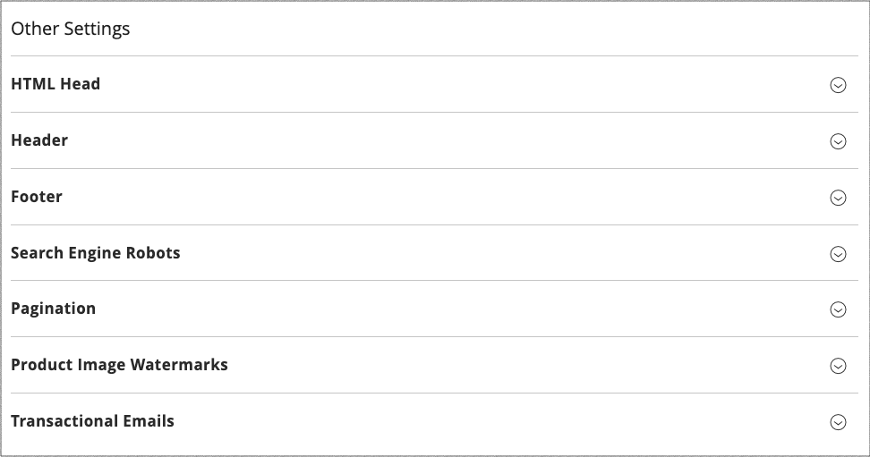

# デザイン設定

デザイン設定を使用すると、デザイン関連のルールや設定を 1 ページに表示して簡単に編集できます。

{width="700" zoomable="yes"}

## デザイン設定の変更

1. _管理者_ サイドバーで、**[!UICONTROL Content]**/_[!UICONTROL Design]_/**[!UICONTROL Configuration]**&#x200B;に移動します。

1. 設定するストア表示を見つけ、_[!UICONTROL Action]_&#x200B;列の&#x200B;**[!UICONTROL Edit]**&#x200B;をクリックします。

   このページには、ストア表示の現在のデザイン設定が表示されます。

1. デフォルトのテーマを変更するには、ビューに適用するテーマに **[!UICONTROL Applied Theme]** を設定します。

   テーマを指定しない場合は、システムのデフォルトテーマが使用されます。 一部のサードパーティの拡張機能では、システムのデフォルトテーマが変更されます。

1. [!BADGE PaaS のみ &#x200B;]{type=Informative url="https://experienceleague.adobe.com/en/docs/commerce/user-guides/product-solutions" tooltip="Adobe Commerce on Cloud プロジェクト（Adobeが管理する PaaS インフラストラクチャ）およびオンプレミスプロジェクトにのみ適用されます。"} テーマを特定のデバイスにのみ使用する場合は、**[!UICONTROL User Agent Rules]** を設定します。

   {width="400" zoomable="yes"}

   テーマを指定する各デバイスタイプに対して、次の手順を実行します。

   - 「**[!UICONTROL Add New User Agent Rule]**」をクリックします。

   - **[!UICONTROL Search String]**：特定のデバイスのブラウザー ID を入力します。

     検索文字列には、正規表現または Perl 互換正規表現（PCRE）を使用できます（詳しくは [ ユーザーエージェント ](https://en.wikipedia.org/wiki/User_agent) を参照してください）。 次の検索文字列は Firefox を示しています。

         /^mozilla/i
     
   - **[!UICONTROL Theme Name]**：指定したデバイスに使用するテーマを選択します。

   >[!NOTE]
   >
   >指定するデバイスに対して、必要な数のルールを追加できます。 検索文字列は、入力された順序で一致します。

1. 「_[!UICONTROL Other Settings]_」の下で各セクションを展開し、リンクされているトピックの指示に従って、必要に応じて設定を編集します。

   - [[!UICONTROL Pagination]](../catalog/navigation-product-listings.md#pagination-controls) [!BADGE PaaS のみ &#x200B;]{type=Informative url="https://experienceleague.adobe.com/en/docs/commerce/user-guides/product-solutions" tooltip="Adobe Commerce on Cloud プロジェクト（Adobeが管理する PaaS インフラストラクチャ）およびオンプレミスプロジェクトにのみ適用されます。"}
   - [[!UICONTROL HTML Head]](page-setup.md#html-head) [!BADGE PaaS のみ &#x200B;]{type=Informative url="https://experienceleague.adobe.com/en/docs/commerce/user-guides/product-solutions" tooltip="Adobe Commerce on Cloud プロジェクト（Adobeが管理する PaaS インフラストラクチャ）およびオンプレミスプロジェクトにのみ適用されます。"}
   - [[!UICONTROL Header]](page-setup.md#header) [!BADGE PaaS のみ &#x200B;]{type=Informative url="https://experienceleague.adobe.com/en/docs/commerce/user-guides/product-solutions" tooltip="Adobe Commerce on Cloud プロジェクト（Adobeが管理する PaaS インフラストラクチャ）およびオンプレミスプロジェクトにのみ適用されます。"}
   - [[!UICONTROL Footer]](page-setup.md#footer) [!BADGE PaaS のみ &#x200B;]{type=Informative url="https://experienceleague.adobe.com/en/docs/commerce/user-guides/product-solutions" tooltip="Adobe Commerce on Cloud プロジェクト（Adobeが管理する PaaS インフラストラクチャ）およびオンプレミスプロジェクトにのみ適用されます。"}
   - [[!UICONTROL Search Engine Robots]](../merchandising-promotions/seo-overview.md#search-engine-robots) [!BADGE PaaS のみ &#x200B;]{type=Informative url="https://experienceleague.adobe.com/en/docs/commerce/user-guides/product-solutions" tooltip="Adobe Commerce on Cloud プロジェクト（Adobeが管理する PaaS インフラストラクチャ）およびオンプレミスプロジェクトにのみ適用されます。"}
   - [[!UICONTROL Product Image Watermarks]](../catalog/product-image.md#watermarks)
   - [[!UICONTROL Transactional Emails]](../systems/email-templates.md#configure-email-templates)

   {width="500" zoomable="yes"}

1. 完了したら、「**[!UICONTROL Save Configuration]**」をクリックします。
