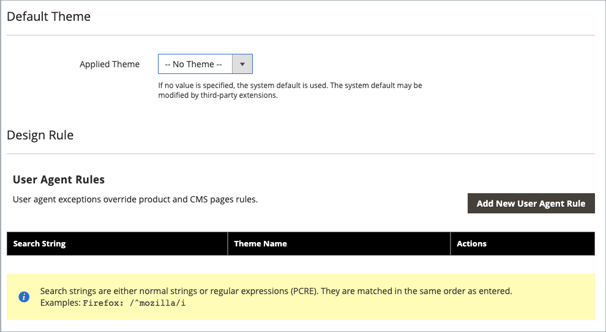

# デザイン設定

デザイン設定を使用すると、単一ページに設定を表示することで、デザイン関連のルールと設定設定を簡単に編集できます。

{width="700" zoomable="yes"}

## デザイン設定の変更

1. _管理者_ サイドバーで、**[!UICONTROL Content]** > _[!UICONTROL Design]_>**[!UICONTROL Configuration]**に移動します。

1. 設定するストアビューを見つけ、_[!UICONTROL Action]_列の&#x200B;**[!UICONTROL Edit]**をクリックします。

   このページには、ストアビューの現在のデザイン設定が表示されます。

1. デフォルトのテーマを変更するには、**[!UICONTROL Applied Theme]**&#x200B;をビューに適用するテーマに設定します。

   テーマを指定しない場合は、システムのデフォルトのテーマが使用されます。 一部のサードパーティの拡張機能は、システムのデフォルトのテーマを変更します。

1. [!BADGE PaaSのみ]{type=Informative url="https://experienceleague.adobe.com/en/docs/commerce/user-guides/product-solutions" tooltip="Adobe Commerce on Cloud プロジェクト（Adobeで管理されるPaaS インフラストラクチャ）とオンプレミス プロジェクトにのみ適用されます。"} テーマを特定のデバイスにのみ使用する場合は、**[!UICONTROL User Agent Rules]**&#x200B;を設定します。

   {width="400" zoomable="yes"}

   テーマを指定するデバイスタイプごとに：

   - **[!UICONTROL Add New User Agent Rule]**&#x200B;をクリックします。

   - **[!UICONTROL Search String]**&#x200B;に、特定のデバイスのブラウザーIDを入力します。

     検索文字列は、正規表現またはPerl互換性のある正規表現（PCRE）のいずれかです（詳細は[User Agent](https://en.wikipedia.org/wiki/User_agent)を参照）。 次の検索文字列はFirefoxを識別します：

         /^mozilla/i
     
   - **[!UICONTROL Theme Name]**&#x200B;で、指定したデバイスに使用するテーマを選択します。

   >[!NOTE]
   >
   >指定するデバイスに対して、いくつでもルールを追加できます。 検索文字列は、入力された順序で一致します。

1. _[!UICONTROL Other Settings]_で、各セクションを展開し、リンクされたトピックの指示に従って、必要に応じて設定を編集します。

   - [!BADGE PaaSのみ]{type=Informative url="https://experienceleague.adobe.com/en/docs/commerce/user-guides/product-solutions" tooltip="Adobe Commerce on Cloud プロジェクト（Adobeで管理されるPaaS インフラストラクチャ）とオンプレミス プロジェクトにのみ適用されます。"} [[!UICONTROL Pagination]](../catalog/navigation-product-listings.md#pagination-controls)
   - [!BADGE PaaSのみ]{type=Informative url="https://experienceleague.adobe.com/en/docs/commerce/user-guides/product-solutions" tooltip="Adobe Commerce on Cloud プロジェクト（Adobeで管理されるPaaS インフラストラクチャ）とオンプレミス プロジェクトにのみ適用されます。"} [[!UICONTROL HTML Head]](page-setup.md#html-head)
   - [!BADGE PaaSのみ]{type=Informative url="https://experienceleague.adobe.com/en/docs/commerce/user-guides/product-solutions" tooltip="Adobe Commerce on Cloud プロジェクト（Adobeで管理されるPaaS インフラストラクチャ）とオンプレミス プロジェクトにのみ適用されます。"} [[!UICONTROL Header]](page-setup.md#header)
   - [!BADGE PaaSのみ]{type=Informative url="https://experienceleague.adobe.com/en/docs/commerce/user-guides/product-solutions" tooltip="Adobe Commerce on Cloud プロジェクト（Adobeで管理されるPaaS インフラストラクチャ）とオンプレミス プロジェクトにのみ適用されます。"} [[!UICONTROL Footer]](page-setup.md#footer)
   - [!BADGE PaaSのみ]{type=Informative url="https://experienceleague.adobe.com/en/docs/commerce/user-guides/product-solutions" tooltip="Adobe Commerce on Cloud プロジェクト（Adobeで管理されるPaaS インフラストラクチャ）とオンプレミス プロジェクトにのみ適用されます。"} [[!UICONTROL Search Engine Robots]](../merchandising-promotions/seo-overview.md#search-engine-robots)
   - [[!UICONTROL Product Image Watermarks]](../catalog/product-image.md#watermarks)
   - [[!UICONTROL Transactional Emails]](../systems/email-templates.md#configure-email-templates)

   {width="500" zoomable="yes"}

1. 完了したら、**[!UICONTROL Save Configuration]**&#x200B;をクリックします。
