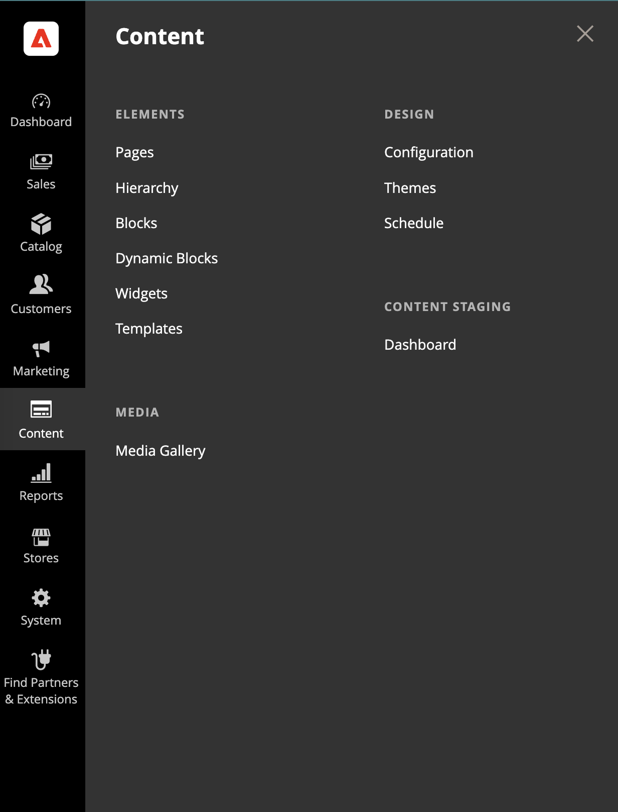
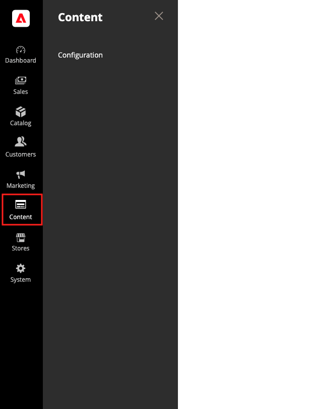

# [!UICONTROL Content] メニュー

>[!NOTE]
>
>新しい[[!DNL Media Gallery]](media-gallery.md)が有効になると、_[!UICONTROL Media]_セクションが表示され、1つのオプションで[!DNL Media Gallery]にアクセスできます。**[!UICONTROL Enable Old Media Gallery]**オプションを`No`に設定するには、**[!UICONTROL Stores]**>_[!UICONTROL Settings]_ > **[!UICONTROL Configuration]**&#x200B;に移動し、左側のパネルで&#x200B;**[!UICONTROL Advanced]** > **[!UICONTROL System]**&#x200B;を選択します。

>[!BEGINTABS]

>[!TAB Adobe Commerce]

[!BADGE PaaSのみ]{type=Informative url="https://experienceleague.adobe.com/en/docs/commerce/user-guides/product-solutions" tooltip="Adobe Commerce on Cloud プロジェクト（Adobeで管理されるPaaS インフラストラクチャ）とオンプレミス プロジェクトにのみ適用されます。"}

{width="400" zoomable="yes"}に表示される[!UICONTROL Content] メニュー

>[!TAB Adobe Commerce as a Cloud Service]

[!BADGE SaaSのみ]{type=Positive url="https://experienceleague.adobe.com/en/docs/commerce/user-guides/product-solutions" tooltip="Adobe Commerce as a Cloud ServiceおよびAdobe Commerce Optimizer プロジェクト（Adobeが管理するSaaS インフラストラクチャ）にのみ適用されます。"}

{width="400" zoomable="yes"}に表示される[!UICONTROL Content] メニュー

>[!ENDTABS]

## [!UICONTROL Content] メニューの表示

_管理者_ サイドバーで、**[!UICONTROL Content]**&#x200B;を選択します。

## [!UICONTROL Elements]

- テキスト、画像、ブロック、変数、ウィジェットを使用して[ ページ ](pages.md)を作成します。 ページは、ストアのナビゲーションに組み込んだり、他のページにリンクしたりできます。
-  （Adobe Commerceのみ）ナビゲーション機能を使用して、ページを[階層](page-hierarchy.md)に整理します。
- コードを記述せずに、コンテンツの[ ブロック ](blocks.md)を作成します。 ブロックにはテキスト、画像、動画などを含め、ページレイアウトの任意の部分に割り当てることができます。
-  （Adobe Commerceのみ）動的ブロック [を作成して](dynamic-blocks.md) リッチでインタラクティブなコンテンツを組み込みます。このコンテンツは、[価格ルール ](../merchandising-promotions/introduction.md#promotions)および[顧客セグメント ](../customers/customer-segments.md)のロジックに基づいています。
- 動的なデータを表示する[ ウィジェット ](widgets.md)を作成し、ストア内の任意の場所にブロック、リンク、インタラクティブ要素を追加します。
- ページビルダーコンテンツから[ テンプレート ](../page-builder/templates.md)を作成し、新しいコンテンツを追加（または古いコンテンツを置き換える）する際の時間と労力を節約します。

>[!NOTE]
>
>このメニューの&#x200B;_[!UICONTROL Banners]_オプションは2.3.1で廃止され、削除されました。 その機能はダイナミックブロックに置き換えられます。

## [!UICONTROL Design] {#design-features}

ストアのビジュアルプレゼンテーションを管理します。

- [ デザイン設定](configuration.md)を設定して、[!DNL Commerce] インストールでweb サイト、ストア、ビューごとに異なる設定を管理します。

- レイアウトファイル、テンプレートファイル、翻訳ファイル、スキンのコレクションである[ テーマ ](themes.md)を使用して、ストアの視覚的なプレゼンテーションを決定します。

- [ スケジュール ](schedule.md)を使用して、シーズンまたはプロモーションのテーマの変更を事前に計画します。

## [!UICONTROL Content Staging]

{{ee-feature}}

[ コンテンツのステージング ](content-staging.md)を使用すると、ビジネス チームは、ストアの管理者から直接、さまざまなコンテンツの更新を簡単に作成、プレビュー、スケジュールできます。
