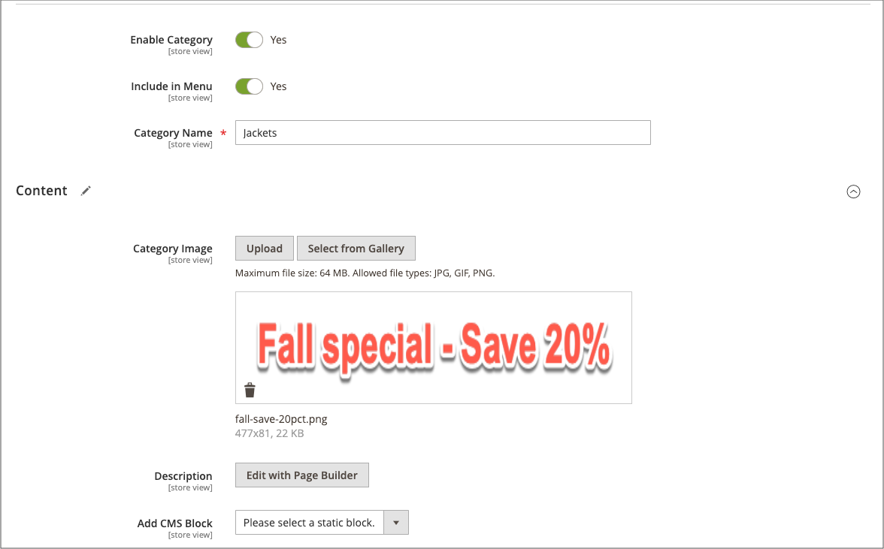
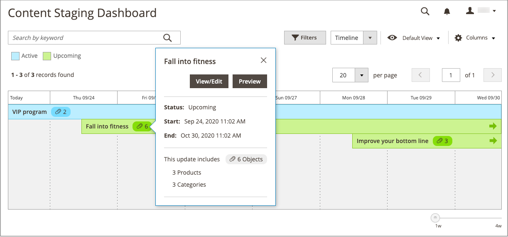

# キャンペーンへの項目の追加

{{ee-feature}}

次の例では、キャンペーン中にプロモーション画像をカテゴリページに追加します。 製品ページまたはCMSページに対しても、同じ操作を行うことができます。

## カテゴリのキャンペーン項目の追加

1. _管理者_ サイドバーで、**[!UICONTROL Catalog]**/**[!UICONTROL Categories]** に移動します。

1. キャンペーンで使用するカテゴリを見つけ、編集モードで開きます。

1. 「**[!UICONTROL Schedule New Update]**」をクリックします。

1. 「**[!UICONTROL Assign to Existing Campaign]**」を選択します。

1. リストで、変更するキャンペーンを選択します。

   {width="600" zoomable="yes"}

1.  **[!UICONTROL Content]** を展開します。

1. **[!UICONTROL Category Image]**:「**[!UICONTROL Upload]**」をクリックし、キャンペーン中にカテゴリページに表示する画像を選択します。

   {width="600" zoomable="yes"}

1. 完了したら、「**[!UICONTROL Save]**」をクリックします。

## 項目の検証

1. _管理者_ サイドバーで、**[!UICONTROL Content]**/_[!UICONTROL Content Staging]_/**[!UICONTROL Dashboard]**&#x200B;に移動します。

1. 表示されたリストまたはタイムラインでキャンペーンを見つけて、開いて詳細にアクセスします。

   - リストを表示するには、「**[!UICONTROL Select]**」をクリックし、_[!UICONTROL Action]_&#x200B;の列の「**[!UICONTROL View/Edit]**」をクリックします。
   - タイムライン表示の場合、1 回クリックして概要を表示し、「**[!UICONTROL View/Edit]**」をクリックします。

   {width="600" zoomable="yes"}

1. **[!UICONTROL Categories]** を展開して、割り当てられたカテゴリのリストを表示します。

1. キャンペーンがアクティブなときにカテゴリのページをレビューするには、ダッシュボードに戻ってキャンペーンをもう一度クリックし、「**[!UICONTROL Preview]**」をクリックします。
