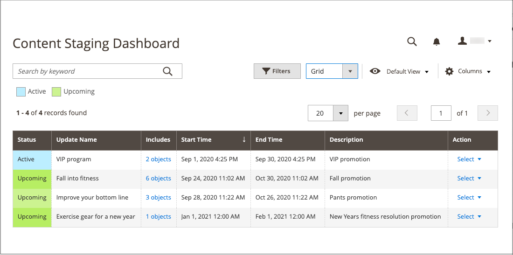
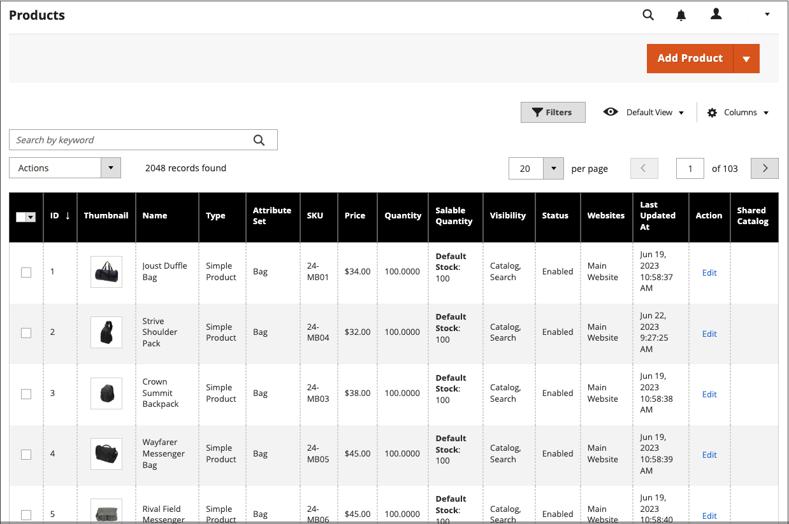

# コンテンツのステージングダッシュボード

{{ee-feature}}

[!UICONTROL Content Staging] ダッシュボードには、アクティブなすべてのキャンペーンと今後のキャンペーンの概要が表示されます。 ダッシュボードの形式は、グリッドからタイムラインに変更できます。 また、フィルターを使用してキャンペーンを検索したり、列レイアウトをカスタマイズしたり、グリッドの様々なビューを保存したりすることもできます。 ワークスペース制御について詳しくは、[管理者ワークスペース ](../getting-started/admin-workspace.md)を参照してください。

{width="600" zoomable="yes"}

## ステージングダッシュボードを見る

1. _管理者_ サイドバーで、**[!UICONTROL Content]** > _[!UICONTROL Content Staging]_>**[!UICONTROL Dashboard]**に移動します。

1. ダッシュボードの形式を変更するには、**[!UICONTROL View As]** コントロールを`list`、`Grid`、または`Timeline`に設定します。

   {width="600" zoomable="yes"}

   タイムラインが表示されている場合、右下隅のスライダーを使用して、1週間から4週間のビューを調整できます。 各列は1日を表します。

1. タイムラインが表示されている場合は、スライダーを右端の`4w`位置までドラッグして、長いスパンを表示します。

   {width="600" zoomable="yes"}

1. キャンペーンに関する一般的な情報を表示するには、ページ上の任意の項目をクリックします。

   - キャンペーンを開くには、**[!UICONTROL View/Edit]**&#x200B;をクリックします。

   - その日にストアの顧客にキャンペーンがどのように表示されるかを確認するには、**[!UICONTROL Preview]**&#x200B;をクリックします。

   {width="600" zoomable="yes"}

## ステージングダッシュボードの列の説明

| 列 | 説明 |
|--- |--- |
| [!UICONTROL Status] | キャンペーンのステータス： `Active`または`Upcoming`。 |
| [!UICONTROL Update Name] | キャンペーンの名前。 |
| [!UICONTROL Includes] | キャンペーンに含めるオブジェクトの数を定義します。 |
| [!UICONTROL Start Time] | キャンペーンが開始される日付。 |
| [!UICONTROL End Time] | キャンペーンが終了する日付。 |
| [!UICONTROL Description] | 各キャンペーンの追加説明。 |
| [!UICONTROL Action] | 個々のレコードに適用できるアクションは次のとおりです。 **[!UICONTROL View/Edit]**- キャンペーンを編集モードで開きます。 **[!UICONTROL Preview]** - キャンペーンをプレビューモードで表示します。 |

{style="table-layout:auto"}

## キャンペーンの編集

既存のキャンペーンオブジェクトは、終了日のない価格ルールキャンペーンを除き、ステージングダッシュボードから編集できます。

>[!NOTE]
>
>アクティブなキャンペーンが最初に終了日なしで作成された場合、そのキャンペーンを後で編集して終了日を含めることはできません。 この場合、重複する施策を作成し、必要な終了日を入力する必要があります。

{width="600" zoomable="yes"}

この例のキャンペーンには、2つのカテゴリと3つの個別の製品が含まれています。

このキャンペーンのオブジェクトを編集するには、次の手順に従います。

1. _管理者_ サイドバーで、**[!UICONTROL Content]** > _[!UICONTROL Content Staging]_>**[!UICONTROL Dashboard]**に移動します。

1. 表示されたリストまたはタイムラインでキャンペーンを見つけ、それを開いて詳細にアクセスします。

   - リストを表示するには、**[!UICONTROL Select]**&#x200B;をクリックし、_[!UICONTROL Action]_列の&#x200B;**[!UICONTROL View/Edit]**をクリックします。
   - タイムライン表示の場合は、1回クリックして概要を表示し、**[!UICONTROL View/Edit]**&#x200B;をクリックします。

1. 必要に応じて、_[!UICONTROL General]_セクションのいずれかの設定を更新します。

1. を展開して、編集対象の項目を含む任意のセクションを展開します。

   {width="600" zoomable="yes"}

1. **[!UICONTROL Save]**&#x200B;をクリックします。
