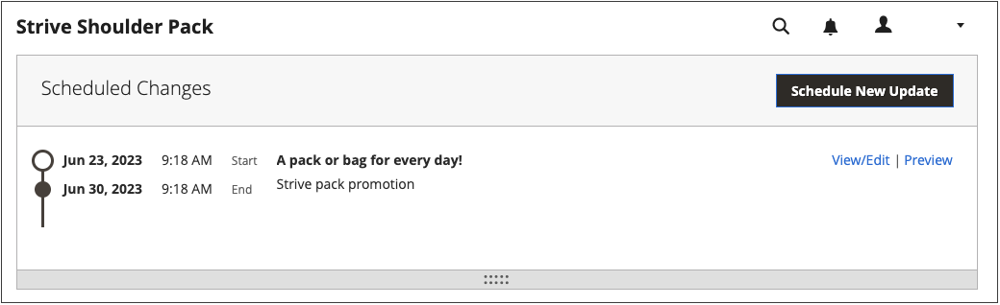

# コンテンツ更新のスケジュール

{{ee-feature}}

次の例は、製品の一時的な価格変更をスケジュールする方法を示しています。 これには、変更のスケジュール設定とプレビュー、スケジュールされた更新のカレンダーでの表示が含まれます。 この例では、1回の変更のみを含みますが、施策では、商品、価格規則、CMSページ、および同時に行われる予定のその他のエンティティに対する複数の変更を含めることができます。 同様の方法で、[!UICONTROL Set Product As New]属性の開始日/終了日を指定します。

>[!NOTE]
>[!UICONTROL Set Product As New]の開始日（および終了日）を指定するには、スケジュールされた更新を作成する必要があります。 [!UICONTROL Special Price]および[!UICONTROL Design Change]の場合、開始日/終了日フィールドはAdobe Commerceから削除され、Magento Open Sourceでのみ使用できます。
>
>スケジュールされた更新はすべて連続して適用されます。つまり、どのエンティティも一度に1つのスケジュールされた更新のみを持つことができます。 スケジュールされた更新は、その時間枠内のすべてのストアビューに適用されます。 その結果、エンティティは、異なるストアビューに対して異なるスケジュールされた更新を同時に行うことはできません。 現在のスケジュールされた更新の影響を受けない、すべてのストアビュー内のすべてのエンティティ属性値は、以前のスケジュールされた更新の値ではなく、デフォルト値から取得されます。

## 製品の更新をスケジュール

1. _[!UICONTROL Products]_&#x200B;グリッドから、商品を編集モードで開きます。

1. ページ上部の&#x200B;_[!UICONTROL Scheduled Changes]_&#x200B;ボックスで、**[!UICONTROL Schedule New Update]**&#x200B;をクリックします。

   {width="600" zoomable="yes"}

1. **[!UICONTROL Save as a New Update]** オプションを選択した状態で、更新の基本パラメーターを設定します。

   - **[!UICONTROL Update Name]**&#x200B;に、新しいコンテンツステージングキャンペーンの名前を入力します。

   - 更新プログラムの概要&#x200B;**[!UICONTROL Description]**&#x200B;とその使用方法を入力します。

   - カレンダー（）ツールを使用して、キャンペーンの&#x200B;**開始日**&#x200B;と&#x200B;**終了日**&#x200B;を選択します。

     オープンエンドのキャンペーンを作成するには、終了日を指定しないでください（空白のままにします）。 この例では、キャンペーンは2021年1月1日午前0時（太平洋標準時）に開始される予定です。:00

     終了日なしで作成された価格ルールキャンペーンの場合、終了日を後で追加することはできません。 このような場合は、キャンペーンを作成し、開始日を古いキャンペーンを終了する日付に設定し、新しいキャンペーンを開始する日付に設定する必要があります。 その開始日に、古いキャンペーンが終了し、新しいキャンペーンが定義どおりに開始されます。

     {width="600" zoomable="yes"}

     >[!NOTE]
     >
     >キャンペーンの開始日と終了日は、各web サイトのローカルタイムゾーンから変換される&#x200B;**_default_**&#x200B;管理者タイムゾーンを使用して定義する必要があります。 例えば、異なるタイムゾーンに複数のweb サイトがある場合、米国（デフォルト）のタイムゾーンに基づいてキャンペーンを開始する場合は、ローカルタイムゾーンごとに個別の更新をスケジュールする必要があります。 この場合、各ローカル web サイトのタイムゾーンからデフォルトの管理者タイムゾーンに変換する&#x200B;**[!UICONTROL Start Date]**&#x200B;と&#x200B;**[!UICONTROL End Date]**&#x200B;を設定します。

1. _[!UICONTROL Price]_&#x200B;までスクロールして、**[!UICONTROL Advanced Pricing]**&#x200B;をクリックします。

1. スケジュールされたキャンペーン中に製品の&#x200B;**[!UICONTROL Special Price]**&#x200B;を入力し、**[!UICONTROL Done]**&#x200B;をクリックします。

1. 完了したら、**[!UICONTROL Save]**&#x200B;をクリックします。

   予定された変更は、製品ページの上部に表示され、キャンペーンの開始日と終了日が表示されます。

   {width="600" zoomable="yes"}

## スケジュールされた変更の編集

1. ページ上部の「_変更予定_」ボックスで、「**[!UICONTROL View/Edit]**」をクリックします。

1. スケジュールされた更新に必要な変更を加えます。

1. **[!UICONTROL Save]**&#x200B;をクリックします。

## スケジュールされた変更のプレビュー

ページ上部の「_変更予定_」ボックスで、「**[!UICONTROL Preview]**」をクリックします。

プレビューでは、新しいブラウザータブが開き、スケジュールされたキャンペーン中に製品がどのように表示されるかを示します。

>[!NOTE]
>
>スケジュールされた更新のステージング プレビューは、常に&#x200B;**default** ストアビューから開始され、ステージング更新キャンペーンをナビゲートする顧客のエクスペリエンスをエミュレートします。

プレビューコンテンツツールを使用してプレビューの日付と範囲を変更する方法について詳しくは、[&#x200B; キャンペーンのプレビュー](content-staging-preview.md)を参照してください。 ストアのプレビューへのリンクを同僚と共有することもできます。
