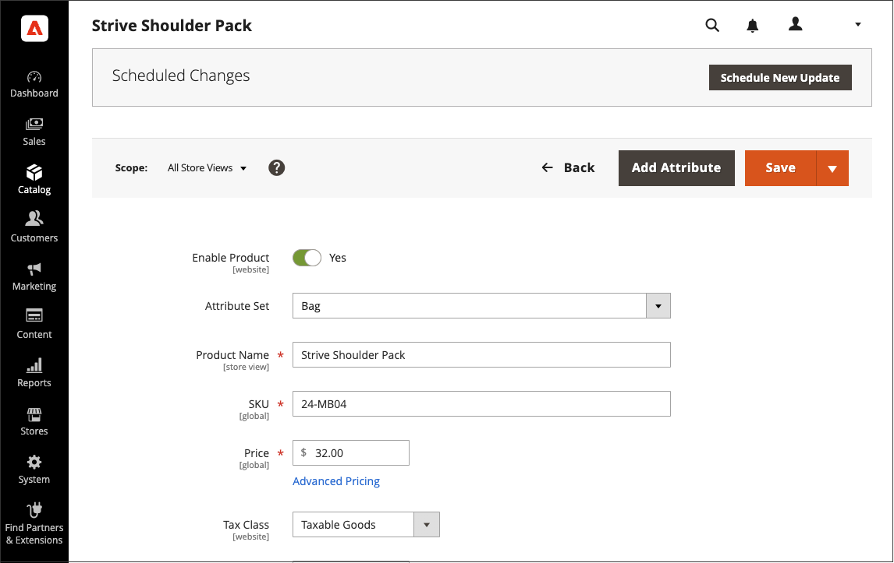

# コンテンツの更新をスケジュール

{{ee-feature}}

次の例は、商品の一時的な価格変更をスケジュールする方法を示しています。 これには、変更のスケジュールとプレビュー、およびスケジュールされた更新のカレンダーでの表示が含まれます。 この例には 1 つの変更のみが含まれますが、キャンペーンには、同時に実行されるようにスケジュールされた製品、価格ルール、CMS ページおよびその他のエンティティに対する複数の変更が含まれる場合があります。 同様の方法に従って、[!UICONTROL Set Product As New] 属性の開始日/終了日を指定します。

>[!NOTE]
>[!UICONTROL Set Product As New] の開始日（および終了日）を指定するには、スケジュールされた更新を作成する必要があります。 [!UICONTROL Special Price] および [!UICONTROL Design Change] の場合、開始日/終了日フィールドはAdobe Commerceから削除され、Magento Open Sourceでのみ使用できます。
>
>スケジュールされた更新はすべて連続して適用されます。つまり、どのエンティティも一度に 1 つのスケジュールされた更新しか持つことができません。 スケジュールされた更新は、その期間内のすべてのストアビューに適用されます。 その結果、1 つのエンティティに対して、異なるストア表示の異なるスケジュールされた更新を同時に行うことはできません。 現在スケジュールされている更新の影響を受けないすべてのストアビュー内のすべてのエンティティ属性値は、前回スケジュールされた更新ではなく、デフォルト値から取得されます。

## 製品の更新をスケジュール

1. _[!UICONTROL Products]_グリッドから、編集モードで製品を開きます。

1. ページ上部の _[!UICONTROL Scheduled Changes]_ボックスで、[**[!UICONTROL Schedule New Update]**] をクリックします。

   {width="600" zoomable="yes"}

1. **[!UICONTROL Save as a New Update]** オプションを選択した状態で、更新の基本パラメーターを設定します。

   - **[!UICONTROL Update Name]**：新しいコンテンツのステージングキャンペーンの名前を入力します。

   - 更新の簡単な **[!UICONTROL Description]** と使用方法を入力します。

   - カレンダー（）ツールを使用して、キャンペーンの **開始日** と **終了日** を選択します。

     無期限のキャンペーンを作成するには、終了日を指定しません（空白のままにします）。 この例では、キャンペーンは、2021 年 1 月 1 日の午前 0 時（PT）の午前 12:00 （PST）に開始されるようにスケジュールされています。

     終了日なしで作成された価格ルールキャンペーンの場合、終了日を後で追加することはできません。 このような場合は、キャンペーンを作成し、開始日を、古いキャンペーンを終了する日付と新しいキャンペーンを開始する日付に設定する必要があります。 その開始日に、古いキャンペーンが終了し、新しいキャンペーンは定義どおりに開始されます。

     {width="600" zoomable="yes"}

     >[!NOTE]
     >
     >キャンペーンの開始日と終了日は、**_デフォルト_** の管理者タイムゾーンを使用して定義する必要があります。このタイムゾーンは、各 web サイトのローカルタイムゾーンから変換されます。 例えば、異なるタイムゾーンに複数の web サイトがあり、米国（デフォルト）のタイムゾーンに基づいてキャンペーンを開始する場合、ローカルタイムゾーンごとに個別の更新をスケジュールする必要があります。 この場合は、各ローカル Web サイトのタイムゾーンからデフォルトの管理者タイムゾーンに変換された **[!UICONTROL Start Date]** と **[!UICONTROL End Date]** を設定します。

1. _[!UICONTROL Price]_まで下にスクロールし、「**[!UICONTROL Advanced Pricing]**」をクリックします。

1. スケジュール済みキャンペーン中に製品の **[!UICONTROL Special Price]** を入力し、「**[!UICONTROL Done]**」をクリックします。

1. 完了したら、「**[!UICONTROL Save]**」をクリックします。

   スケジュールされた変更が、キャンペーンの開始日と終了日と共に、製品ページの上部に表示されます。

   {width="600" zoomable="yes"}

## スケジュールされた変更の編集

1. ページ上部の _スケジュールされた変更_ ボックスで、「**[!UICONTROL View/Edit]** 更」をクリックします。

1. スケジュールされている更新に必要な変更を加えます。

1. 「**[!UICONTROL Save]**」をクリックします。

## スケジュールされた変更のプレビュー

ページ上部の _スケジュールされた変更_ ボックスで、「**[!UICONTROL Preview]** 更」をクリックします。

プレビューでは、新しいブラウザータブが開き、スケジュールされたキャンペーン中に製品がどのように表示されるかを示します。

>[!NOTE]
>
>スケジュールされた更新のステージングプレビューは、常に **デフォルト** のストア表示から開始されます。この表示は、ステージング更新キャンペーンをナビゲートする顧客のエクスペリエンスをエミュレートします。

プレビューコンテンツツールを使用してプレビューの日付と範囲を変更する方法について詳しくは、「[ キャンペーンのプレビュー ](content-staging-preview.md)」を参照してください。 ストアのプレビューへのリンクを同僚と共有することもできます。
