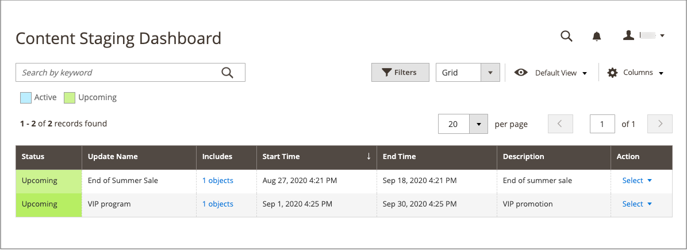

# コンテンツのステージング

{{ee-feature}}

コンテンツのステージング機能により、ビジネス チームは&#x200B;_管理者_&#x200B;から直接、ストアの様々なコンテンツ更新を簡単に作成、プレビュー、スケジュールできます。 例えば、静的なページではなく、スケジュールに基づいて&#x200B;_on_&#x200B;または&#x200B;_off_&#x200B;に切り替えることができる様々な要素のコレクションとしてページを考えてみましょう。 コンテンツのステージング機能を利用すれば、年間を通じて自動的に更新されるページをスケジュールどおりに作成できます。

_campaign_&#x200B;という用語は、スケジュールされた変更のレコード、またはステージングダッシュボードから管理される変更のコレクションを指します。 変更内容は、カレンダーまたはタイムラインで表示できます。 _スケジュールされた変更_&#x200B;と&#x200B;_スケジュールされた更新_&#x200B;という用語は互換性があり、1つの変更を参照します。

特定の期間のコンテンツ変更をスケジュールすると、スケジュールされた変更の有効期限が切れると、コンテンツは以前のバージョンに戻ります。 同じベースラインコンテンツの複数のバージョンを作成して、今後の更新に使用できます。 タイムラインに戻って、コンテンツの以前のバージョンを表示することもできます。 ドラフトバージョンを保存するには、タイムライン上で日付を割り当てるだけで、その日付がプロダクションに入らない未来まで遡ることができます。

## コンテンツのステージングオブジェクトとキャンペーン

開始日と終了日に関連するフィールドがAdobe Commerceから削除され、カート価格ルール、カタログ価格ルール、商品、カテゴリ、およびCMS ページで直接変更できません。 これらのアクティベーションのスケジュールされた更新を作成する必要があります。

スケジュールされた更新はすべて連続して適用されます。つまり、どのエンティティも一度に1つのスケジュールされた更新のみを持つことができます。 スケジュールされた更新は、その時間枠内のすべてのストアビューに適用されます。 その結果、エンティティは、異なるストアビューに対して異なるスケジュールされた更新を同時に行うことはできません。 現在のスケジュールされた更新の影響を受けない、すべてのストアビュー内のすべてのエンティティ属性値は、以前のスケジュールされた更新の値ではなく、デフォルト値から取得されます。

次のいずれかのオブジェクトに対して新しいスケジュールされた更新が作成されると、対応するキャンペーンがプレースホルダーとして作成され、ページの上部に&#x200B;_[!UICONTROL Scheduled Changes]_&#x200B;ボックスが表示されます。 プレースホルダーキャンペーンには開始日がありますが、終了日はありません。 キャンペーンの一環としてコンテンツの更新をスケジュールし、その変更を日付、時間、またはストアビューごとにプレビューして共有することができます。 1つのオブジェクトに対して新しいキャンペーンを作成した後、他のオブジェクトのスケジュールされた更新として割り当てることができます。

- [特定可能](../catalog/product-scheduled-changes.md)
- [カテゴリ](../catalog/category-scheduled-changes.md)
- [カタログ価格ルール](../merchandising-promotions/price-rule-catalog-scheduled-changes.md)
- [カートの価格ルール](../merchandising-promotions/price-rule-cart-scheduled-changes.md)
- [CMS Pages](pages-workspace.md#scheduled-changes)
- [CMSブロック](blocks.md)

## コンテンツのステージングワークフロー

1. **ベースラインコンテンツの作成**

   ベースラインは、キャンペーンのないアセットのコンテンツであり、ページ上部の「_[!UICONTROL Scheduled Changes]_」セクションの下にあるすべてを含みます。 タイムライン上のその場所に変更がスケジュールされているアクティブなキャンペーンがない限り、ベースラインコンテンツは常に使用されます。

1. **最初のキャンペーンを作成**

   必要に応じて、開始日と終了日を設定した最初のキャンペーンを作成します。 キャンペーンをオープンエンドにするには、終了日を空白のままにします。 最初のキャンペーンが終了すると、元のベースラインコンテンツが復元されます。

   キャンペーンの開始日と終了日は、各web サイトのローカルタイムゾーンから変換される&#x200B;**_default_**&#x200B;管理者タイムゾーンを使用して定義する必要があります。 複数のタイムゾーンに複数のweb サイトを持ち、米国のタイムゾーンに基づいて施策を開始したい場合の例を考えてみましょう。 この場合、ローカルのタイムゾーンごとに個別の更新をスケジュールし、各ローカル web サイトのタイムゾーンからデフォルトの管理者のタイムゾーンに変換する&#x200B;**[!UICONTROL Start Date]**&#x200B;と&#x200B;**[!UICONTROL End Date]**&#x200B;を設定する必要があります。

1. **2つ目のキャンペーンを追加**

   必要に応じて、開始日と終了日を設定した2つ目のキャンペーンを作成します。 2つ目のキャンペーンは、まったく異なる期間に割り当てることができます。 同じアセットに対して複数のキャンペーンを作成する場合、キャンペーンを重ねることはできません。 必要なだけキャンペーンを作成できます。

   まだ開始していない既存のキャンペーンに、複数のアセットを割り当てることができます。 例えば、同じキャンペーンの範囲で、2つの異なる製品価格を将来の開始日と共に更新できます。

   >[!NOTE]
   >
   >キャンペーンが複数のエンティティにリンクされている場合、キャンペーンは[&#x200B; コンテンツステージングダッシュボード &#x200B;](content-staging-dashboard.md)からのみ編集できます。

1. **ベースラインコンテンツの復元**

   すべてのキャンペーンに終了日がある場合、すべてのアクティブなキャンペーンが終了すると、ベースラインコンテンツが復元されます。

   >[!NOTE]
   >
   >アクティブなキャンペーンが最初に終了日なしで作成された場合、そのキャンペーンを後で編集して終了日を含めることはできません。 この場合、重複する施策を作成し、必要な終了日を入力する必要があります。

>[!NOTE]
>
>エンティティのステージング更新がアクティブな場合、エンティティを編集すると、現在アクティブなステージング更新が編集されます。 ステージング更新が終了したときに復元されるベースラインコンテンツには影響しません。

## [!UICONTROL Content Staging] ダッシュボード

[!UICONTROL Content Staging] [&#x200B; ダッシュボード &#x200B;](content-staging-dashboard.md)は、予定されているすべてのサイトの変更と更新を可視化します。 キャンペーンのどの日、日付の範囲、または期間でも、プレビューして他のユーザーと共有することができます。

{width="600" zoomable="yes"}

## コンテンツのステージングデモ

コンテンツのステージングについて詳しくは、次の動画をご覧ください。

>[!VIDEO](https://video.tv.adobe.com/v/343784?quality=12&learn=on)

## リソースのトラブルシューティング

コンテンツのステージングの問題のトラブルシューティングについては、次の[!DNL Commerce] サポート技術情報の記事を参照してください。

- [コンテンツのステージングの問題により、すべてのページでエラー404](https://experienceleague.adobe.com/docs/commerce-knowledge-base/kb/troubleshooting/site-down-or-unresponsive/error-404-on-all-pages-due-to-content-staging-issue.html?lang=ja)
- [スケジュールされたコンテンツステージングの更新が、古いFastly キャッシュで表示されない](https://experienceleague.adobe.com/docs/commerce-knowledge-base/kb/troubleshooting/miscellaneous/scheduled-content-staging-updates-not-displayed-with-stale-fastly-cache.html?lang=ja)
- [共有カタログの価格に関するコンテンツステージングの更新をスケジュールできますか？](https://experienceleague.adobe.com/docs/commerce-knowledge-base/kb/faq/can-i-schedule-content-staging-updates-for-prices-in-a-shared-catalog.html?lang=ja)
