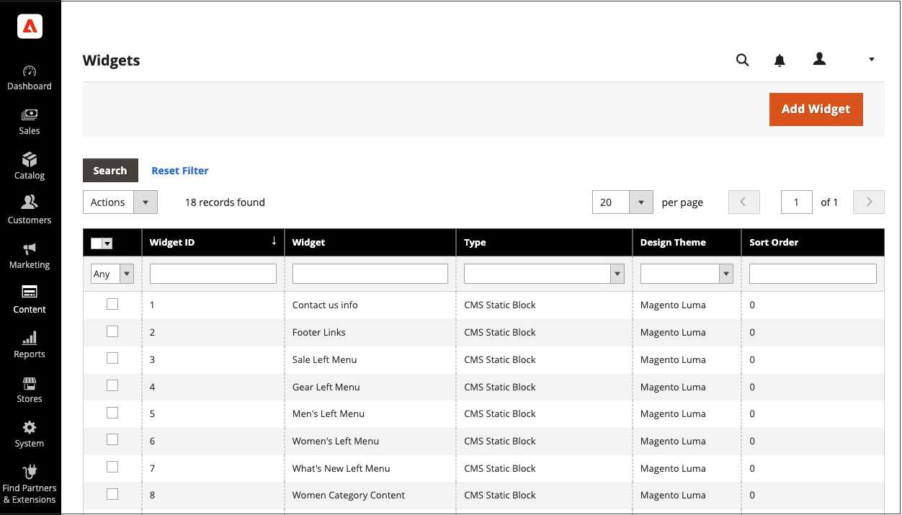
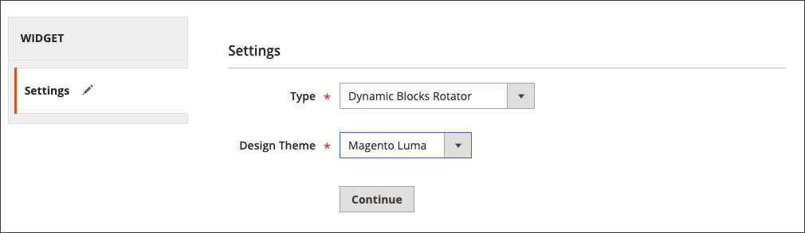
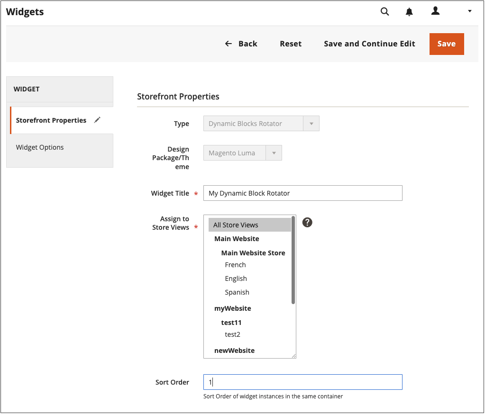
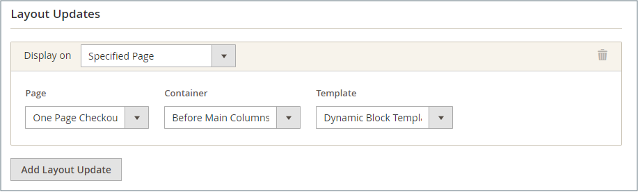
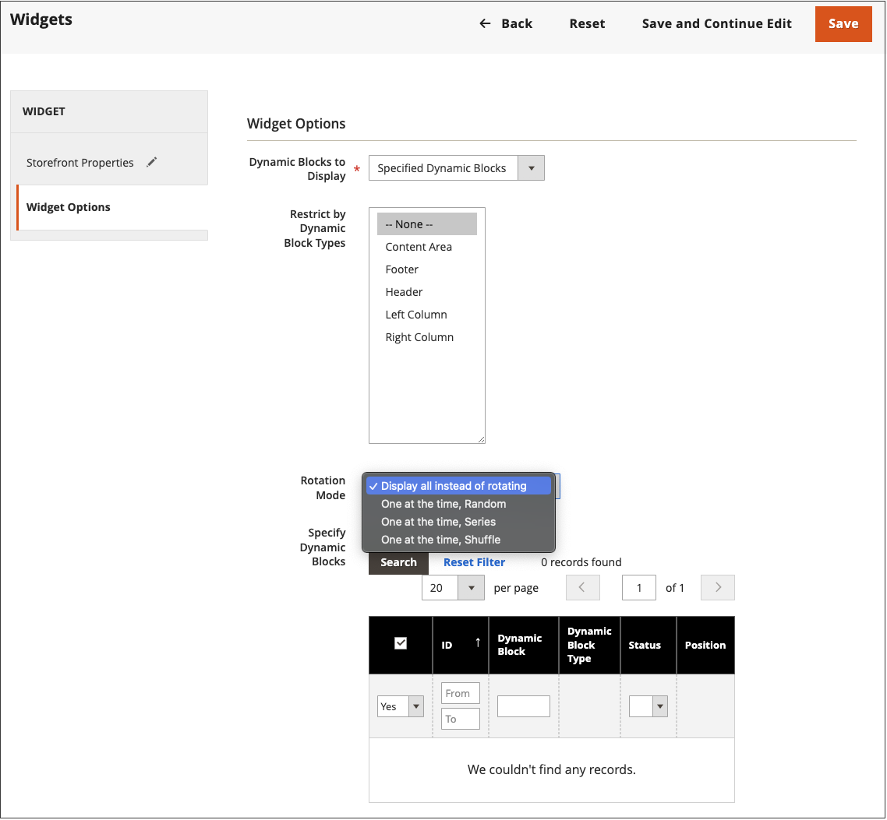

# 回転ダイナミックブロックを追加

{{ee-feature}}

インタラクティブなコンテンツのスライドショーを表示するには、複数の[動的ブロック &#x200B;](dynamic-blocks.md)を回転子に追加できます。 [&#x200B; ウィジェット &#x200B;](widgets.md) ツールは、単一ページまたはストア全体の複数ページの特定の場所に回転子を配置するために使用されます。

{width="700" zoomable="yes"}

## 手順1：個別の動的ブロックの作成

回転子に配置する動的ブロック [&#128279;](dynamic-blocks.md)を作成するには、次の手順に従います。

## 手順2：動的ブロックローテーターウィジェットの追加

1. _管理者_ サイドバーで、**[!UICONTROL Content]** > _[!UICONTROL Elements]_>**[!UICONTROL Widgets]**&#x200B;に移動します。

1. 右上隅の「**[!UICONTROL Add Widget]**」をクリックします。

1. _設定_&#x200B;で、**[!UICONTROL Type]**&#x200B;を`Dynamic Blocks Rotator`に設定します。

1. ストアの現在の&#x200B;**[!UICONTROL Design Theme]**&#x200B;を選択します。

   この設定は、ストアのページレイアウトを決定する現在のパッケージまたは[&#x200B; テーマ &#x200B;](themes.md)を識別します。

1. **[!UICONTROL Continue]**&#x200B;をクリックします。

   {width="600" zoomable="yes"}

## ステップ 3：オプションを完了する

1. _ストアフロントのプロパティ_&#x200B;で、オプションを設定します。

   - 回転子の&#x200B;**[!UICONTROL Title]**&#x200B;を入力します。

   - **[!UICONTROL Assign to Store Views]** リストで、回転子が使用可能な[&#x200B; ストアビュー](../getting-started/websites-stores-views.md)を選択します。

   - （オプション） **[!UICONTROL Sort Order]**&#x200B;番号を入力して、ターゲットコンテナ内の回転子の位置を決定します。 これは、同じコンテナに割り当てられる他のウィジェットに対する相対パスです。

   {width="600" zoomable="yes"}

1. _レイアウトオプション_&#x200B;で、**[!UICONTROL Add Layout Update]**&#x200B;をクリックし、次の操作を行います。

   - **[!UICONTROL Display on]**&#x200B;を、回転子が表示されるページまたはページの種類に設定します。

      - `Categories` - [&#x200B; アンカー](../catalog/navigation-layered.md)またはアンカー以外のカテゴリ ページに回転子を表示します。 オプション：アンカーカテゴリ/アンカー以外のカテゴリ
      - `Products` – 特定の種類の製品ページまたはすべての製品ページに回転子を表示します。 オプション：すべての製品タイプ / [&#x200B; シンプル製品](../catalog/product-create-simple.md) / [&#x200B; バーチャル製品](../catalog/product-create-virtual.md) / [&#x200B; バンドル製品](../catalog/product-create-bundle.md) / [&#x200B; ダウンロード可能な製品](../catalog/product-create-downloadable.md) / [&#x200B; ギフトカード &#x200B;](../catalog/product-gift-card-create.md) / [設定可能な製品](../catalog/product-create-configurable.md) / [&#x200B; グループ化された製品](../catalog/product-create-grouped.md)
      - `Generic Pages` – すべてのページ、特定のページ、または特定のレイアウトを持つページにのみ回転子を表示します。 オプション：`All Pages` / `Specified Page` / `Page Layouts`

     この例では、回転子を`Specified Page`に配置します。

   - 回転子を表示する特定の&#x200B;**[!UICONTROL Page]**&#x200B;を選択します。

   - **[!UICONTROL Container]**&#x200B;を[&#x200B; ページレイアウト &#x200B;](page-layout.md#standard-page-layouts)の回転子が表示される部分に設定します。

     他のウィジェットが同じコンテナに割り当てられている場合は、並べ替え順序に従って順番に表示されます。

   - `Dynamic Block Template`を既定の&#x200B;**[!UICONTROL Template]**&#x200B;として受け入れます。

     この設定は、回転子を単独で配置するか、既存のテキスト内に配置するかによって、回転子の書式設定に使用するテンプレートを決定します。

     {width="600" zoomable="yes"}

   - **[!UICONTROL Save and Continue Edit]**&#x200B;をクリックします。

1. 左側のパネルで、**[!UICONTROL Widget Options]**&#x200B;を選択します。

1. **[!UICONTROL Dynamic Blocks to Display]**&#x200B;の場合は、`Specified Dynamic Blocks`を受け入れます。

   この設定により、回転子に含まれるダイナミックブロックのタイプが決まります。

   - `Specified Dynamic Blocks` – 特定の動的ブロックのみを含みます。
   - `Cart Price Rule Related` - カート価格ルールに関連付けられている動的ブロックのみを含みます。
   - `Catalog Price Rule Related` - カタログ価格ルールに関連付けられている動的ブロックのみを含みます。

1. ウィジェットで使用できる&#x200B;**[!UICONTROL Restrict the Dynamic Block Types]**&#x200B;に対して、`Content Area`を選択します。

   この設定により、バナーはページレイアウトの特定の部分に限定されます。

   - `Content Area` - ダイナミックブロックをページのメインコンテンツ領域に配置します。
   - `Footer` - ダイナミックブロックをページフッターに配置します。
   - `Header` - ダイナミックブロックをページヘッダーに配置します。
   - `Left Column` – 使用可能な場合、ダイナミックブロックをページレイアウトの左列に配置します。
   - `Right Column` – 使用可能な場合、ダイナミックブロックをページレイアウトの右側の列に配置します。

1. **[!UICONTROL Rotation Mode]**&#x200B;を次のいずれかに設定します：

   - `Display all instead of rotating` – 動的ブロックのスタックを表示します。すべてのブロックが表示されます。
   - `One at a time, Random` – 指定された動的ブロックをランダムな順序で表示します。 ページが更新されると、別の（ランダムな）動的ブロックが表示されます。
   - `One at the time, Series` – 指定された動的ブロックを、追加されたシーケンスに表示します。 ページが更新されると、シーケンス内の次の動的ブロックが表示されます。
   - `One at the time, Shuffle` – 一度に1つの動的ブロックをシャッフルされた順序で表示します。 このオプションは、`One at a time, Random` オプションと似ていますが、同じ動的ブロックが繰り返されない点が異なります。

     {width="600" zoomable="yes"}

1. **[!UICONTROL Specify Dynamic Blocks]** グリッドで、回転子に含める各ダイナミック ブロックのチェックボックスを選択します。

1. 完了したら、**[!UICONTROL Save]**&#x200B;をクリックします。
