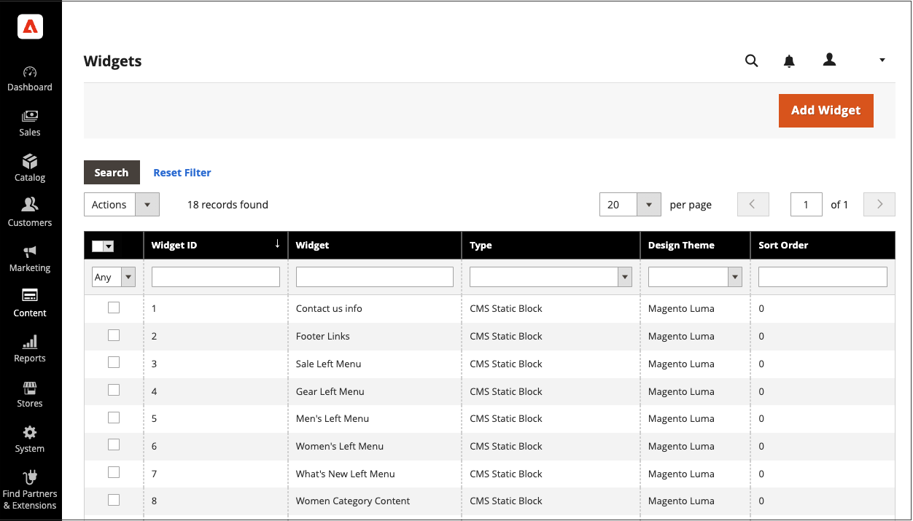

# 回転するダイナミック ブロックを追加する

{{ee-feature}}

インタラクティブコンテンツのスライドショーを表示するには、複数のコンテンツを追加します [ダイナミック ブロック](dynamic-blocks.md) ローテータに。 この [ウィジェット](widgets.md) ツールを使用して、ローテータを単一ページまたはストア全体の複数ページの特定の場所に配置します。

{width="700" zoomable="yes"}

## 手順 1：個々のダイナミック ブロックを作成する

終了 [ダイナミック ブロックを作成する](dynamic-blocks.md) ロテータに配置するには、次の手順に従います。

## 手順 2：動的ブロックローテータウィジェットの追加

1. 日 _Admin_ サイドバー、に移動 **[!UICONTROL Content]** > _[!UICONTROL Elements]_>**[!UICONTROL Widgets]**.

1. 右上隅のをクリックします。 **[!UICONTROL Add Widget]**.

1. 次の下 _設定_、設定 **[!UICONTROL Type]** 対象： `Dynamic Blocks Rotator`.

1. 現在のを選択 **[!UICONTROL Design Theme]** 店舗の。

   この設定は、現在のパッケージ、または [テーマ](themes.md) ストアのページレイアウトを決定します。

1. クリック **[!UICONTROL Continue]**.

   {width="600" zoomable="yes"}

## 手順 3：オプションの完了

1. 次の下 _ストアフロント プロパティ_、次のオプションを設定します。

   - を入力 **[!UICONTROL Title]** ローテーターのために。

   - が含まれる **[!UICONTROL Assign to Store Views]** リストで、 [ビューを保存](../getting-started/websites-stores-views.md) ロテータが使用可能な場所。

   - （任意） a と入力します **[!UICONTROL Sort Order]** ターゲットコンテナ内のローテータの位置を決定する数値。 これは、同じコンテナに割り当てられる可能性のある他のウィジェットに対する相対パスです。

   {width="600" zoomable="yes"}

1. 次の下 _レイアウトオプション_&#x200B;を選択し、 **[!UICONTROL Add Layout Update]** 次の手順を実行します。

   - を設定 **[!UICONTROL Display on]** ローテータを表示するページまたはページの種類。

      - `Categories`  – 次のいずれかで回転を表示します [アンカー](../catalog/navigation-layered.md) またはアンカーされていないカテゴリページ。 オプション：アンカーカテゴリ/アンカー以外のカテゴリ
      - `Products`  – 特定のタイプの製品ページ、またはすべての製品ページにロテータを表示します。 オプション：すべての製品タイプ / [シンプルな製品](../catalog/product-create-simple.md) /  [バーチャル製品](../catalog/product-create-virtual.md) / [バンドル製品](../catalog/product-create-bundle.md) / [ダウンロード可能製品](../catalog/product-create-downloadable.md) / [ギフトカード](../catalog/product-gift-card-create.md) / [設定可能な製品](../catalog/product-create-configurable.md) / [グループ化された製品](../catalog/product-create-grouped.md)
      - `Generic Pages`  – すべてのページ、特定のページ、または特定のレイアウトを持つページにのみローテーターを表示します。 オプション： `All Pages` / `Specified Page` / `Page Layouts`

     この例では、ロテータを `Specified Page`.

   - 特定のを選択します **[!UICONTROL Page]** ロテータが表示される場所。

   - を設定 **[!UICONTROL Container]** の部分に [ページレイアウト](page-layout.md#standard-page-layouts) ロテータが表示される場所。

     他のウィジェットが同じコンテナに割り当てられている場合、並べ替え順に従って順番に表示されます。

   - 承諾 `Dynamic Block Template` デフォルトとして **[!UICONTROL Template]**.

     この設定により、回転子を単独で配置するか、既存のテキスト内に配置するかに基づいて、回転子の書式設定に使用するテンプレートが決定されます。

     {width="600" zoomable="yes"}

   - クリック **[!UICONTROL Save and Continue Edit]**.

1. 左パネルで、を選択します。 **[!UICONTROL Widget Options]**.

1. の場合 **[!UICONTROL Dynamic Blocks to Display]**、同意する `Specified Dynamic Blocks`.

   この設定により、ロテータに含まれるダイナミック ブロックのタイプが決まります。

   - `Specified Dynamic Blocks`  – 特定のダイナミックブロックのみが含まれます。
   - `Cart Price Rule Related`  – 買い物かごの価格ルールに関連付けられた動的ブロックのみを含めます。
   - `Catalog Price Rule Related` - カタログ価格ルールに関連付けられている動的ブロックのみが含まれます。

1. 終了 **[!UICONTROL Restrict the Dynamic Block Types]** ウィジェットで使用できるオプションで、 `Content Area`.

   この設定では、バナーをページレイアウトの特定の部分に制限します。

   - `Content Area` - ページのメインコンテンツ領域に動的ブロックを配置します。
   - `Footer` - ページフッターに動的ブロックを配置します。
   - `Header` - ダイナミックブロックをページヘッダーに配置します。
   - `Left Column`  – 可能な場合は、動的ブロックをページレイアウトの左の列に配置します。
   - `Right Column`  – 可能な場合は、動的ブロックをページレイアウトの右側の列に配置します。

1. を設定 **[!UICONTROL Rotation Mode]** を次のいずれかに変更します。

   - `Display all instead of rotating`  – ダイナミック ブロックのスタックを表示します。ここで、すべてが表示されます。
   - `One at a time, Random`  – 指定したダイナミック ブロックをランダムに表示します。 ページを更新すると、別の（ランダムな）ダイナミックブロックが表示されます。
   - `One at the time, Series`  – 指定したダイナミック ブロックが追加された順序で表示されます。 ページが更新されると、シーケンス内の次の動的ブロックが表示されます。
   - `One at the time, Shuffle`  – 一度に 1 つのダイナミック ブロックを入れ替えて表示します。 このオプションは、 `One at a time, Random` 同じダイナミック ブロックが繰り返されないことを除き、オプションを使用します。

     {width="600" zoomable="yes"}

1. が含まれる **[!UICONTROL Specify Dynamic Blocks]** グリッドを選択し、回転ツールに含める各ダイナミック ブロックのチェックボックスをオンにします。

1. 完了したら、 **[!UICONTROL Save]**.
