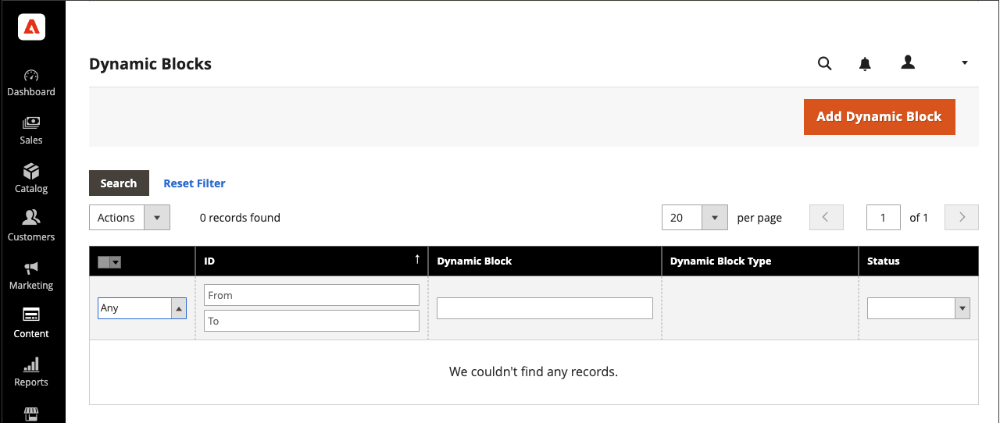
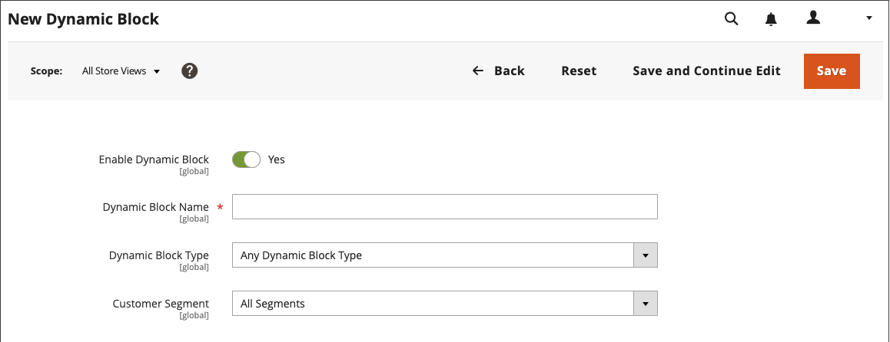
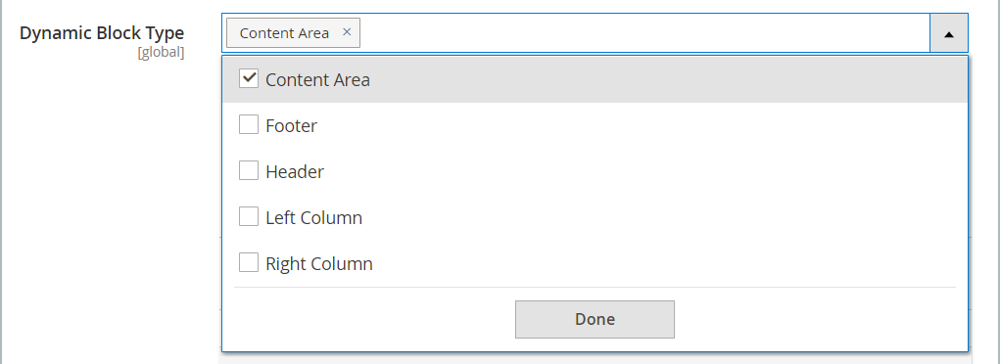
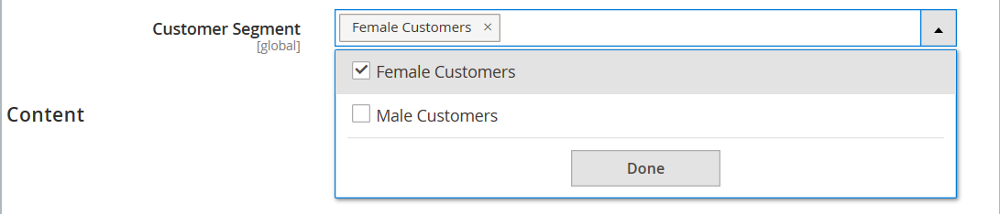
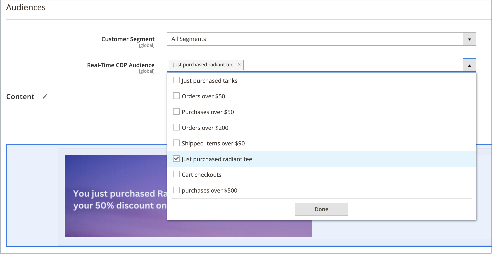

# 動的ブロック

{{ee-feature}}

[価格ルール ](../merchandising-promotions/introduction.md#price-rules)と[顧客セグメント ](../customers/customer-segments.md)のロジックによって駆動される、リッチでインタラクティブなコンテンツを作成します。 既存の[動的ブロック ](../page-builder/dynamic-block.md)を[!DNL Page Builder] [ ステージ ](../page-builder/workspace.md)に直接追加できます。 動的ブロックを使用するための詳細なステップバイステップの例については、[ チュートリアル 2: ブロック ](../page-builder/2-blocks.md)を参照してください。

>[!NOTE]
>
>[[!UICONTROL Content] メニュー](content-menu.md)の&#x200B;_[!UICONTROL Banner]_オプションは2.3.1で廃止され、2.4.0で削除されました。 その機能はダイナミックブロックに置き換えられます。

![[!DNL Page Builder] – 価格ルールと顧客セグメントを含む動的ブロック ](../page-builder/assets/pb-tutorial2-dynamic-block-storefront.png){width="600" zoomable="yes"}

## 手順1：動的ブロックの作成

1. _管理者_ サイドバーで、**[!UICONTROL Content]** > _[!UICONTROL Elements]_>**[!UICONTROL Dynamic Blocks]**に移動します。

   {width="600" zoomable="yes"}

1. 右上隅の「**[!UICONTROL Add Dynamic Block]**」をクリックします。

   {width="600" zoomable="yes"}

1. 該当する場合は、ダイナミックブロックを表示する特定のストアビューに&#x200B;**[!UICONTROL Store View]**&#x200B;を設定します。

1. 動的ブロックをアクティブにするには、**[!UICONTROL Enable Dynamic Block]**&#x200B;を`Yes`に設定します。

1. 内部参照の場合は、記述的な&#x200B;**[!UICONTROL Dynamic Block Name]**&#x200B;を入力します。

1. **[!UICONTROL Dynamic Block Type]**&#x200B;を、ダイナミックブロックを表示するページの領域に設定し、**[!UICONTROL Done]**&#x200B;をクリックします。

   {width="500" zoomable="yes"}

1. **[!UICONTROL Customer Segment]** リストで、動的ブロックを表示する各セグメントのチェックボックスを選択し、**[!UICONTROL Done]**&#x200B;をクリックして設定を保存します。

   {width="500" zoomable="yes"}

   >[!NOTE]
   >
   >- セグメントが作成されていない場合、ダイナミックブロックは全員に表示されます。
   >- 顧客が任意のセグメントに属しておらず、すべてのセグメントに対して動的ブロックが作成された場合、動的ブロックの内容は引き続き表示されます。
   >- 動的ブロックに割り当てられたすべての顧客セグメントが削除されると、その内容は全員に表示されます。

### 動的ブロックでのReal-Time CDP オーディエンスの使用

[!DNL Audience Activation]拡張機能を[ インストール ](../customers/audience-activation.md#install-the-extension)および[設定](../customers/audience-activation.md#configure-the-extension)した場合は、**[!UICONTROL Audiences]**&#x200B;というセクションが表示されます。

{width="600" zoomable="yes"}

**[!UICONTROL Real-Time CDP Audience]** リストで、動的ブロックを表示する各オーディエンスのチェックボックスを選択し、**[!UICONTROL Done]**&#x200B;をクリックして設定を保存します。

## ステップ 2：コンテンツを完了する

[!DNL Page Builder] [ ワークスペース ](../page-builder/workspace.md)を使用して、コンテンツを完了します。

![[!DNL Page Builder] – 動的ブロックワークスペース ](../page-builder/assets/pb-dynamic-block-workspace.png){width="600" zoomable="yes"}

## ステップ 3：関連するプロモーションの選択

1. 下にスクロールして、 **[!UICONTROL Related Promotions]**&#x200B;を展開します。

1. ダイナミックブロックに関連付けるプロモーションのタイプをクリックします。

   - **[!UICONTROL Add Cart Price Rules]** （[買い物かご価格規則](../merchandising-promotions/price-rules-cart.md)を参照）

   - **[!UICONTROL Add Catalog Price Rules]** （[ カタログ価格ルール ](../merchandising-promotions/price-rules-catalog.md)を参照）

   >[!NOTE]
   >
   >カタログの価格規則は、Real-Time CDP オーディエンスではサポートされていません。

1. 使用可能なルールのリストで、使用する各ルールのチェックボックスを選択し、**[!UICONTROL Add Selected]**&#x200B;をクリックします。

1. 動的ブロックが完了したら、**[!UICONTROL Save]**&#x200B;をクリックします。

## 手順4：ページへのダイナミックブロックの追加

1. ダイナミックブロックを表示するページを開きます。

1. [[!UICONTROL Add Dynamic Block]](../page-builder/dynamic-block.md) コンテンツタイプを使用して、ダイナミックブロックをステージに追加します。

## フィールドとツールの説明

| フィールド | 説明 |
|--- |--- |
| [!UICONTROL Store View] | ダイナミックブロックを使用できるストアビューを指定します。 |
| [!UICONTROL Enable Dynamic Block] | ダイナミックブロックをアクティブ化または非アクティブ化します。 オプション：はい/いいえ |
| [!UICONTROL Dynamic Block Name] | 管理画面の動的ブロックを識別するわかりやすい名前。 |
| [!UICONTROL Dynamic Block Type] | 動的ブロックが配置される[標準ページレイアウト ](layout-updates.md)内の場所を識別します。 オプション： **[!UICONTROL Content Area]**- ダイナミックブロックをページのメイン [ コンテンツ領域](layout-updates.md)に配置します。 **[!UICONTROL Footer]** – 動的ブロックをページ [ フッター](page-setup.md#footer)に配置します。 **[!UICONTROL Header]**– 動的ブロックをページ [ ヘッダー](page-setup.md#header)に配置します。 **[!UICONTROL Left Column]** – 動的ブロックを2列または3列のレイアウトの[左サイドバー](page-layout.md#standard-page-layouts)に配置します。 **[!UICONTROL Right Column]**– 動的ブロックを2列または3列のレイアウトの[右側のサイドバー](page-layout.md#standard-page-layouts)に配置します。 |
| 顧客セグメント | 顧客セグメントを動的ブロックに関連付けて、どの顧客がそれを見ることができるかを決定します。 |
| Real-Time CDP Audience | [Real-Time CDP オーディエンス ](../customers/audience-activation.md)を動的ブロックに関連付けて、どのユーザーが表示できるかを判断します。 |

{style="table-layout:auto"}

### 目次

| フィールド | 説明 |
|--- |--- |
| [!UICONTROL Layout] | ステージに行、列またはタブを追加します。 |
| [!UICONTROL Elements] | ステージ上の任意のレイアウトコンテナに、テキスト、見出し、ボタン、区切り記号、HTML コードを追加します。 |
| [!UICONTROL Media] | 画像、ビデオ、バナー、スライダー、Google マップを、ステージ上の既存のレイアウトコンテナに追加します。 |
| [!UICONTROL Add Content] | 既存のブロック、ダイナミックブロック、商品をステージに追加します。 |

{style="table-layout:auto"}

### 関連するプロモーション

| フィールド | 説明 |
|--- |--- |
| [!UICONTROL Related Cart Price Rule] | **[!UICONTROL Add Cart Price Rules]** – 既存の[買い物かご価格ルール ](../merchandising-promotions/price-rules-cart.md)をダイナミックブロックにプロモーションとして関連付けます。 |
| [!UICONTROL Related Catalog Price Rule] | **[!UICONTROL Add Catalog Price Rules]** – 既存の[ カタログ価格ルール ](../merchandising-promotions/price-rules-catalog.md)をダイナミックブロックにプロモーションとして関連付けます。 |

{style="table-layout:auto"}
