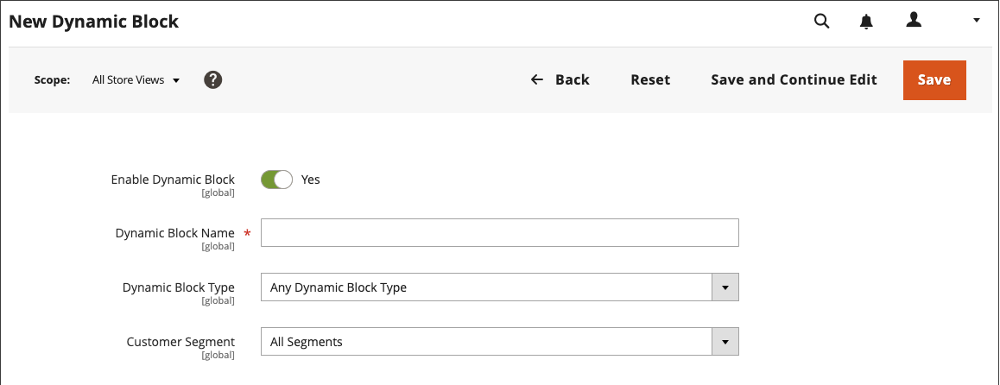

# ダイナミック ブロック

{{ee-feature}}

[ 価格ルール ](../merchandising-promotions/introduction.md#price-rules) および [ 顧客セグメント ](../customers/customer-segments.md) のロジックによって駆動される、リッチでインタラクティブなコンテンツを作成します。 既存の [ ダイナミック ブロック ](../page-builder/dynamic-block.md) を [!DNL Page Builder] ージ [ ステージ ](../page-builder/workspace.md) に直接追加できます。 ダイナミック ブロックを使用する詳細な手順の例については、[ チュートリアル 2: ブロック ](../page-builder/2-blocks.md) を参照してください。

>[!NOTE]
>
>[[!UICONTROL Content] メニューの _[!UICONTROL Banner]_オプションは ](content-menu.md)2.3.1 で非推奨となり、2.4.0 で削除されました。その機能はダイナミック ブロックに置き換えられています。

![[!DNL Page Builder] – 価格ルールと顧客セグメントを含むダイナミックブロック ](../page-builder/assets/pb-tutorial2-dynamic-block-storefront.png){width="600" zoomable="yes"}

## 手順 1：ダイナミックブロックの作成

1. _管理者_ サイドバーで、**[!UICONTROL Content]**/_[!UICONTROL Elements]_/**[!UICONTROL Dynamic Blocks]**に移動します。

   {width="600" zoomable="yes"}

1. 右上隅の「**[!UICONTROL Add Dynamic Block]**」をクリックします。

   {width="600" zoomable="yes"}

1. 必要に応じて、動的ブロックを表示する特定のストア表示に **[!UICONTROL Store View]** を設定します。

1. ダイナミック ブロックをアクティブにするには、**[!UICONTROL Enable Dynamic Block]** を `Yes` に設定します。

1. 内部参照の場合は、わかりやすい **[!UICONTROL Dynamic Block Name]** を入力します。

1. ダイナミックブロックを表示するページの領域に **[!UICONTROL Dynamic Block Type]** を設定し、「**[!UICONTROL Done]**」をクリックします。

   {width="500" zoomable="yes"}

1. **[!UICONTROL Customer Segment]** リストで、動的ブロックを表示する各セグメントのチェックボックスをオンにし、「**[!UICONTROL Done]**」をクリックして設定を保存します。

   {width="500" zoomable="yes"}

   >[!NOTE]
   >
   >- セグメントが作成されない場合、ダイナミック ブロックはすべてのユーザに表示されます。
   >- 顧客がどのセグメントにも属しておらず、ダイナミック ブロックがすべてのセグメントに対して作成されている場合、ダイナミック ブロックのコンテンツは表示されたままになります。
   >- 動的ブロックに割り当てられたすべての顧客セグメントが削除されると、そのコンテンツは全員に表示されます。

### 動的ブロックでのReal-Time CDP オーディエンスの使用

[!DNL Audience Activation] 拡張機能を [ インストール ](../customers/audience-activation.md#install-the-extension) および [ 設定 ](../customers/audience-activation.md#configure-the-extension) した場合は、「**[!UICONTROL Audiences]**」というセクションが表示されます。

{width="600" zoomable="yes"}

**[!UICONTROL Real-Time CDP Audience]** リストで、動的ブロックを表示する各オーディエンスのチェックボックスをオンにし、「**[!UICONTROL Done]**」をクリックして設定を保存します。

## 手順 2：コンテンツを完了する

[!DNL Page Builder] [ ワークスペース ](../page-builder/workspace.md) を使用して、コンテンツを完了します。

![[!DNL Page Builder] - ダイナミック ブロック ワークスペース ](../page-builder/assets/pb-dynamic-block-workspace.png){width="600" zoomable="yes"}

## 手順 3：関連プロモーションの選択

1. 下にスクロールして、**[!UICONTROL Related Promotions]** を展開します。

1. ダイナミックブロックに関連付けるプロモーションのタイプをクリックします。

   - **[!UICONTROL Add Cart Price Rules]** （[ 買い物かご価格ルール ](../merchandising-promotions/price-rules-cart.md)）

   - **[!UICONTROL Add Catalog Price Rules]** （[ カタログ価格ルール ](../merchandising-promotions/price-rules-catalog.md)）

   >[!NOTE]
   >
   >カタログ価格ルールは、Real-Time CDP オーディエンスではサポートされていません。

1. 使用可能なルールのリストで、使用する各ルールのチェックボックスをオンにし、「**[!UICONTROL Add Selected]**」をクリックします。

1. ダイナミック ブロックが完成したら、[**[!UICONTROL Save]**] をクリックします。

## 手順 4：ページへの動的ブロックの追加

1. ダイナミックブロックを表示するページを開きます。

1. [[!UICONTROL Add Dynamic Block]](../page-builder/dynamic-block.md) コンテンツタイプを使用して、動的ブロックをステージに追加します。

## フィールドとツールの説明

| フィールド | 説明 |
|--- |--- |
| [!UICONTROL Store View] | ダイナミック ブロックを使用できるストア ビューを指定します。 |
| [!UICONTROL Enable Dynamic Block] | ダイナミック ブロックをアクティブまたは非アクティブにします。 オプション：はい/いいえ |
| [!UICONTROL Dynamic Block Name] | 管理画面で動的ブロックを識別するわかりやすい名前。 |
| [!UICONTROL Dynamic Block Type] | ダイナミック ブロックが配置される [ 標準ページ レイアウト ](layout-updates.md) 内の場所を識別します。 オプション： **[!UICONTROL Content Area]**- ページのメイン [ コンテンツ領域 ](layout-updates.md) に動的ブロックを配置します。 **[!UICONTROL Footer]** - ページに動的ブロックを配置します [ フッター ](page-setup.md#footer)。  **[!UICONTROL Header]**- ページに動的ブロックを配置します [ ヘッダー ](page-setup.md#header)。 **[!UICONTROL Left Column]** - 2 列または 3 列のレイアウトの [ 左側のサイドバー ](page-layout.md#standard-page-layouts) に動的ブロックを配置します。  **[!UICONTROL Right Column]**- 2 列または 3 列のレイアウトの [ 右側のサイドバー ](page-layout.md#standard-page-layouts) にダイナミックブロックを配置します。 |
| 顧客セグメント | 顧客セグメントを動的ブロックに関連付けて、どの顧客に表示できるかを決定します。 |
| Real-Time CDP オーディエンス | [Real-Time CDP オーディエンス ](../customers/audience-activation.md) を動的ブロックに関連付けて、どの顧客に表示できるかを決定します。 |

{style="table-layout:auto"}

### 目次

| フィールド | 説明 |
|--- |--- |
| [!UICONTROL Layout] | 行、列、タブをステージに追加します。 |
| [!UICONTROL Elements] | ステージ上の任意のレイアウトコンテナにテキスト、見出し、ボタン、区切り文字、HTMLコードを追加できます。 |
| [!UICONTROL Media] | 画像、ビデオ、バナー、スライダー、Googleマップを、ステージ上の既存のレイアウトコンテナに追加します。 |
| [!UICONTROL Add Content] | 既存のブロック、ダイナミック ブロック、および製品をステージに追加します。 |

{style="table-layout:auto"}

### 関連するプロモーション

| フィールド | 説明 |
|--- |--- |
| [!UICONTROL Related Cart Price Rule] | **[!UICONTROL Add Cart Price Rules]** – 既存の [ 買い物かご価格ルール ](../merchandising-promotions/price-rules-cart.md) を動的ブロックにプロモーションとして関連付けます。 |
| [!UICONTROL Related Catalog Price Rule] | **[!UICONTROL Add Catalog Price Rules]** – 既存の [ カタログ価格ルール ](../merchandising-promotions/price-rules-catalog.md) をプロモーションとして動的ブロックに関連付けます。 |

{style="table-layout:auto"}
