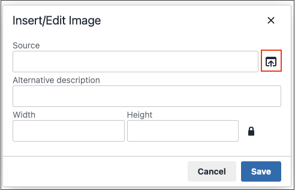

# エディターでの画像の挿入

エディターから、次の 3 つのソースタイプを使用して画像を挿入できます。

- [ メディアストレージ ](media-storage.md) にアップロードされた画像を追加
- 別のサーバーにある画像へのリンク
- Adobe Stock統合を使用したAdobe Stock アセットの検索と使用

{width="650" zoomable="yes"}

1. ページ、ブロック、またはダイナミックブロックを編集モードで開きます。

1. 「_[!UICONTROL Content]_」セクションに移動して、エディターをサポートする要素をクリックします。

1. 画像を表示する位置にカーソルを置きます。

1. エディターツールバーで、「_画像を挿入_ アイコンをクリックします。

   {width="700" zoomable="yes"}

   この操作を実行すると、_[!UICONTROL Insert/edit image]_ダイアログが開きます。

1. **Source** の場合は、「_検索_ アイコンをクリックし、使用する画像アセットの場所に一致するメソッドを使用します。

   {width="250" zoomable="yes"}

   - **新しい画像をアップロード**：新しい画像ファイルをアップロードするには、この方法を使用します。

      - 新しい画像ファイルを追加するツリー内のフォルダーを選択します。

      - 「**[!UICONTROL Choose Files]**」をクリックします。

      - 画像ファイルを見つけて選択します。

      - 新しいファイルのサムネールをクリックし、「**[!UICONTROL Add Selected]**」をクリックします。

   - **既存のアセットを選択**：メディアストレージ/ギャラリーから既存の画像アセットを選択する場合は、この方法を使用します。

      - ツリーを使用して画像に移動します。

      - サムネールをクリックし、「**[!UICONTROL Add Selected]**」をクリックします。

   - **Adobe Stock画像を検索して選択**:Adobe Stock内から画像を検索する場合に使用します。

     >[!NOTE]
     >
     >この方法を使用するには、管理者向けに設定された ](adobe-stock.md)0}Adobe Stock統合 } が必要です。[

      - 「**[!UICONTROL Search Adobe Stock]**」をクリックして画像を検索します。

      - プレビューまたはライセンス済み画像をギャラリーに保存します。

        [2}Adobe Stock](adobe-stock-manage.md) アセットの操作について詳しくは、{Adobe Stock画像の使用 ](https://stock.adobe.com) を参照してください。[

      - ギャラリーでアセットのサムネールを選択し、「**[!UICONTROL Add Selected]**」をクリックします。

1. **[!UICONTROL Image Description]**：画像の簡単な説明を入力します。

1. ページ上の画像のレンダリングに使用する幅と高さの **[!UICONTROL Dimensions]** をピクセル単位で入力します。

   画像の縦横比を自動的に維持するには、「**[!UICONTROL Constrain proportions]**」チェックボックスをオンのままにします。

1. 「**[!UICONTROL Insert]**」をクリックしてプロセスを完了します。
