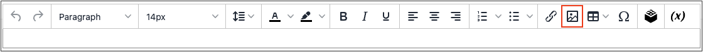

# エディターでの画像の挿入

エディターから、次の3つのソースタイプを使用して画像を挿入できます。

- [&#x200B; メディアストレージ &#x200B;](media-storage.md)にアップロードされた画像を追加します
- 別のサーバーにある画像へのリンク
- Adobe Stockとの統合を使用して、Adobe Stock アセットを検索および使用する

{width="650" zoomable="yes"}

1. 編集モードでページ、ブロック、またはダイナミックブロックを開きます。

1. _[!UICONTROL Content]_&#x200B;セクションに移動し、エディターをサポートする任意の要素をクリックします。

1. 画像を表示する位置にカーソルを置きます。

1. エディターツールバーで、_画像を挿入_ アイコンをクリックします。

   {width="700" zoomable="yes"}

   このアクションにより、_[!UICONTROL Insert/edit image]_&#x200B;ダイアログが開きます。

1. **Source**&#x200B;の場合、_検索_ アイコンをクリックし、使用する画像アセットの場所と一致するメソッドを使用します。

   {width="250" zoomable="yes"}

   - **新しい画像をアップロード**：この方法を使用して、新しい画像ファイルをアップロードします。

      - 新しい画像ファイルを追加するツリー内のフォルダーを選択します。

      - **[!UICONTROL Choose Files]**&#x200B;をクリックします。

      - 画像ファイルを探して選択します。

      - 新しいファイルのサムネールをクリックし、**[!UICONTROL Add Selected]**&#x200B;をクリックします。

   - **既存のアセットを選択**：この方法を使用して、メディアストレージ/ギャラリーから既存の画像アセットを選択します。

      - ツリーを使用して画像に移動します。

      - サムネールをクリックし、**[!UICONTROL Add Selected]**&#x200B;をクリックします。

   - **Adobe Stock画像を検索して選択**：この方法を使用して、Adobe Stockから画像を検索します。

     >[!NOTE]
     >
     >この方法では、管理者用に設定された[Adobe Stock統合](adobe-stock.md)が必要です。

      - **[!UICONTROL Search Adobe Stock]**&#x200B;をクリックし、画像を検索します。

      - プレビューまたはライセンスされた画像をギャラリーに保存します。

        [Adobe Stock](https://stock.adobe.com) アセットの操作について詳しくは、[Adobe Stock Images](adobe-stock-manage.md)の使用を参照してください。

      - ギャラリーでアセットのサムネールを選択し、**[!UICONTROL Add Selected]**&#x200B;をクリックします。

1. **[!UICONTROL Image Description]**&#x200B;に、画像の簡単な説明を入力します。

1. ページ上に画像をレンダリングするために、幅と高さ&#x200B;**[!UICONTROL Dimensions]**&#x200B;をピクセル単位で入力します。

   画像の縦横比を自動的に維持するには、**[!UICONTROL Constrain proportions]** チェックボックスを選択したままにします。

1. **[!UICONTROL Insert]**&#x200B;をクリックしてプロセスを完了します。
