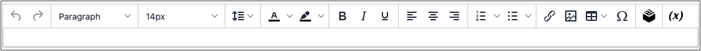

# WYSIWYG Editor

エディターを使用すると、コンテンツの _What You See Is What You Get_ （WYSIWYG）ビューでの作業中に、入力や書式設定をおこなうことができます。 基になるHTMLコードを直接操作する場合は、モードを簡単に変更できます。 エディターを使用して、[ ページ ](pages.md)、[ ブロック ](blocks.md) および [ 製品説明 ](../catalog/product-content.md) のコンテンツを作成できます。 製品の詳細を操作する場合は、「」をクリックしてエディターにアクセス **[!UICONTROL Show / Hide Editor]** ます。

{width="700" zoomable="yes"}

以下のトピックでは、エディターの使用について詳しく説明します。

- [リンクの挿入](editor-insert-link.md)
- [画像の挿入](editor-insert-image.md)
- [ウィジェットの挿入](editor-widget.md)
- [変数の挿入](editor-insert-variable.md)

## エディターの設定

WYSIWYG エディターはデフォルトで有効になっており、CMSのページやブロックおよび商品やカテゴリのコンテンツを編集するために使用できます。 設定からエディターをアクティブ化または非アクティブ化し、製品やカテゴリの説明でメディアコンテンツの URL を [ 動的 ](../catalog/catalog-urls.md#dynamic-url) ではなく静的に使用することを選択できます。

{width="600" zoomable="yes"}

すべてのWYSIWYG オプションについて詳しくは、[ 設定リファレンス ](../configuration-reference/general/content-management.md) の _コンテンツ管理_ を参照してください。

1. _管理者_ サイドバーで、**[!UICONTROL Stores]**/_[!UICONTROL Settings]_/**[!UICONTROL Configuration]**&#x200B;に移動します。

1. _[!UICONTROL General]_&#x200B;の下の左パネルで、「**[!UICONTROL Content Management]**」を選択します。

1.  **[!UICONTROL WYSIWYG Options]** を展開します。

1. **[!UICONTROL Enable WYSIWYG Editor]** を好みに合わせて設定します。

   このエディターは、デフォルトで有効になっています。

1. WYSIWYG エディターで入力するすべての [ メディアコンテンツ ](../catalog/catalog-urls.md#static-url) に対して、環境設定に **[!UICONTROL Static URLs for Media Content in WYSIWYG]** を設定します。

1. 完了したら、「**[!UICONTROL Save Config]**」をクリックします。
