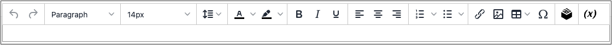

# WYSIWYG エディター

エディターでは、コンテンツの&#x200B;_What You See Is What You Get_ （WYSIWYG）ビューで作業する際に入力および書式設定を行うことができます。 基盤となるHTMLのコードを直接操作したい場合は、簡単にモードを変更できます。 エディターを使用して、[&#x200B; ページ &#x200B;](pages.md)、[&#x200B; ブロック &#x200B;](blocks.md)、[商品説明](../catalog/product-content.md)のコンテンツを作成できます。 製品の詳細を操作する場合は、**[!UICONTROL Show / Hide Editor]**&#x200B;をクリックしてエディターにアクセスします。

{width="700" zoomable="yes"}

次のトピックでは、エディターの使用に関する詳細な情報を提供します。

- [リンクの挿入](editor-insert-link.md)
- [画像の挿入](editor-insert-image.md)
- [ウィジェットの挿入](editor-widget.md)
- [変数の挿入](editor-insert-variable.md)

## エディターの設定

WYSIWYG エディターはデフォルトで有効になっており、CMSのページやブロック、および商品やカテゴリーでコンテンツを編集するために使用できます。 設定から、エディターをアクティブ化または非アクティブ化し、製品およびカテゴリの説明のメディアコンテンツに[dynamic](../catalog/catalog-urls.md#dynamic-url)ではなく静的URLを使用することを選択できます。

{width="600" zoomable="yes"}

>[!NOTE]
>
>TinyMCEは、Magento 2.4.6以降のバージョンのデフォルトのWYSIWYG エディターとしてHugerteに置き換えられました。

すべてのWYSIWYG オプションについて詳しくは、_Configuration Reference_&#x200B;の[Content Management](../configuration-reference/general/content-management.md)を参照してください。

1. _管理者_ サイドバーで、**[!UICONTROL Stores]** > _[!UICONTROL Settings]_>**[!UICONTROL Configuration]**&#x200B;に移動します。

1. _[!UICONTROL General]_&#x200B;の下の左側のパネルで、**[!UICONTROL Content Management]**&#x200B;を選択します。

1.  **[!UICONTROL WYSIWYG Options]**&#x200B;を展開します。

1. **[!UICONTROL Enable WYSIWYG Editor]**&#x200B;を好みに合わせて設定します。

   エディターはデフォルトで有効になっています。

1. WYSIWYG エディターで入力されたすべての[&#x200B; メディアコンテンツ &#x200B;](../catalog/catalog-urls.md#static-url)に対して、**[!UICONTROL Static URLs for Media Content in WYSIWYG]**&#x200B;を環境設定に設定します。

1. 完了したら、**[!UICONTROL Save Config]**&#x200B;をクリックします。
