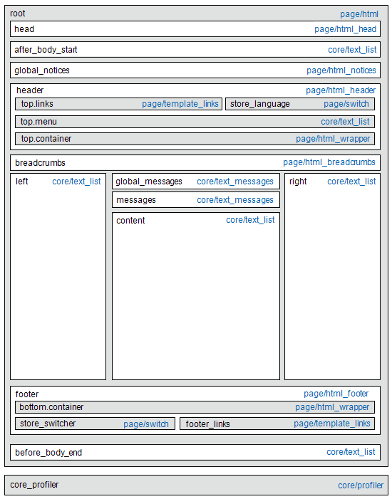

# レイアウトの更新

カスタムレイアウトの更新を使用する前に、ストアのページの構築方法と、*layout*&#x200B;と&#x200B;*layout update*&#x200B;の用語の違いを理解することが重要です。 レイアウトとは、ページの視覚的および構造的な構成を指します。 レイアウトの更新とは、ページの作成方法を上書きまたはカスタマイズできる特定のXML命令セットを指します。

[!DNL Commerce] ストアのXML レイアウトは、コンテナとブロックの階層構造です。 すべてのページに表示される要素もあれば、特定のページにのみ表示される要素もあります。 レイアウト、コンテナ、ブロックについて詳しくは、_フロントエンド開発者ガイド_&#x200B;の[&#x200B; レイアウトの概要](https://developer.adobe.com/commerce/frontend-core/guide/layouts/)を参照してください。

[&#x200B; ウィジェット &#x200B;](widgets.md) ツールは、既存の[&#x200B; コンテンツブロック &#x200B;](blocks.md)をページのデフォルトレイアウトに簡単に追加する方法です。 さらに高度な更新を行うには、XML レイアウト更新コードをサーバーに保存し、そのファイルを管理者からカスタム レイアウト更新として参照する必要があります。 プロセスの概要については、[&#x200B; レイアウト更新の使用](layout-updates.md#place-a-block-using-layout-updates)を参照してください。

次の図では、コンテナを参照する名前は黒で、ブロックタイプ（ブロッククラスパス）は青です。

{width="500" zoomable="yes"}

| ブロックタイプ | 説明 |
|--- |--- |
| `page/html` | このブロックの名前は`root`で、レイアウト内のいくつかのルート ブロックの1つです。 独自のブロックを作成し、このタイプのブロックの標準名である`root`という名前を付けることもできます。 このタイプのブロックは、ページごとに1つだけ指定できます。 |
| `page/html_head` | ブロック名は`head`で、ルートブロックの子です。 このタイプのブロックは1 ページにつき1つしか存在できず、削除しないでください。 |
| `page/html_notices` | ブロック名は`global_notices`で、ルートブロックの子です。 このブロックがレイアウトから削除された場合、グローバル通知はページに表示されません。 このタイプのブロックは、ページごとに1つだけ指定できます。 |
| `page/html_header` | ブロック名は`header`で、ルートブロックの子です。 このブロックは、ページ上部のビジュアルヘッダーに対応し、いくつかの標準ブロックを含んでいます。 このタイプのブロックは1 ページにつき1つしか存在できず、削除しないでください。 |
| `page/html_wrapper` | デフォルトのレイアウトに含まれていますが、このブロックは非推奨（廃止予定）であり、後方互換性を確保するためにのみ含まれています。 このタイプのブロックは使用しないでください。 |
| `page/html_breadcrumbs` | このブロックの名前は`breadcrumbs`で、ヘッダーブロックの子です。 このブロックには、現在のページのパンくずリストが表示されます。 このタイプのブロックは、ページごとに1つだけ指定できます。 |
| `page/html_footer` | ブロック名は`footer`で、ルートブロックの子です。 フッターブロックは、ページ下部のビジュアルフッターに対応し、いくつかの標準ブロックを含みます。 このタイプのブロックは1 ページにつき1つしか存在できず、削除しないでください。 |
| `page/template_links` | 標準レイアウトには、このタイプのブロックが2つあります。 `top.links` ブロックはヘッダーブロックの子であり、上部のナビゲーションメニューに対応します。 `footer_links` ブロックはフッターブロックの子であり、下部のナビゲーションメニューに対応します。   **_Note:_**&#x200B;例に示すように、テンプレートリンクを操作できます。 |
| `page/switch` | 標準レイアウトには、このタイプの2つのブロックがあります。 `store_language` ブロックはヘッダーブロックの子であり、最上位の言語スイッチャーに対応します。 `store_switcher` ブロックはフッターブロックの子であり、ボトムストアスイッチャーに対応します。 |
| コア/メッセージ | 標準レイアウトには、このタイプの2つのブロックがあります。 `global_messages` ブロックには、グローバル メッセージが表示されます。 `messages` ブロックは、他のすべてのメッセージを表示するために使用されます。 これらのブロックを削除すると、お客様にはメッセージが表示されません。 |
| `core/text_list` | このタイプのブロックは、子ブロックをレンダリングするためのプレースホルダーとして[!DNL Commerce]全体で広く使用されています。 |
| `core/profiler` | このタイプのブロックのインスタンスは、ページごとに1つだけです。 これは内部[!DNL Commerce] プロファイラーに使用されます。他の目的には使用しないでください。 |

{style="table-layout:auto"}

## レイアウトの更新を使用したブロックの配置

[&#x200B; レイアウトの更新](layout-updates.md)により、ページのレイアウトをカスタマイズできます。 レイアウトの更新は、[&#x200B; ウィジェット &#x200B;](widgets.md)よりも柔軟性が高くなりますが、サーバーへのアクセスとXMLの基本的な知識が必要です。

次の手順では、レイアウトアップデートを使用してブロックをページに配置する方法を示します。 具体的な例と構文に関するヘルプについては、_フロントエンド開発者ガイド_&#x200B;の[一般的なレイアウトのカスタマイズ タスク &#x200B;](https://developer.adobe.com/commerce/frontend-core/guide/layouts/)を参照してください。

### 手順1：ブロックを作成する

1. 配置する[&#x200B; ブロック &#x200B;](block-add.md)を作成します。

1. レイアウトの更新手順で使用されるので、`block_id`に注意してください。

### 手順2:XMLでのレイアウト更新の作成

1. XMLのレイアウト手順を作成して[CMS ブロックを参照](https://developer.adobe.com/commerce/frontend-core/guide/layouts/xml-manage/)します。

1. テーマ用にXML ファイルが保存されているレイアウトフォルダー内のサーバーに[&#x200B; レイアウト手順](https://developer.adobe.com/commerce/frontend-core/guide/layouts/xml-instructions/)を保存します。

   例：

   `<theme_dir>/<Namespace>_<Module>/layout`

   レイアウトハンドルは、`cms_page_view_selectable_`で始まるファイル名の後に、CMS ページのURL キー、レイアウト更新オプション、および`xml` ファイルサフィックスが続きます。 次の例では、`customer-service`はページのURL キーであり、`ChatTool`はレイアウト更新をページに適用するために選択するオプションです。

   `cms_page_view_selectable_`&lt;`customer-service`>`_`&lt;`ChatTool`>`.xml`

   | 要素 | 説明 |
   |--- |--- |
   | CMS ページ識別子 | ページのURL キーにスラッシュ （`/`）がアンダースコア （`_`）で置き換えられています。 |
   | レイアウト更新名 | _カスタムレイアウトの更新_&#x200B;に表示されるオプション。 |

   {style="table-layout:auto"}

### 手順3：ページからレイアウト更新を参照する

1. _管理者_ サイドバーで、**[!UICONTROL Content]** > _[!UICONTROL Elements]_>**[!UICONTROL Pages]**&#x200B;に移動します。

1. ブロックを配置するページを見つけ、編集モードで開きます。

1. 下にスクロールして、**[!UICONTROL Design]** セクションのを展開します。

1. ページに関連付けられている利用可能なすべてのレイアウト更新を表示するには、**[!UICONTROL Custom Layout Update]** メニューをクリックします。

   {width="400" zoomable="yes"}

1. ページに適用するレイアウト更新を選択します。

### 手順4：キャッシュの保存と更新

1. 完了したら、**[!UICONTROL Save & Close]**&#x200B;をクリックします。

1. ワークスペースの上部にあるメッセージで、**[!UICONTROL Cache Management]**&#x200B;をクリックし、無効なすべてのキャッシュ項目を更新します。
