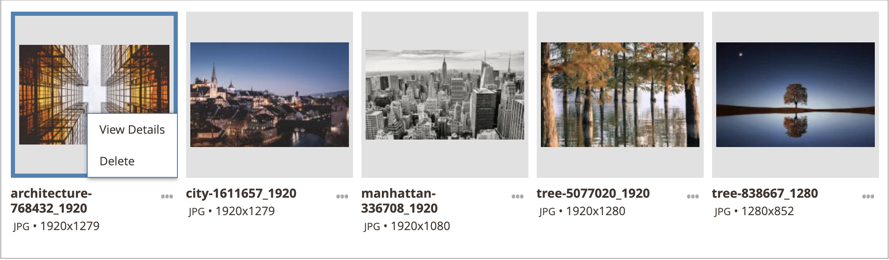
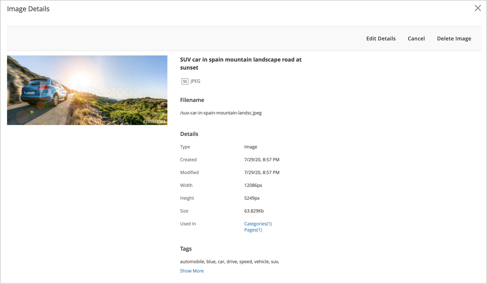
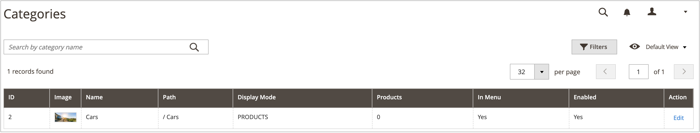
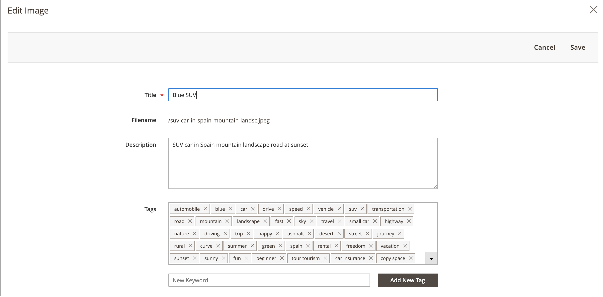
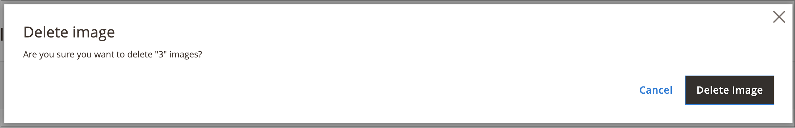
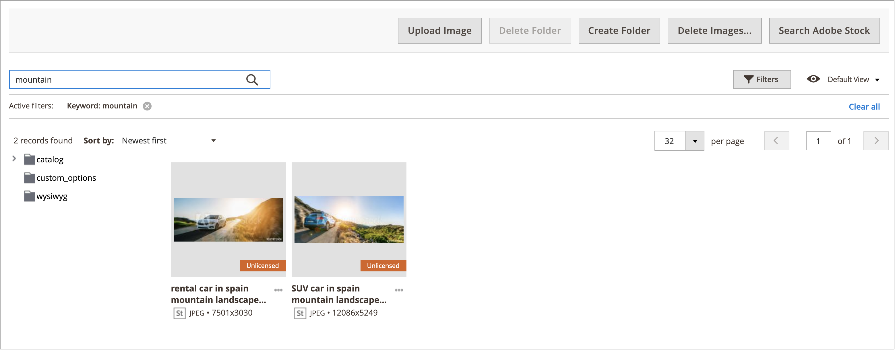
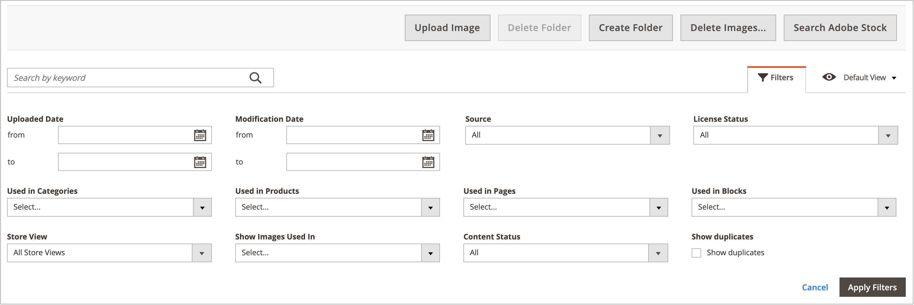
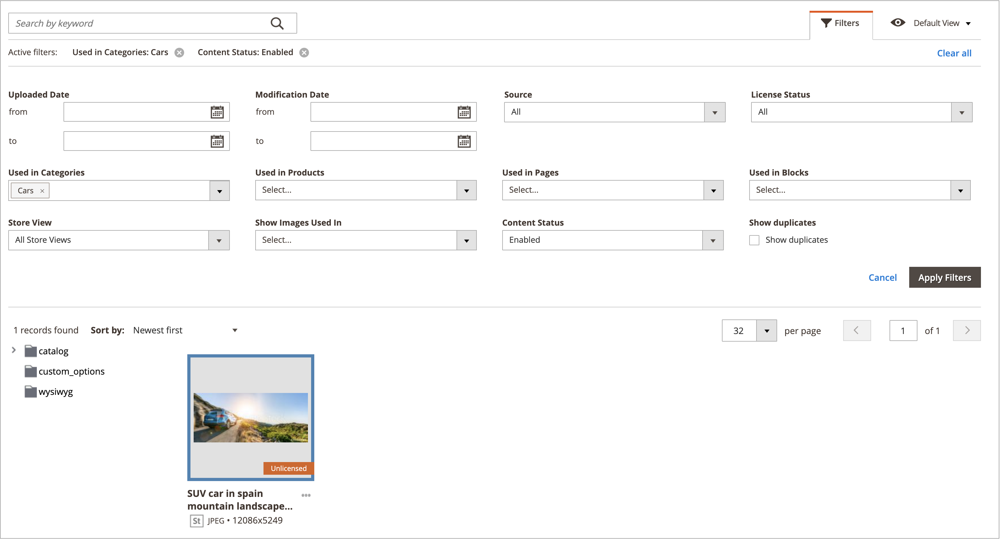

# Media Gallery アセット管理

新しい[Media Gallery](media-gallery.md)には、アップロードされたメディアファイルと、[Adobe Stockとの統合](adobe-stock.md)を通じて取得したアセットを管理するためのツールが用意されています。 Adobe Stock [画像プレビュー](adobe-stock-save-preview.md)を保存した場合は、新しいMedia Galleryで画像を[&#x200B; ライセンス &#x200B;](adobe-stock-license-image.md)することもできます。

Assetsは、モジュールによって追加された`pub/media/wysywig`、`pub/media/catalog/category`またはその他のフォルダーにのみアップロードできます。

## アセットのアップロード

1. _管理者_ サイドバーで、**[!UICONTROL Content]** > _[!UICONTROL Media]_>**[!UICONTROL Media Gallery]**&#x200B;に移動します。

1. **[!UICONTROL Upload Image]**&#x200B;をクリックします。

1. アップロードするファイルを選択します。

   選択したアセットが、選択したフォルダーに自動的にアップロードされます。

## アセットの詳細を表示

1. _管理者_ サイドバーで、**[!UICONTROL Content]** > _[!UICONTROL Media]_>**[!UICONTROL Media Gallery]**&#x200B;に移動します。

1. アセット（{width="10" zoomable="no"}）の下にある3つのドットをクリックし、**[!UICONTROL View Details]**&#x200B;をクリックします。

   {width="600" zoomable="yes"}

   アセットの詳細がスライドパネルに表示されます。 これには、アセットが使用されている情報が含まれます。

   - **[!UICONTROL Categories]**
   - **[!UICONTROL Products]**
   - **[!UICONTROL Pages]**
   - **[!UICONTROL Blocks]**

   {width="600" zoomable="yes"}

   詳細を表示するには、**[!UICONTROL Used In]** リンクをクリックします。 次の例のグリッドは、特定のアセットが使用されているすべてのカテゴリを示しています。

   {width="600" zoomable="yes"}

   _詳細を表示_ セクションからアセットを削除することもできます。

## アセットの編集

1. _管理者_ サイドバーで、**[!UICONTROL Content]** > _[!UICONTROL Media]_>**[!UICONTROL Media Gallery]**&#x200B;に移動します。

1. アセット （{width="10" zoomable="no"}）の下にある3つのドットをクリックし、**[!UICONTROL Edit]**&#x200B;をクリックします。

   {width="600" zoomable="yes"}

1. 必要に応じて、次のいずれかのメタデータ値を変更します。

   - **[!UICONTROL Title]**
   - **[!UICONTROL Description]**
   - **[!UICONTROL Tags/Keywords]**

   このデータは、データベースとファイルメタデータ自体に保存されます。 現在、XMPとIPTCのフォーマットがサポートされています。

   更新されたメタデータを含む画像をダウンロードできます。

## アセットの使用

Assetsは、[&#x200B; ページの追加または編集](page-add.md)、[&#x200B; カテゴリの作成または編集](../catalog/category-create.md)、[&#x200B; コンテンツエディターからの画像の挿入](editor-insert-image.md)など、管理者全体で幅広く使用できます。

1. メディアアセットを使用できる領域から、新しいメディアギャラリーにアクセスします。

1. アセットを選択し、**[!UICONTROL Add Selected]**&#x200B;をクリックします。

{{$include /help/_includes/image-optimization-animated-gif-note.md}}

## アセットの削除

1. _管理者_ サイドバーで、**[!UICONTROL Content]** > _[!UICONTROL Media]_>**[!UICONTROL Media Gallery]**&#x200B;に移動します。

1. **[!UICONTROL Delete Images...]**&#x200B;をクリックし、削除する各アセットのチェックボックスを選択します。

1. 確認ダイアログで、**[!UICONTROL Delete Image]**&#x200B;をクリックします。

   {width="500" zoomable="yes"}

## アセットの検索

1. _管理者_ サイドバーで、**[!UICONTROL Content]** > _[!UICONTROL Media]_>**[!UICONTROL Media Gallery]**&#x200B;に移動します。

1. キーワード/タグによる画像検索を実行するには、**[!UICONTROL Search by keywords]**&#x200B;入力を使用します。

   次の例の検索では、特定のタグ （`mountain`）を含むアセットが見つかりました。

   {width="600" zoomable="yes"}

>[!NOTE]
>
>画像タグを更新する方法については、「_[アセットを編集](#edit-an-asset)_」の節を参照してください。

## アセットのフィルタリング

>[!NOTE]
>
>_で使用される_&#x200B;機能では、[!UICONTROL Media Gallery Image Optimization]が[構成設定](media-gallery-image-optimization.md)で有効になっている必要があります。

1. _管理者_ サイドバーで、**[!UICONTROL Content]** > _[!UICONTROL Media]_>**[!UICONTROL Media Gallery]**&#x200B;に移動します。

1. 「**[!UICONTROL Filters]**」タブをクリックします。

   {width="600" zoomable="yes"}

1. フィルターオプションを設定します。

   エンティティによる使用状況に応じて、アセットをフィルタリングできます。

   - **[!UICONTROL Used in Categories]**
   - **[!UICONTROL Used in Products]**
   - **[!UICONTROL Used in Pages]**
   - **[!UICONTROL Used in Blocks]**

   **[!UICONTROL Store View]**、**[!UICONTROL License Status]**&#x200B;および&#x200B;**[!UICONTROL Content Status]**&#x200B;でアセットをフィルタリングすることもできます。 ファイル日付に従ってアセットをフィルタリングするために、**[!UICONTROL Uploaded Date]**&#x200B;または&#x200B;**[!UICONTROL Modification Date]**&#x200B;の日付範囲を設定します。

1. **[!UICONTROL Apply Filters]**&#x200B;をクリックして結果を表示します。

   次の例のフィルタリングでは、特定のカテゴリ （`cars`）で使用され、有効になっているアセットが見つかります。

   {width="600" zoomable="yes"}

## 重複した画像を探す

1. 「**[!UICONTROL Filters]**」タブをクリックし、「**[!UICONTROL Show duplicates]**」チェックボックスを選択します。

1. 結果を表示するには、**[!UICONTROL Apply Filters]**&#x200B;をクリックします。

<!-- Last updated from includes: 2024-01-30 15:43:39 -->
