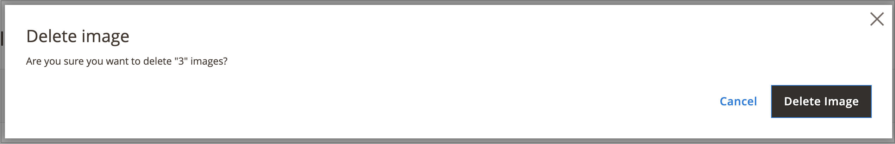

# Media Gallery アセット管理

新しい [メディアギャラリー](media-gallery.md) には、アップロードされたメディアファイルと、を介して取得したアセットを管理するためのツールが用意されています。 [Adobe Stockの統合](adobe-stock.md). Adobe Stockを保存している場合 [画像プレビュー](adobe-stock-save-preview.md)また、次のこともできます [ライセンス](adobe-stock-license-image.md) 新しいメディアギャラリーの画像。

## アセットのアップロード

1. 日 _Admin_ サイドバー、に移動 **[!UICONTROL Content]** > _[!UICONTROL Media]_>**[!UICONTROL Media Gallery]**.

1. クリック **[!UICONTROL Upload Image]**.

1. アップロードするファイルを選択します。

   選択したアセットは、選択したフォルダー（フォルダーが選択されていない場合はストレージルート）に自動的にアップロードされます。

## アセットの詳細の表示

1. 日 _Admin_ サイドバー、に移動 **[!UICONTROL Content]** > _[!UICONTROL Media]_>**[!UICONTROL Media Gallery]**.

1. アセットの下にある 3 ドットアイコン（{width="10" zoomable="no"}）を選択してから、 **[!UICONTROL View Details]**.

   {width="600" zoomable="yes"}

   アセットの詳細は、スライドパネルに表示されます。 これには、アセットが使用されている場所に関する情報が含まれます。

   - **[!UICONTROL Categories]**
   - **[!UICONTROL Products]**
   - **[!UICONTROL Pages]**
   - **[!UICONTROL Blocks]**

   {width="600" zoomable="yes"}

   詳細を確認するには、 **[!UICONTROL Used In]** リンク . 次の例のグリッドは、特定のアセットが使用されているすべてのカテゴリを示しています。

   {width="600" zoomable="yes"}

   アセットは、 _詳細を表示_ セクション。

## アセットの編集

1. 日 _Admin_ サイドバー、に移動 **[!UICONTROL Content]** > _[!UICONTROL Media]_>**[!UICONTROL Media Gallery]**.

1. アセットの下にある 3 ドットアイコン（{width="10" zoomable="no"}）を選択してから、 **[!UICONTROL Edit]**.

   {width="600" zoomable="yes"}

1. 必要に応じて、次のいずれかのメタデータ値を変更します。

   - **[!UICONTROL Title]**
   - **[!UICONTROL Description]**
   - **[!UICONTROL Tags/Keywords]**

   このデータはデータベースとファイルのメタデータ自体に保存されます。 現在、XMPおよび IPTC 形式がサポートされています。

   更新されたメタデータを含む画像をダウンロードできます。

## アセットの使用

アセットは、管理者全体で幅広く使用できます。例えば、次のようなものがあります [ページの追加または編集](page-add.md), [カテゴリの作成または編集](../catalog/category-create.md)、または [コンテンツ エディタからのイメージの挿入](editor-insert-image.md).

1. メディアアセットを使用できる領域から新しいメディアギャラリーにアクセスします。

1. アセットを選択し、 **[!UICONTROL Add Selected]**.

{{$include /help/_includes/image-optimization-animated-gif-note.md}}

## アセットの削除

1. 日 _Admin_ サイドバー、に移動 **[!UICONTROL Content]** > _[!UICONTROL Media]_>**[!UICONTROL Media Gallery]**.

1. クリック **[!UICONTROL Delete Images...]** 削除する各アセットのチェックボックスをオンにします。

1. 確認ダイアログで、 **[!UICONTROL Delete Image]**.

   {width="500" zoomable="yes"}

## アセットの検索

1. 日 _Admin_ サイドバー、に移動 **[!UICONTROL Content]** > _[!UICONTROL Media]_>**[!UICONTROL Media Gallery]**.

1. の使用 **[!UICONTROL Search by keywords]** キーワード/タグによる画像検索を行うための入力。

   次の例の検索では、特定のタグ（`mountain`）に設定します。

   {width="600" zoomable="yes"}

>[!NOTE]
>
>画像タグの更新方法については、を参照してください _[アセットの編集](#edit-an-asset)_ セクション。

## アセットのフィルタリング

>[!NOTE]
>
>この _使用されている場所_ 機能では、次の操作が必要です [!UICONTROL Media Gallery Image Optimization] では有効になっています [設定](media-gallery-image-optimization.md).

1. 日 _Admin_ サイドバー、に移動 **[!UICONTROL Content]** > _[!UICONTROL Media]_>**[!UICONTROL Media Gallery]**.

1. 「」をクリックします **[!UICONTROL Filters]** タブ。

   {width="600" zoomable="yes"}

1. フィルターオプションを設定します。

   エンティティの使用状況に従ってアセットをフィルタリングできます。

   - **[!UICONTROL Used in Categories]**
   - **[!UICONTROL Used in Products]**
   - **[!UICONTROL Used in Pages]**
   - **[!UICONTROL Used in Blocks]**

   アセットは、次の項目でフィルタリングすることもできます **[!UICONTROL Store View]**, **[!UICONTROL License Status]**、および **[!UICONTROL Content Status]**. の日付範囲を設定 **[!UICONTROL Uploaded Date]** および/または **[!UICONTROL Modification Date]** ファイルの日付に従ってアセットをフィルタリングするには：

1. クリック **[!UICONTROL Apply Filters]** をクリックして結果を確認します。

   次の例のフィルタリングは、特定のカテゴリ（`cars`）に設定し、有効にします。

   {width="600" zoomable="yes"}

## 画像の重複の検索

1. 「」をクリックします **[!UICONTROL Filters]** tab キーを押しながら **[!UICONTROL Show duplicates]** チェックボックス。

1. 結果を確認するには、 **[!UICONTROL Apply Filters]**.
