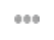
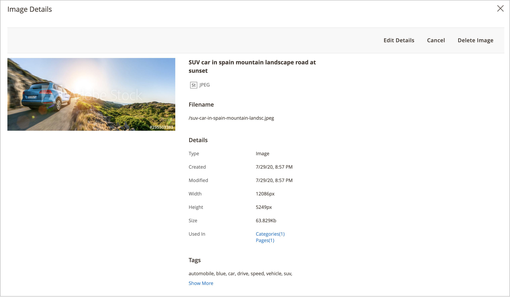

# Media Gallery アセット管理

新しい [Media Gallery](media-gallery.md) には、アップロードされたメディアファイルと、[Adobe Stock統合 ](adobe-stock.md) を通じて取得したアセットを管理するためのツールが用意されています。 Adobe Stock[ 画像プレビュー ](adobe-stock-save-preview.md) を保存した場合は、新しい Media Gallery で画像を [ ライセンス ](adobe-stock-license-image.md) することもできます。

## アセットのアップロード

1. _管理者_ サイドバーで、**[!UICONTROL Content]**/_[!UICONTROL Media]_/**[!UICONTROL Media Gallery]**に移動します。

1. 「**[!UICONTROL Upload Image]**」をクリックします。

1. アップロードするファイルを選択します。

   選択したアセットは、選択したフォルダー（フォルダーが選択されていない場合はストレージルート）に自動的にアップロードされます。

## アセットの詳細の表示

1. _管理者_ サイドバーで、**[!UICONTROL Content]**/_[!UICONTROL Media]_/**[!UICONTROL Media Gallery]**に移動します。

1. アセットの下にある 3 ドットアイコン（{width="10" zoomable="no"}）をクリックし、「**[!UICONTROL View Details]**」をクリックします。

   {width="600" zoomable="yes"}

   アセットの詳細は、スライドパネルに表示されます。 これには、アセットが使用されている場所に関する情報が含まれます。

   - **[!UICONTROL Categories]**
   - **[!UICONTROL Products]**
   - **[!UICONTROL Pages]**
   - **[!UICONTROL Blocks]**

   {width="600" zoomable="yes"}

   詳細を確認するには、**[!UICONTROL Used In]** のリンクをクリックしてください。 次の例のグリッドは、特定のアセットが使用されているすべてのカテゴリを示しています。

   {width="600" zoomable="yes"}

   「_詳細を表示_ セクションからアセットを削除することもできます。

## アセットの編集

1. _管理者_ サイドバーで、**[!UICONTROL Content]**/_[!UICONTROL Media]_/**[!UICONTROL Media Gallery]**に移動します。

1. アセットの下にある 3 ドットアイコン（{width="10" zoomable="no"}）をクリックし、「**[!UICONTROL Edit]**」をクリックします。

   {width="600" zoomable="yes"}

1. 必要に応じて、次のいずれかのメタデータ値を変更します。

   - **[!UICONTROL Title]**
   - **[!UICONTROL Description]**
   - **[!UICONTROL Tags/Keywords]**

   このデータはデータベースとファイルのメタデータ自体に保存されます。 現在、XMPおよび IPTC 形式がサポートされています。

   更新されたメタデータを含む画像をダウンロードできます。

## アセットの使用

Assetsは、管理全体を通して幅広く使用できます。例えば、[ ページの追加や編集 ](page-add.md)、[ カテゴリの作成や編集 ](../catalog/category-create.md)、[ コンテンツエディターからの画像の挿入 ](editor-insert-image.md) などです。

1. メディアアセットを使用できる領域から新しいメディアギャラリーにアクセスします。

1. アセットを選択し、「**[!UICONTROL Add Selected]**」をクリックします。

{{$include /help/_includes/image-optimization-animated-gif-note.md}}

## アセットの削除

1. _管理者_ サイドバーで、**[!UICONTROL Content]**/_[!UICONTROL Media]_/**[!UICONTROL Media Gallery]**に移動します。

1. 「**[!UICONTROL Delete Images...]**」をクリックし、削除する各アセットのチェックボックスを選択します。

1. 確認ダイアログで、「**[!UICONTROL Delete Image]**」をクリックします。

   {width="500" zoomable="yes"}

## アセットの検索

1. _管理者_ サイドバーで、**[!UICONTROL Content]**/_[!UICONTROL Media]_/**[!UICONTROL Media Gallery]**に移動します。

1. キーワード/タグによる画像検索を実行するには、**[!UICONTROL Search by keywords]** 入力を使用します。

   次の例の検索では、特定のタグ（`mountain`）を含むアセットを検索します。

   {width="600" zoomable="yes"}

>[!NOTE]
>
>画像タグの更新方法については、「_[アセットの編集](#edit-an-asset)_ の節を参照してください。

## アセットのフィルタリング

>[!NOTE]
>
>_使用されている場所_ 機能を使用するには、[ 設定 ](media-gallery-image-optimization.md) で [!UICONTROL Media Gallery Image Optimization] が有効になっている必要があります。

1. _管理者_ サイドバーで、**[!UICONTROL Content]**/_[!UICONTROL Media]_/**[!UICONTROL Media Gallery]**に移動します。

1. 「**[!UICONTROL Filters]**」タブをクリックします。

   {width="600" zoomable="yes"}

1. フィルターオプションを設定します。

   エンティティの使用状況に従ってアセットをフィルタリングできます。

   - **[!UICONTROL Used in Categories]**
   - **[!UICONTROL Used in Products]**
   - **[!UICONTROL Used in Pages]**
   - **[!UICONTROL Used in Blocks]**

   **[!UICONTROL Store View]**、**[!UICONTROL License Status]** および **[!UICONTROL Content Status]** でアセットをフィルタリングすることもできます。 ファイルの日付に従ってアセットをフィルタリングするには、**[!UICONTROL Uploaded Date]** や **[!UICONTROL Modification Date]** の日付範囲を設定します。

1. 「**[!UICONTROL Apply Filters]**」をクリックして結果を確認します。

   次の例のフィルタリングでは、特定のカテゴリ（`cars`）で使用されていて、有効になっているアセットを検索します。

   {width="600" zoomable="yes"}

## 画像の重複の検索

1. 「**[!UICONTROL Filters]**」タブをクリックし、「**[!UICONTROL Show duplicates]**」チェックボックスを選択します。

1. 結果を確認するには、[**[!UICONTROL Apply Filters]**] をクリックします。
