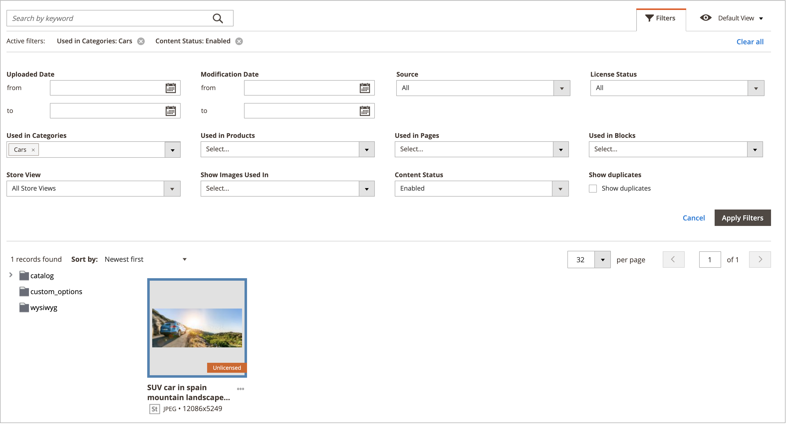

# Media Gallery アセット管理

新しい [メディアギャラリー](media-gallery.md) には、アップロードされたメディアファイルおよびを管理するためのツールが用意されています。 [Adobe Stock統合](adobe-stock.md). Adobe Stock [画像プレビュー](adobe-stock-save-preview.md)また、 [ライセンス](adobe-stock-license-image.md) 新しいメディアギャラリー内の画像。

## アセットのアップロード

1. 次の日： _管理者_ サイドバー、移動 **[!UICONTROL Content]** > _[!UICONTROL Media]_>**[!UICONTROL Media Gallery]**.

1. クリック **[!UICONTROL Upload Image]**.

1. アップロードするファイルを選択します。

   選択したアセットは、選択したフォルダー（またはフォルダーが選択されていない場合はストレージルート）に自動的にアップロードされます。

## アセットの詳細を表示

1. 次の日： _管理者_ サイドバー、移動 **[!UICONTROL Content]** > _[!UICONTROL Media]_>**[!UICONTROL Media Gallery]**.

1. アセットの下の 3 つのドット ({width="10" zoomable="no"}) をクリックしてから、 **[!UICONTROL View Details]**.

   {width="600" zoomable="yes"}

   アセットの詳細がスライドパネルに表示されます。 これには、アセットが使用されている情報が含まれます。

   - **[!UICONTROL Categories]**
   - **[!UICONTROL Products]**
   - **[!UICONTROL Pages]**
   - **[!UICONTROL Blocks]**

   {width="600" zoomable="yes"}

   詳細を確認するには、 **[!UICONTROL Used In]** リンク。 次の例のグリッドは、特定のアセットが使用されているすべてのカテゴリを示しています。

   {width="600" zoomable="yes"}

   また、 _詳細を表示_ 」セクションに入力します。

## アセットの編集

1. 次の日： _管理者_ サイドバー、移動 **[!UICONTROL Content]** > _[!UICONTROL Media]_>**[!UICONTROL Media Gallery]**.

1. アセットの下の 3 つのドット ({width="10" zoomable="no"}) をクリックしてから、 **[!UICONTROL Edit]**.

   {width="600" zoomable="yes"}

1. 必要に応じて、次のいずれかのメタデータ値を変更します。

   - **[!UICONTROL Title]**
   - **[!UICONTROL Description]**
   - **[!UICONTROL Tags/Keywords]**

   このデータは、データベースおよびファイルメタデータ自体に保存されます。 現在、XMPおよび IPTC 形式がサポートされています。

   更新されたメタデータを含む画像をダウンロードできます。

## アセットを使用

アセットは、管理者全体で広く使用できます ( 例： [ページを追加または編集](page-add.md), [カテゴリの作成または編集](../catalog/category-create.md)または [コンテンツエディターから画像を挿入する](editor-insert-image.md).

1. メディアアセットを使用できる領域から、新しいメディアギャラリーにアクセスします。

1. アセットを選択し、 **[!UICONTROL Add Selected]**.

{{$include /help/_includes/image-optimization-animated-gif-note.md}}

## アセットの削除

1. 次の日： _管理者_ サイドバー、移動 **[!UICONTROL Content]** > _[!UICONTROL Media]_>**[!UICONTROL Media Gallery]**.

1. クリック **[!UICONTROL Delete Images...]** をクリックし、削除する各アセットのチェックボックスをオンにします。

1. 確認ダイアログで、 **[!UICONTROL Delete Image]**.

   {width="500" zoomable="yes"}

## アセットの検索

1. 次の日： _管理者_ サイドバー、移動 **[!UICONTROL Content]** > _[!UICONTROL Media]_>**[!UICONTROL Media Gallery]**.

1. 以下を使用します。 **[!UICONTROL Search by keywords]** 入力して、キーワード/タグで画像検索を実行します。

   次の例の検索では、特定のタグ (`mountain`) をクリックします。

   {width="600" zoomable="yes"}

>[!NOTE]
>
>画像タグを更新する方法については、 _[アセットの編集](#edit-an-asset)_ 」セクションに入力します。

## アセットのフィルタリング

>[!NOTE]
>
>The _使用場所_ 機能にはが必要です。 [!UICONTROL Media Gallery Image Optimization] が有効な場合は、 [設定](media-gallery-image-optimization.md).

1. 次の日： _管理者_ サイドバー、移動 **[!UICONTROL Content]** > _[!UICONTROL Media]_>**[!UICONTROL Media Gallery]**.

1. 次をクリック： **[!UICONTROL Filters]** タブをクリックします。

   {width="600" zoomable="yes"}

1. フィルターオプションを設定します。

   エンティティの使用状況に応じて、アセットをフィルタリングできます。

   - **[!UICONTROL Used in Categories]**
   - **[!UICONTROL Used in Products]**
   - **[!UICONTROL Used in Pages]**
   - **[!UICONTROL Used in Blocks]**

   また、次の条件でアセットをフィルタリングすることもできます。 **[!UICONTROL Store View]**, **[!UICONTROL License Status]**、および **[!UICONTROL Content Status]**. の日付範囲を設定 **[!UICONTROL Uploaded Date]** および/または **[!UICONTROL Modification Date]** をクリックして、ファイルの日付に従ってアセットをフィルタリングします。

1. クリック **[!UICONTROL Apply Filters]** 結果を確認する。

   次の例のフィルターでは、特定のカテゴリ (`cars`) とが有効になっています。

   {width="600" zoomable="yes"}

## 画像の重複を検索

1. 次をクリック： **[!UICONTROL Filters]** 」タブで「 **[!UICONTROL Show duplicates]** チェックボックス。

1. 結果を確認するには、 **[!UICONTROL Apply Filters]**.
