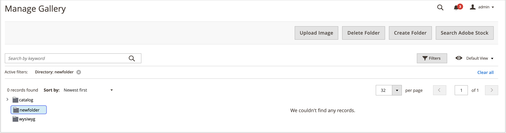

# Media Gallery フォルダー管理

フォルダーを使用して、新しい[&#x200B; メディアギャラリー](media-gallery.md)で画像を整理します。 メディアアセットの数が増えるにつれて、フォルダーを使用すると、メディアギャラリー内の既存のアセットを簡単に見つけて管理できます。

## フォルダーを作成

フォルダーは、`pub/media/wysywig`、`pub/media/catalog/category`、またはモジュールによって追加されたその他のフォルダーでのみ作成できます。

1. _管理者_ サイドバーで、**[!UICONTROL Content]** > _[!UICONTROL Media]_>**[!UICONTROL Media Gallery]**&#x200B;に移動します。

1. **[!UICONTROL Create Folder]**&#x200B;をクリックします。

   サブフォルダーを作成する場合は、**[!UICONTROL Create Folder]**&#x200B;をクリックする前に親フォルダーを選択します。

1. 新しいフォルダー名を入力し、**[!UICONTROL Confirm]**&#x200B;をクリックします。

   {width="600" zoomable="yes"}

## フォルダーの削除

>[!WARNING]
>
>フォルダーを削除すると、そのフォルダー内のすべての画像が削除されます。 削除できるのは、`pub/media/wysywig`および`pub/media/catalog/category` フォルダー内のフォルダーのみです。

1. _管理者_ サイドバーで、**[!UICONTROL Content]** > _[!UICONTROL Media]_>**[!UICONTROL Media Gallery]**&#x200B;に移動します。

1. 削除するフォルダーを選択します。

   {width="600" zoomable="yes"}

1. **[!UICONTROL Delete Folder]**&#x200B;をクリックします。

1. フォルダーの削除を確認するには、**[!UICONTROL OK]**&#x200B;をクリックします。
