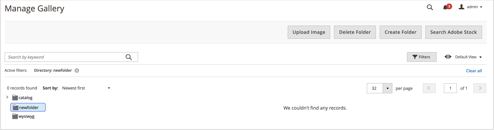

# Media Gallery フォルダー管理

フォルダーを使用した新規画像の整理 [メディアギャラリー](media-gallery.md). メディアアセットの数が増えると、フォルダーを使用してメディアギャラリー内の既存のアセットを簡単に見つけて管理できます。

## フォルダーの作成

>[!NOTE]
>
>ではフォルダーのみを作成できます `pub/media/wysywig` および `pub/media/catalog/category` フォルダー。

1. 日 _Admin_ サイドバー、に移動 **[!UICONTROL Content]** > _[!UICONTROL Media]_>**[!UICONTROL Media Gallery]**.

1. クリック **[!UICONTROL Create Folder]**.

   サブフォルダーを作成する場合は、親フォルダーを選択してから、をクリックします **[!UICONTROL Create Folder]**.

1. 新しいフォルダー名を入力し、 **[!UICONTROL Confirm]**.

   {width="600" zoomable="yes"}

## フォルダーの削除

>[!WARNING]
>
>フォルダーを削除すると、そのフォルダー内のすべての画像が削除されます。 で削除できるのはフォルダーのみです `pub/media/wysywig` および `pub/media/catalog/category` フォルダー。

1. 日 _Admin_ サイドバー、に移動 **[!UICONTROL Content]** > _[!UICONTROL Media]_>**[!UICONTROL Media Gallery]**.

1. 削除するフォルダーを選択します。

   {width="600" zoomable="yes"}

1. クリック **[!UICONTROL Delete Folder]**.

1. フォルダーの削除を確認するには、 **[!UICONTROL OK]**.
