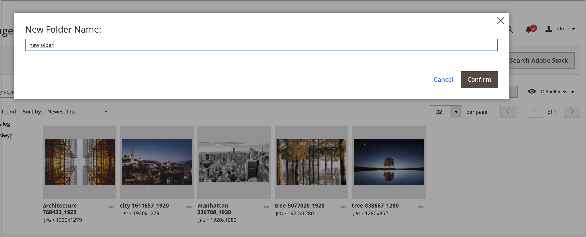

# メディアギャラリーフォルダー管理

フォルダーを使用して新しい [メディアギャラリー](media-gallery.md). メディアアセットの数が多くなると、フォルダーを使用すると、メディアギャラリー内の既存のアセットを簡単に見つけて管理できます。

## フォルダーの作成

>[!NOTE]
>
>フォルダーは、 `pub/media/wysywig` および `pub/media/catalog/category` フォルダー。

1. 次の日： _管理者_ サイドバー、移動 **[!UICONTROL Content]** > _[!UICONTROL Media]_>**[!UICONTROL Media Gallery]**.

1. クリック **[!UICONTROL Create Folder]**.

   サブフォルダーを作成する場合は、親フォルダーを選択してから「 **[!UICONTROL Create Folder]**.

1. 新しいフォルダー名を入力し、 **[!UICONTROL Confirm]**.

   {width="600" zoomable="yes"}

## フォルダーの削除

>[!WARNING]
>
>フォルダーを削除すると、そのフォルダー内のすべての画像が削除されます。 削除できるのは、 `pub/media/wysywig` および `pub/media/catalog/category` フォルダー。

1. 次の日： _管理者_ サイドバー、移動 **[!UICONTROL Content]** > _[!UICONTROL Media]_>**[!UICONTROL Media Gallery]**.

1. 削除するフォルダーを選択します。

   {width="600" zoomable="yes"}

1. クリック **[!UICONTROL Delete Folder]**.

1. フォルダーの削除を確定するには、 **[!UICONTROL OK]**.
