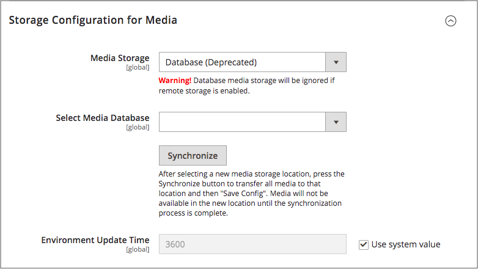

# メディアデータベースの使用

>[!IMPORTANT]
>
>Database Media Storage メソッドは、Adobe CommerceおよびMagento Open Source 2.4.3の時点で廃止されています。

デフォルトでは、[!DNL Commerce] インスタンスのすべての画像、コンパイル済みCSS ファイルおよびコンパイル済みJavaScript ファイルは、web サーバー上のファイルシステムに保存されます。 これらのファイルをデータベース・サーバ上のデータベースに保存することを選択できます。 このアプローチの利点の1つは、Web サーバー・ファイル・システムとデータベース間の自動同期と逆同期のオプションです。 デフォルトのデータベースを使用して、メディアを保存したり、メディアを作成したりできます。 新しく作成したデータベースをメディア ストレージとして使用するには、そのデータベースとアクセス資格情報に関する情報を`env.php` ファイルに追加する必要があります。

## データベースワークフロー

1. **Browser requests media** - ストアのページがお客様のブラウザーで開き、ブラウザーがHTMLで指定されたメディアをリクエストします。

1. **システムはファイルシステム内のメディアを検索します** - システムはファイルシステム内のメディアを検索し、見つかった場合はブラウザーに渡します。

1. **システムがデータベース内のメディアを検索します** - メディアがファイルシステム内に見つからない場合、メディアのリクエストが設定で指定されたデータベースに送信されます。

1. **システムがデータベース内のメディアを見つける** - PHP スクリプトは、データベースからファイル システムにファイルを転送し、お客様のブラウザーに送信します。 メディアトリガーに対するブラウザーリクエストは、次のように実行するスクリプトを指定します。

   - Web サーバー[書き換え](../merchandising-promotions/url-rewrite.md)が[!DNL Commerce]に対して有効であり、サーバーでサポートされている場合、PHP スクリプトは、要求されたメディアがファイルシステムに見つからない場合にのみ実行されます。
   - Web サーバーの書き換えが[!DNL Commerce]に対して無効になっているか、サーバーでサポートされていない場合、必要なメディアがファイルシステムで使用可能であっても、PHP スクリプトが実行されます。

## データベースをメディアストレージに使用する

1. _管理者_ サイドバーで、**[!UICONTROL Stores]** > _[!UICONTROL Settings]_>**[!UICONTROL Configuration]**&#x200B;に移動します。

1. 左側のパネルで、**[!UICONTROL Advanced]**&#x200B;を展開し、**[!UICONTROL System]**&#x200B;を選択します。

1. 左上隅で、**[!UICONTROL Store View]**&#x200B;を`Default Config`に設定して、グローバルレベルで設定を適用します。

1. **[!UICONTROL Storage Configuration for Media]** セクションのを展開し、次の操作を行います。

   {width="600" zoomable="yes"}

   - **[!UICONTROL Media Storage]**&#x200B;を`Database`に設定します。

   - 使用するデータベースに&#x200B;**[!UICONTROL Select Media Database]**&#x200B;を設定します。

   - 既存のメディアを新しく選択したデータベースに転送するには、**[!UICONTROL Synchronize]**&#x200B;をクリックします。

   - **[!UICONTROL Environment Update Time]**&#x200B;を秒単位で入力します。

1. 完了したら、**[!UICONTROL Save Config]**&#x200B;をクリックします。
