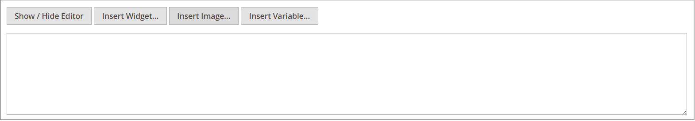

# メディアストレージ

メディアストレージを使用すると、サーバーに保存されているメディアファイルを整理し、アクセスできます。 ファイルの場所へのパスは、[base URL](../stores-purchase/store-urls.md) 設定によって決定されます。 メディアストレージ内のファイルは、ページや静的ブロックの作業中にエディターからアクセスできます。 通常、メディアストレージは、[!DNL Commerce] プログラムファイルと同じサーバー上のファイルシステムに存在します。

また、メディアファイルは、[ データベース ](media-storage-database.md) で管理することも、別のサーバーまたは [ コンテンツ配信ネットワーク ](media-storage-content-delivery-network.md) で管理することもできます。 代替ストレージを使用する利点は、メディアの同期に必要な労力を最小限に抑えることです。 同じ画像、CSS ファイル、その他のメディアファイルへのアクセスが必要な異なるサーバーにシステムの複数のインスタンスがデプロイされている場合、同期のパフォーマンスは特に影響を受けます。

カテゴリまたは製品の説明のカタログコンテンツに、静的 URL または [Dynamic Media URL](../catalog/catalog-urls.md#configure-catalog-media-url-format) を使用するようにエディターを設定できます。

![[!DNL Commerce] Media ストレージ ](./assets/media-storage.png){width="650" zoomable="yes"}

## メディアストレージへのファイルの追加

最初の 2 つの手順は、画像を挿入する場合と同じです。

1. [ エディター ](editor.md) ツールバーで _画像を挿入_ アイコンをクリックします。

   {width="700" zoomable="yes"}

   この操作を実行すると、_[!UICONTROL Insert/edit image]_&#x200B;ダイアログが開きます。

1. _[!UICONTROL Source]_&#x200B;の後、_ 検索 _アイコン（{width="10" zoomable="no"}）をクリックします。

1. 左側のディレクトリツリーで、次のいずれかの操作を行います。

   - アップロードした画像を保存するフォルダーに移動します。

   - フォルダーを作成する場所に移動し、「**フォルダーを作成**」をクリックします。

     フォルダーを追加する場合は、フォルダー名を入力し、「**[!UICONTROL OK]**」をクリックします。

1. 1 つ以上のファイルをメディア ストレージに追加するには、お使いのシステムからファイルをアップロードするか、[Adobe Stock Integration](adobe-stock.md) を使用します。

   システムからファイルをアップロードするには、「アップロー **[!UICONTROL Choose Files]**」をクリックして、以下の手順を実行します。

   - ローカルコンピューターのディレクトリで、画像の場所に移動します。

   - アップロードする各画像を選択します。

   - 「**[!UICONTROL Open]**」をクリックします。

   [integration](adobe-stock.md) でAdobe Stockのアセットを使用するには：

   - 「**[!UICONTROL Search Adobe Stock]**」をクリックします。

   - Adobe Stockからプレビュー画像またはライセンス済み画像を追加します（[Adobe Stock画像の使用 ](adobe-stock-manage.md) を参照）。

画像は、サーバー上の現在のメディアストレージフォルダーにアップロードされます。

![[!DNL Commerce] Media ストレージ ](./assets/media-storage.png){width="650" zoomable="yes"}

## メディアストレージからの画像の挿入

編集するページまたはブロックを開きます。 次に、次のいずれかの方法を使用して、メディアストレージから画像を挿入します。

### 方法 1:WYSIWYG モード

1. [ エディター ](editor.md) ツールバーで _画像を挿入_ アイコンをクリックします。

1. _[!UICONTROL Source]_&#x200B;の後、_ 検索 _アイコン（{width="10" zoomable="no"}）をクリックします。

   {width="250" zoomable="yes"}

1. 左側のディレクトリツリーで、画像が格納されているフォルダーに移動します。

1. 画像のタイルを選択し、「**[!UICONTROL Add Selected]**」をクリックします。

### 方法 2:HTML モード

1. コード内で `` タグを挿入する位置にカーソルを置きます。

1. 「**[!UICONTROL Insert Image]**」をクリックします。

   {width="600" zoomable="yes"}
