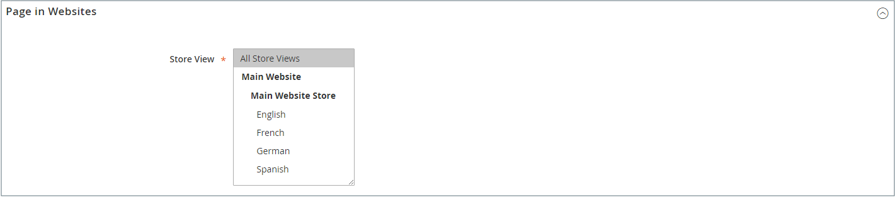
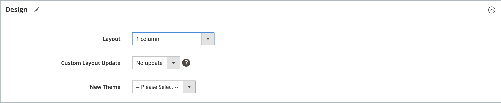

# ページの追加と削除

コンテンツページをストアに追加するプロセスは、作成する可能性のあるすべてのタイプのページで基本的に同じです。 テキスト、画像、コンテンツブロック、変数およびウィジェットを含めることができます。 ほとんどのコンテンツページは、最初は検索エンジンで、2 番目は人物で読むように設計されています。 ページタイトルや URL を選択する際と、メタデータやコンテンツを構成する際は、これら 2 つの異なるオーディエンスのニーズを念頭に置いてください。 ページが完成したら、ページをストアナビゲーションに追加したり、他のページにリンクしたり、ストアのフッターからリンクしたり、新しい [&#x200B; ホームページ &#x200B;](page-home-new.md) として使用したりできます。

{width="700" zoomable="yes"}

## ページを追加

以下の手順では、基本的なページを作成するための各手順について説明します。 一部の高度な機能は飛ばされますが、他のトピックで説明しています。

### 手順 1：ページを作成する

1. _管理者_ サイドバーで、**[!UICONTROL Content]**/_[!UICONTROL Elements]_/**[!UICONTROL Pages]**&#x200B;に移動します。

1. 「**[!UICONTROL Add New Page]**」をクリックします。

   {width="600" zoomable="yes"}

1. ページをすぐに公開しない場合は、**[!UICONTROL Enable Page]** を `No` に設定します。

1. **[!UICONTROL Page Title]** を入力します。

   ページタイトルは [&#x200B; パンくず &#x200B;](../catalog/navigation-breadcrumb-trail.md) ナビゲーションに表示されます。

### 手順 2：コンテンツを完了する

[&#x200B; 詳細なコンテンツツールの設定 &#x200B;](../configuration-reference/general/content-management.md) に応じて、ページコンテンツを追加します。

>[!NOTE]
>
>ページビルダーのコンテンツエディターには、デフォルトのストア表示では使用できないCMS ページ要素のプレビューは表示されません。 例えば、デフォルト以外のストアビューにのみ割り当てられているCMS ブロックをプレビューすることはできません。 この場合、最初にCMS ページを公開する必要があります。 その後、このページをストアフロントで直接確認できます。 または、[!UICONTROL Pages] の列のCMSページ [!UICONTROL View] を選択して、管理の [!UICONTROL Action] グリッドからページを表示できます。

#### ページビルダーのコンテンツツールの使用

1.  **[!UICONTROL Content]** を展開します。

   {width="600" zoomable="yes"}

1. **[!UICONTROL Content Heading]** ボックスに、ページの先頭に表示する見出しを入力します。

   有効にすると、[&#x200B; ページビルダー &#x200B;](../page-builder/introduction.md) ステージとパネルがコンテンツ見出しの下に表示されます。 詳しくは、[Workspace](../page-builder/workspace.md) を参照してください。 _ページビルダー_ が有効になっていない場合、エディターはWYSIWYG モードで開き、上部にツールバーが表示されます。

1. コンテンツを完成させ、必要に応じてテキストを書式設定します。

#### エディターツールバーの使用

1.  **[!UICONTROL Content]** を展開します。

   {width="600" zoomable="yes"}

1. **[!UICONTROL Content Heading]** ボックスに、ページの先頭に表示する見出しを入力します。

1. コンテンツを完成させ、必要に応じてテキストを書式設定します。

   必要に応じて、[images](media-storage.md)、[variables](../systems/variables-predefined.md) および [widgets](widgets.md) を追加できます。 詳しくは、[&#x200B; エディターの使用 &#x200B;](editor.md) を参照してください。

### 手順 3:SEO 情報の完了

1.  **[!UICONTROL Search Engine Optimization]** を展開します。

   {width="600" zoomable="yes"}

1. デフォルトをそのまま使用するか、またはスペースではなくハイフンを使用して、すべての小文字で構成される別の **[!UICONTROL URL Key]** を入力します。

   デフォルトの URL キーは、ページの保存時に作成されたもので、コンテンツの見出しに基づいています。

1. ページの **[!UICONTROL Meta Title]** を入力します。

   メタタイトルは 70 文字未満で入力する必要があり、ブラウザーのタイトルバーとタブに表示されます。

1. 検索エンジンがページのインデックス作成に使用できる、値の大きい **[!UICONTROL Meta Keywords]** の選択を入力します。

   複数の単語をコンマで区切ります。 Metaのキーワードは、一部の検索エンジンでは無視されますが、他の検索エンジンでは使用されます。

1. **[!UICONTROL Meta Description]**：検索結果リストのページの簡単な説明を入力します。

   説明の長さは 150～160 文字、上限は 255 にしてください。

1. 「**[!UICONTROL Save]**」をクリックします。

### 手順 4：ページの範囲を指定

1.  **[!UICONTROL Page in Websites]** を展開します。

   {width="600" zoomable="yes"}

1. **[!UICONTROL Store View]** リストで、ページを使用できる各ビューを選択します。

   インストールに複数の web サイトがある場合は、各 web サイトを選択し、ページを使用できるストア表示を選択します。

### 手順 5：親ページを特定する（該当する場合）

{{ee-feature}}

1.  **[!UICONTROL Hierarchy]** を展開します。

   {width="600" zoomable="yes"}

1. このページが別のページの子である場合は、**[!UICONTROL Parent page]** のチェックボックスをオンにします。

### 手順 6：デザインの変更を入力（オプション）

1. ページのレイアウトを変更するには、「」を展開 **[!UICONTROL Design]** ます。

   {width="600" zoomable="yes"}

1. ページの列のレイアウトを変更するには、**[!UICONTROL Layout]** を次のいずれかに設定します。

   - `Empty`
   - `1 column`
   - `2 columns with left bar`
   - `2 columns with right bar`
   - `3 columns`
   - `Page -- Full Width` （[&#x200B; ページビルダー &#x200B;](../page-builder/introduction.md) が必要）
   - `Category -- Full Width` （ページビルダーが必要）
   - `Product -- Full Width` （ページビルダーが必要）

1. **[!UICONTROL Custom Layout Update]** を適用するには、リストからファイルの名前を選択します。

   詳しくは、[&#x200B; レイアウトの更新 &#x200B;](layout-updates.md) を参照してください。

1. ページのテーマを変更するには、**[!UICONTROL New Theme]** を次のいずれかに設定します。

   - `Magento Black`
   - `Magento Luma`

1.  （Magento Open Sourceのみ）デザインの変更をスケジュールするには、 **[!UICONTROL Custom Design Update]** を展開し、次の手順を実行します。

   {width="600" zoomable="yes"}

   - カレンダー（）を使用して、変更を有効にする **[!UICONTROL From]** 日と **[!UICONTROL To]** 日を選択します。

   - ページに別のテーマを適用するには、テー **[!UICONTROL New Theme]** の名前を選択します。

   - ページの列のレイアウトを変更するには、適用する **[!UICONTROL Layout]** を選択します。

### 手順 7：ページのプレビュー

1. **[!UICONTROL Save]** 矢印をクリックし、「**[!UICONTROL Save & Close]**」を選択してページグリッドに戻ります。

1. グリッドでページを見つけ、**[!UICONTROL View]** 列で _[!UICONTROL Action]_&#x200B;を選択します。

1. グリッドに戻るには、ブラウザーウィンドウの左上隅にある **[!UICONTROL Back]** をクリックします。

### 手順 8：ページの公開

1. グリッドの **[!UICONTROL Edit]** 列の「_[!UICONTROL Action]_」を選択します。

1. **[!UICONTROL Enable Page]** を `Yes` に設定します。

1. **[!UICONTROL Save]** の矢印をクリックし、「**[!UICONTROL Save & Close]**」を選択します。

## ページの複製

任意のコンテンツページをテンプレートとして使用し、複製として保存できます。 この時間を節約する手法を使用して、サイト全体のコンテンツページに対して一貫したデザインを作成できます。 複製ページには、元のページのページタイトルが保持されますが、URL キーフィールドとステータスフィールドは更新する必要があります。

{width="600" zoomable="yes"}

1. _管理者_ サイドバーで、**[!UICONTROL Content]**/_[!UICONTROL Elements]_/**[!UICONTROL Pages]**&#x200B;に移動します。

1. グリッドで、複製するページを見つけ、**[!UICONTROL Edit]** の列の _[!UICONTROL Action]_&#x200B;をクリックします。

1. **[!UICONTROL Save]** の矢印をクリックし、「**[!UICONTROL Save & Duplicate]**」を選択します。

1. ページが保存されて複製されたことを示すメッセージが表示されたら、上部のボタンバーの **[!UICONTROL Back]** をクリックしてグリッドに戻ります。

1. グリッドで重複ページを見つけて、次の点に注意してください。

   - ページタイトルは元のタイトルと同じです。
   - 一意の一時 URL キーが割り当てられます。
   - ページのステータスは「`Disabled`」です。

1. 複製ページを _編集_ モードで開き、次の手順を実行します。

   - ページをすぐに公開する場合は、**[!UICONTROL Enable Page]** を `Yes` に設定します。

   - 必要に応じて **[!UICONTROL Page Title]** を更新します。

   -  「**[!UICONTROL Search Engine Optimization]**」セクションを展開し、重複ページに使用する一意の **[!UICONTROL URL Key]** を入力します。

     {width="600" zoomable="yes"}

   - 必要に応じて、残りのページコンテンツを更新します。

1. **[!UICONTROL Save]** の矢印をクリックし、「**[!UICONTROL Save & Close]**」を選択します。

   グリッド内の複製ページに変更内容が反映されます。

## 保存メニュー

| コマンド | 説明 |
|--- |--- |
| [!UICONTROL Save] | 現在のページを保存し、作業を続行します。 |
| [!UICONTROL Save & New] | 現在のページを保存して閉じ、新しいページを開始します。 |
| [!UICONTROL Save & Duplicate] | 現在のページを保存して閉じ、新しい複製コピーを開きます。 |
| [!UICONTROL Save & Close] | 現在のページを保存して閉じ、ページグリッドに戻ります。 |

{style="table-layout:auto"}

## ページの削除

作成したページを削除する方法は 2 つあります。 _[!UICONTROL Pages]_&#x200B;グリッドまたは&#x200B;_[!UICONTROL Edit]_ ページから削除できます。

### 方法 1：ページグリッドからページを削除する

1. _管理者_ サイドバーで、**[!UICONTROL Content]**/_[!UICONTROL Elements]_/**[!UICONTROL Pages]**&#x200B;に移動します。

1. グリッドの上でフィルターを使用してページを見つけ、削除する 1 つ以上のページのチェックボックスを選択します。

1. リストの左上隅にある **[!UICONTROL Actions]** を `Delete` に設定します。

1. アクションを確定するには、「**[!UICONTROL OK]**」をクリックします。

### 方法 2：編集ページからページを削除する

1. _管理者_ サイドバーで、**[!UICONTROL Content]**/_[!UICONTROL Elements]_/**[!UICONTROL Pages]**&#x200B;に移動します。

1. 削除するページを検索します。

1. ページエンティティの「_[!UICONTROL Actions]_」列で「**[!UICONTROL Select]**」をクリックし、「**[!UICONTROL Edit]**」を選択します。

1. ボタン バーで、[**[!UICONTROL Delete Page]**] をクリックします。

1. アクションを確定するには、「**[!UICONTROL OK]**」をクリックします。
