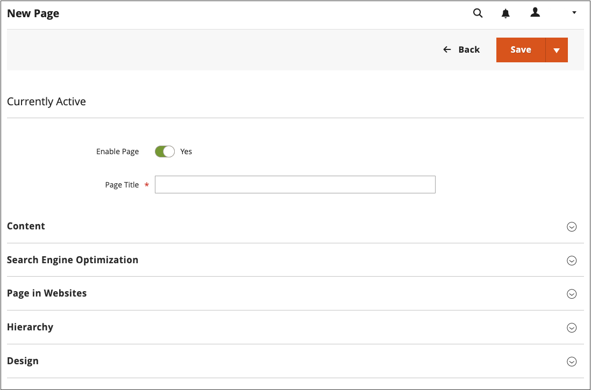
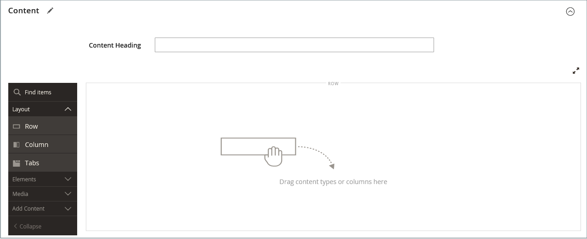
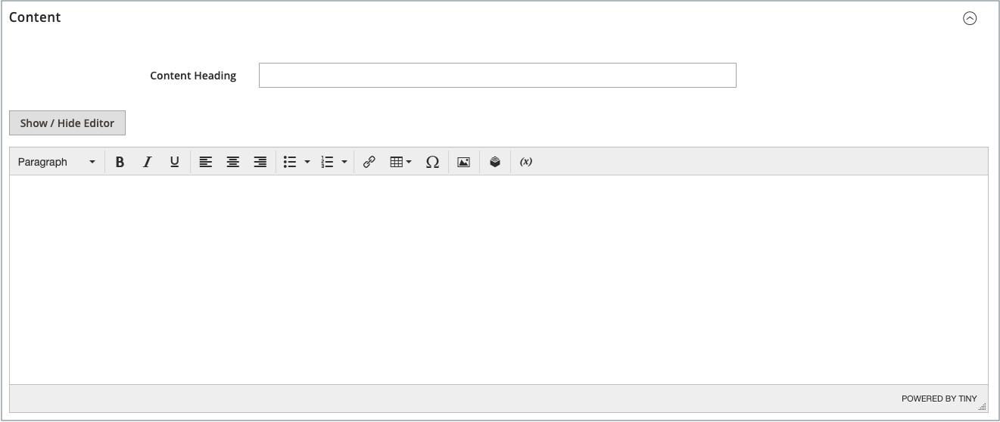
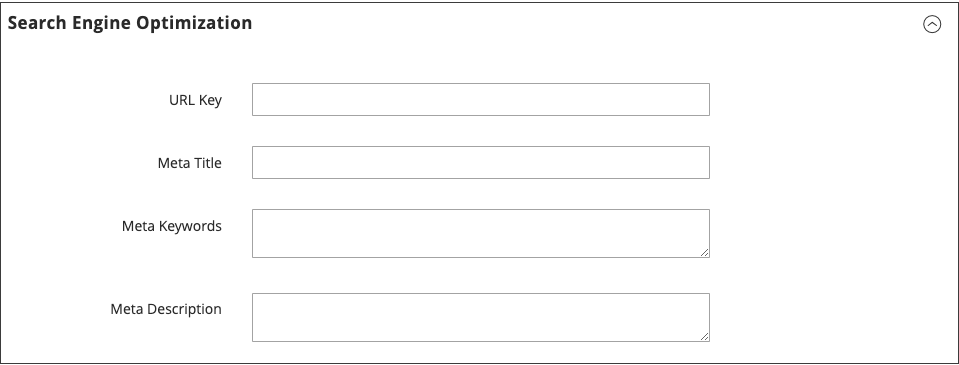
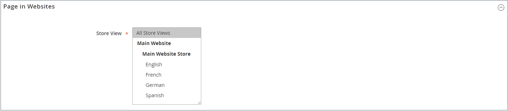
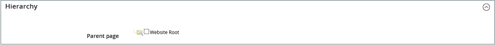
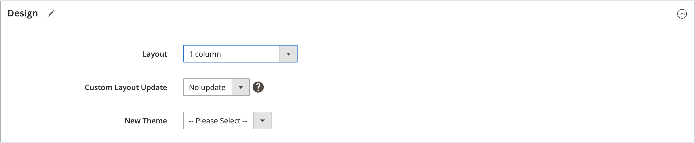
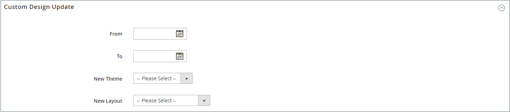
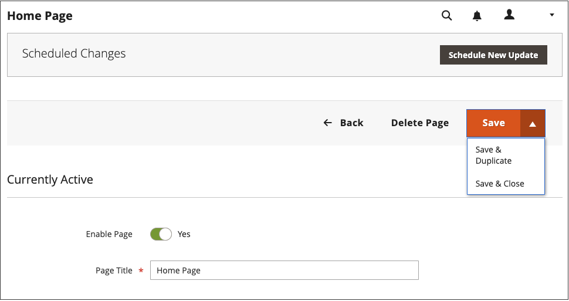
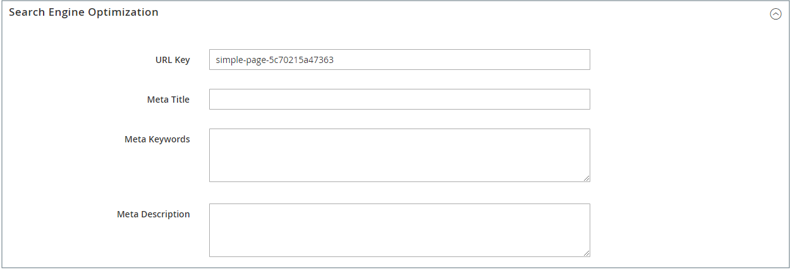

# ページの追加と削除

コンテンツページをストアに追加するプロセスは、作成する可能性のあるあらゆるタイプのページで基本的に同じです。 テキスト、画像、コンテンツブロック、変数、ウィジェットを含めることができます。 多くのコンテンツページは、まず検索エンジンが読むように、そして次に人々が読むように設計されています。 ページタイトル、URLを選択する際、およびメタデータやコンテンツを作成する際には、このふたつの異なるオーディエンスのニーズを念頭に置いてください。 ページが完成したら、ストアナビゲーションに追加したり、他のページにリンクしたり、ストアのフッターからリンクしたり、新しい[&#x200B; ホームページ &#x200B;](page-home-new.md)として使用したりできます。

{width="700" zoomable="yes"}

## ページを追加

次の手順では、基本ページを作成するための各ステップについて説明します。 一部の高度な機能は省略されますが、他のトピックで取り上げられます。

### 手順1：ページの作成

1. _管理者_ サイドバーで、**[!UICONTROL Content]** > _[!UICONTROL Elements]_>**[!UICONTROL Pages]**&#x200B;に移動します。

1. **[!UICONTROL Add New Page]**&#x200B;をクリックします。

   {width="600" zoomable="yes"}

1. ページをすぐに公開しない場合は、**[!UICONTROL Enable Page]**&#x200B;を`No`に設定します。

1. **[!UICONTROL Page Title]**&#x200B;を入力します。

   ページのタイトルが[&#x200B; パンくずリスト &#x200B;](../catalog/navigation-breadcrumb-trail.md) ナビゲーションに表示されます。

### ステップ 2：コンテンツを完了する

[詳細コンテンツツール設定](../configuration-reference/general/content-management.md)に応じて、ページコンテンツを追加します。

>[!NOTE]
>
>ページビルダーのコンテンツエディターに、デフォルトのストアビューで使用できないCMS ページ要素のプレビューが表示されない。 例えば、デフォルト以外のストアビューにのみ割り当てられているCMS ブロックをプレビューすることはできません。 この場合、最初にCMS ページを公開する必要があります。 次に、ストアフロントでこのページを直接表示できます。 または、[!UICONTROL Action]列のCMS ページ [!UICONTROL View]を選択して、管理者の[!UICONTROL Pages] グリッドからページを表示することもできます。

#### ページビルダーのコンテンツツールの使用

1.  **[!UICONTROL Content]**&#x200B;を展開します。

   {width="600" zoomable="yes"}

1. 「**[!UICONTROL Content Heading]**」ボックスに、ページの上部に表示する見出しを入力します。

   有効にすると、[&#x200B; ページビルダー](../page-builder/introduction.md)のステージとパネルがコンテンツ見出しの下に表示されます。 詳しくは、[Workspace](../page-builder/workspace.md)を参照してください。 _ページビルダー_&#x200B;が有効になっていない場合、エディターはWYSIWYG モードで開き、上部にツールバーが表示されます。

1. コンテンツを完成させ、必要に応じてテキストを書式設定します。

#### エディターツールバーの使用

1.  **[!UICONTROL Content]**&#x200B;を展開します。

   {width="600" zoomable="yes"}

1. 「**[!UICONTROL Content Heading]**」ボックスに、ページの上部に表示する見出しを入力します。

1. 必要に応じて、コンテンツを入力し、テキストの書式を設定します。

   必要に応じて、[画像](media-storage.md)、[変数](../systems/variables-predefined.md)、[&#x200B; ウィジェット &#x200B;](widgets.md)を追加できます。 詳しくは、[&#x200B; エディターの使用](editor.md)を参照してください。

### ステップ 3:SEO情報を完了する

1.  **[!UICONTROL Search Engine Optimization]**&#x200B;を展開します。

   {width="600" zoomable="yes"}

1. デフォルトを使用するか、すべての小文字で構成される別の&#x200B;**[!UICONTROL URL Key]**&#x200B;を入力し、スペースの代わりにハイフンを使用します。

   デフォルトのURL キーは、ページの保存時に作成され、コンテンツ見出しに基づいています。

1. ページの&#x200B;**[!UICONTROL Meta Title]**&#x200B;を入力してください。

   メタタイトルは70文字以下にする必要があり、ブラウザーのタイトルバーとタブに表示されます。

1. 検索エンジンがページのインデックス作成に使用できる高価値&#x200B;**[!UICONTROL Meta Keywords]**&#x200B;の選択肢を入力します。

   複数の単語はコンマで区切ります。 Metaのキーワードは、一部の検索エンジンでは無視されますが、他の検索エンジンでは使用されます。

1. **[!UICONTROL Meta Description]**&#x200B;に、検索結果リストのページの簡単な説明を入力します。

   理想的には、説明は150～160文字で、最大255文字までです。

1. **[!UICONTROL Save]**&#x200B;をクリックします。

### 手順4：ページの範囲の指定

1.  **[!UICONTROL Page in Websites]**&#x200B;を展開します。

   Web サイトの{width="600" zoomable="yes"}

1. **[!UICONTROL Store View]** リストで、ページを利用できる各ビューを選択します。

   インストールに複数のweb サイトがある場合は、各web サイトを選択し、ページを使用可能にするストアビューを選択します。

### 手順5：親ページの特定（該当する場合）

{{ee-feature}}

1.  **[!UICONTROL Hierarchy]**&#x200B;を展開します。

   {width="600" zoomable="yes"}

1. このページが別のページの子である場合は、**[!UICONTROL Parent page]**&#x200B;のチェックボックスを選択します。

### 手順6：デザインの変更を入力する（オプション）

1. ページのレイアウトを変更するには、 **[!UICONTROL Design]**&#x200B;を展開します。

   {width="600" zoomable="yes"}

1. ページの列レイアウトを変更するには、**[!UICONTROL Layout]**&#x200B;を次のいずれかに設定します。

   - `Empty`
   - `1 column`
   - `2 columns with left bar`
   - `2 columns with right bar`
   - `3 columns`
   - `Page -- Full Width` （[&#x200B; ページビルダー](../page-builder/introduction.md)が必要）
   - `Category -- Full Width` （ページビルダーが必要）
   - `Product -- Full Width` （ページビルダーが必要）

1. **[!UICONTROL Custom Layout Update]**&#x200B;を適用するには、リストからファイル名を選択します。

   詳しくは、[&#x200B; レイアウトの更新](layout-updates.md)を参照してください。

1. ページのテーマを変更するには、**[!UICONTROL New Theme]**&#x200B;を次のいずれかに設定します。

   - `Magento Black`
   - `Magento Luma`

1.  （Magento Open Sourceのみ）デザインの変更をスケジュールするには、 **[!UICONTROL Custom Design Update]**&#x200B;を展開し、次の操作を行います。

   {width="600" zoomable="yes"}

   - カレンダー（）を使用して、変更を有効にする&#x200B;**[!UICONTROL From]**&#x200B;日と&#x200B;**[!UICONTROL To]**&#x200B;日を選択します。

   - 別のテーマをページに適用するには、**[!UICONTROL New Theme]**&#x200B;の名前を選択します。

   - ページの列レイアウトを変更するには、適用する&#x200B;**[!UICONTROL Layout]**&#x200B;を選択します。

### 手順7：ページのプレビュー

1. **[!UICONTROL Save]**&#x200B;矢印をクリックし、**[!UICONTROL Save & Close]**&#x200B;を選択してページグリッドに戻ります。

1. グリッドでページを検索し、_[!UICONTROL Action]_&#x200B;列の&#x200B;**[!UICONTROL View]**&#x200B;を選択します。

1. グリッドに戻るには、ブラウザーウィンドウの左上隅にある「**[!UICONTROL Back]**」をクリックします。

### 手順8：ページの公開

1. グリッドの&#x200B;_[!UICONTROL Action]_&#x200B;列の&#x200B;**[!UICONTROL Edit]**&#x200B;を選択します。

1. **[!UICONTROL Enable Page]**&#x200B;を`Yes`に設定します。

1. **[!UICONTROL Save]**&#x200B;矢印をクリックし、**[!UICONTROL Save & Close]**&#x200B;を選択します。

## ページの複製

任意のコンテンツページをテンプレートとして使用し、複製として保存できます。 この時間の節約になる手法を利用して、サイト全体でコンテンツページの一貫したデザインを作成することができます。 複製されたページには、元のページタイトルが保持されますが、「URL キー」フィールドと「ステータス」フィールドは更新する必要があります。

{width="600" zoomable="yes"}

1. _管理者_ サイドバーで、**[!UICONTROL Content]** > _[!UICONTROL Elements]_>**[!UICONTROL Pages]**&#x200B;に移動します。

1. グリッドで、複製するページを見つけ、_[!UICONTROL Action]_&#x200B;列の&#x200B;**[!UICONTROL Edit]**&#x200B;をクリックします。

1. **[!UICONTROL Save]**&#x200B;矢印をクリックし、**[!UICONTROL Save & Duplicate]**&#x200B;を選択します。

1. ページが保存され、複製されたメッセージが表示されたら、上部のボタンバーで「**[!UICONTROL Back]**」をクリックしてグリッドに戻ります。

1. グリッドで複製ページを見つけ、次の点に注意してください。

   - ページタイトルはオリジナルと同じです。
   - 一意ですが、一時的なURL キーが割り当てられています。
   - ページのステータスは`Disabled`です。

1. _編集_ モードで複製ページを開き、次の操作を行います。

   - ページをすぐに公開する場合は、**[!UICONTROL Enable Page]**&#x200B;を`Yes`に設定します。

   - 必要に応じて、**[!UICONTROL Page Title]**&#x200B;を更新します。

   - **[!UICONTROL Search Engine Optimization]** セクションのを展開し、複製ページに使用する一意の&#x200B;**[!UICONTROL URL Key]**&#x200B;を入力します。

     {width="600" zoomable="yes"}

   - 必要に応じて、残りのページコンテンツを更新します。

1. **[!UICONTROL Save]**&#x200B;矢印をクリックし、**[!UICONTROL Save & Close]**&#x200B;を選択します。

   グリッドの複製ページには、変更が反映されます。

## メニューを保存

| コマンド | 説明 |
|--- |--- |
| [!UICONTROL Save] | 現在のページを保存して、作業を続行します。 |
| [!UICONTROL Save & New] | 現在のページを保存して閉じ、新しいページを開始します。 |
| [!UICONTROL Save & Duplicate] | 現在のページを保存して閉じ、新しい複製コピーを開きます。 |
| [!UICONTROL Save & Close] | 現在のページを保存して閉じ、ページグリッドに戻ります。 |

{style="table-layout:auto"}

## ページの削除

作成したページを削除する方法は2つあります。 _[!UICONTROL Pages]_&#x200B;グリッドまたは&#x200B;_[!UICONTROL Edit]_ ページから削除できます。

### 方法1: ページグリッドからページを削除する

1. _管理者_ サイドバーで、**[!UICONTROL Content]** > _[!UICONTROL Elements]_>**[!UICONTROL Pages]**&#x200B;に移動します。

1. グリッドの上にあるフィルターを使用してページを見つけ、削除する1つ以上のページのチェックボックスを選択します。

1. リストの左上隅で、**[!UICONTROL Actions]**&#x200B;を`Delete`に設定します。

1. アクションを確認するには、**[!UICONTROL OK]**&#x200B;をクリックします。

### 方法2：編集ページからページを削除する

1. _管理者_ サイドバーで、**[!UICONTROL Content]** > _[!UICONTROL Elements]_>**[!UICONTROL Pages]**&#x200B;に移動します。

1. 削除するページを検索します。

1. ページエンティティの&#x200B;_[!UICONTROL Actions]_&#x200B;列で、**[!UICONTROL Select]**&#x200B;をクリックし、**[!UICONTROL Edit]**&#x200B;を選択します。

1. ボタンバーで、**[!UICONTROL Delete Page]**&#x200B;をクリックします。

1. アクションを確認するには、**[!UICONTROL OK]**&#x200B;をクリックします。
