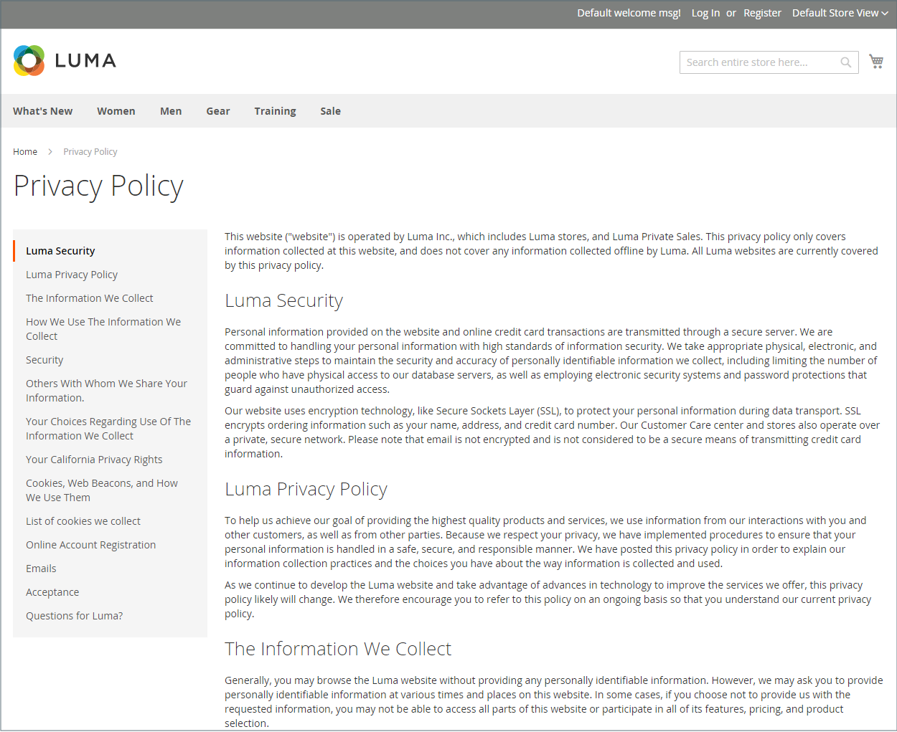
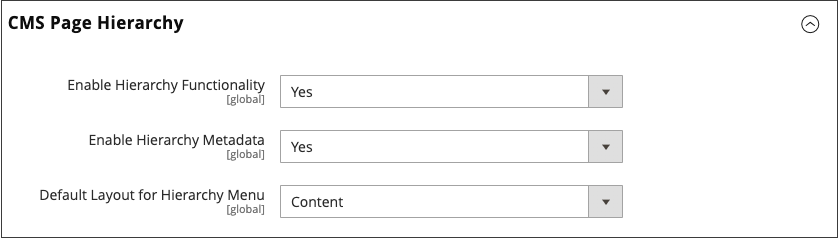
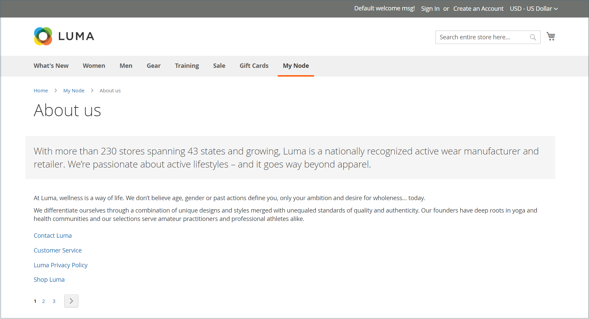
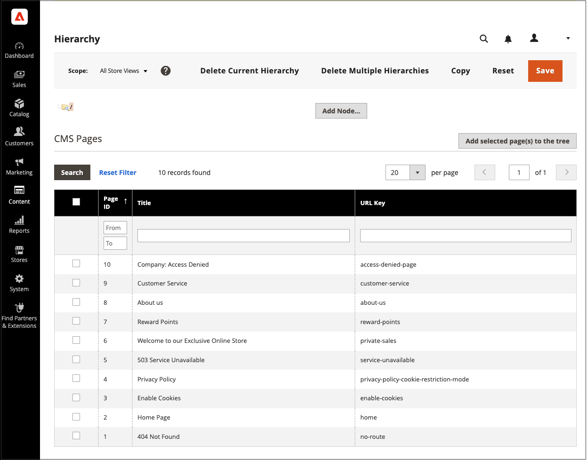
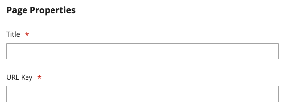
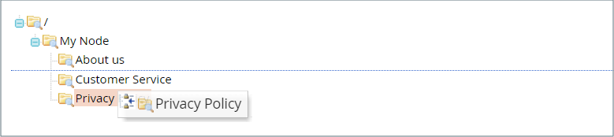
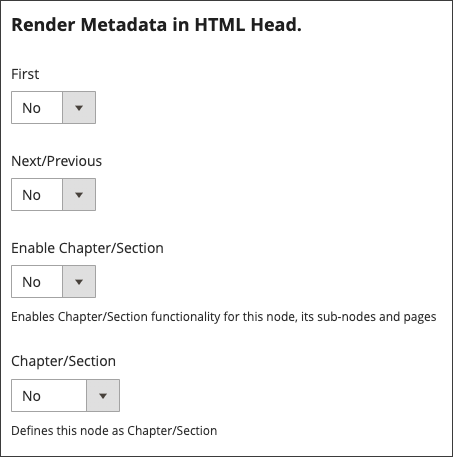
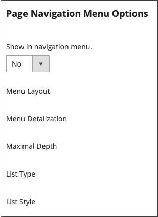
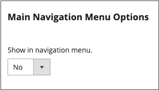

# ページ階層

{{ee-feature}}

ストアページ階層システムは、コンテンツページを整理し、ページネーション、ナビゲーション、メニューを追加する機能を提供します。 サンプルデータのプライバシーポリシーのページは、左側にメニューが表示されているページの例です。 大量のコンテンツを定期的に公開する場合、ページ階層を利用してコンテンツを整理することで、誰かが興味のある記事を簡単に見つけることができます。

ページ階層システムは、ノードを使用して関連するコンテンツを識別し、コンテンツページを親子関係に整理します。 親ノードは、子ノードやページを含む可能性のあるフォルダーのようなものです。 階層内の各ノードとページの相対的な位置は、_ツリー_&#x200B;構造として表示されます。 ノードには他のノードやコンテンツページが含まれる場合があり、単一のコンテンツページは複数のノードや、親子関係や近隣関係にある他のコンテンツページに関連付けられる場合があります。

{width="600" zoomable="yes"}

## ページ階層の設定

設定は、ページ階層システムとメタデータをアクティブ化し、デフォルトのメニューレイアウトを決定します。

{width="600" zoomable="yes"}

1. _管理者_ サイドバーで、**[!UICONTROL Stores]** > _[!UICONTROL Settings]_>**[!UICONTROL Configuration]**&#x200B;に移動します。

1. _[!UICONTROL General]_&#x200B;の下の左側のパネルで、**[!UICONTROL Content Management]**&#x200B;を選択します。

1.  **[!UICONTROL CMS Page Hierarchy]**&#x200B;を展開し、必要な変更を行います。

1. 完了したら、**[!UICONTROL Save Config]**&#x200B;をクリックします。

| フィールド | 説明 |
|--- |--- |
| [!UICONTROL Enable Hierarchy Functionality] | コンテンツページのページ階層の使用を有効にします。 オプション：`Yes` / `No` |
| [!UICONTROL Enable Hierarchy Metadata] | このオプションを有効にすると、メタデータを階層内のページに関連付けることができます。 オプション：`Yes` / `No` |
| [!UICONTROL Default Layout for Hierarchy Menu] | デフォルトのメニュースタイルを指定します。 オプション：`Content` / `Left Column` / `Right Column` |

{style="table-layout:auto"}

## 階層ノードの追加

次の例は、関連するコンテンツページに簡単に移動できるノードを作成する方法を示しています。 ノードにはコンテンツページが関連付けられていませんが、サイトの他の場所で参照できるURL キーがあります。

例えば、個々のプレスリリースへのナビゲーションを持つ&#x200B;_プレスリリース_&#x200B;というノードを作成できます。 次に、ノードへの&#x200B;_About Us_ ページにリンクを含めることができます。 また、ニュースレターのバックイシューのコレクション用のノードを作成することもできます。

ノードにリンクするには、[Widget](widgets.md) ツールを使用してCMS Hierarchy Node リンクを作成し、ウィジェットをコンテンツブロックまたはページに配置します。

{width="600" zoomable="yes"}

### 手順1: ノードの作成

1. _管理者_ サイドバーで、**[!UICONTROL Content]** > _[!UICONTROL Elements]_>**[!UICONTROL Hierarchy]**&#x200B;に移動します。

   {width="600" zoomable="yes"}

1. グリッドの上で、**[!UICONTROL Add Node...]**&#x200B;をクリックします。

1. _[!UICONTROL Page Properties]_&#x200B;の下に、ノードの&#x200B;**[!UICONTROL Title]**&#x200B;と適切な&#x200B;**[!UICONTROL URL Key]**&#x200B;を入力します。

   URL キーは、ノードの一意のWeb アドレスを提供します。 スペースではなく、ハイフンを使用して単語を区切り、すべて小文字にする必要があります。

   {width="500" zoomable="yes"}

1. **[!UICONTROL Save]**&#x200B;をクリックします。

   ノードは、ページの左側のツリーにフォルダーとして表示されます。

### 手順2：ノードへのページの追加

1. 階層ツリーで、をクリックしてノードを選択します。

1. **[!UICONTROL Add Selected Pages(s) to Tree]**&#x200B;をクリックします。

   上にスクロールすると、選択した各ページがノードフォルダーの下のツリーに表示されます。

### 手順3：構造の定義

1. 必要に応じて、ページを位置にドラッグして、メニューに表示される順序を反映します。

   {width="500" zoomable="yes"}

1. 階層の上部にあるノードをクリックします。

   _[!UICONTROL Page Properties]_&#x200B;セクションに、ノードに関する情報が表示されるようになりました。

1. **[!UICONTROL Render Metadata in HTML Head]**&#x200B;で、次の操作を行います。

   {width="400" zoomable="yes"}

   - ノードを階層の最上位として識別するには、**[!UICONTROL First]**&#x200B;を`Yes`に設定します。

   - ページネーション コントロールを表示するには、**[!UICONTROL Next/Previous]**&#x200B;を`Yes`に設定します。

   - 階層内のページをブックとして整理するには、**[!UICONTROL Enable Chapter/Section]**&#x200B;を`Yes`に設定します。

     ブックの一部としてノードを含めたくない場合は、デフォルトの`No`のままにします。

   - ブックの特定の部分にノードを割り当てるには、**[!UICONTROL Chapter/Section]**&#x200B;を次のいずれかに設定します。

      - `No` - ノードを章/セクションとして定義しません。
      - `Chapter` – 現在のノードを章として割り当てます。
      - `Section` – 現在のノードをセクションとして割り当てます。
      - `Both` – 現在のノードを章とセクションの両方として割り当てます。

### 手順4：ページネーション制御の追加

1. ネストされたページ _の_ ページネーション オプションで、**[!UICONTROL Enable Pagination]**&#x200B;を`Yes`に設定します。

1. **[!UICONTROL Frame]**&#x200B;に、ページネーション コントロールに含めるページ リンクの数を入力します。

   ページネーションコントロールに含めることができるページが階層内にさらに存在する場合。

1. **[!UICONTROL Frame Skip]**&#x200B;の場合、次のページ分割リンクのセットをスキップする（または戻る）ページ数を入力します。

### 手順5：メニューレイアウトの選択

ノードをメニューに表示する場合は、次の操作を行います。

1. _ページナビゲーションメニューオプション_&#x200B;で、**[!UICONTROL Show in navigation menu]**&#x200B;を`Yes`に設定します。

   この設定は、ページ階層に対してナビゲーションメニューを生成するかどうかを決定します。

   {width="300" zoomable="yes"}

1. コンテンツに関連するメニューの場所を指定するには、**[!UICONTROL Menu Layout]**&#x200B;を設定します。

   - `Content` - メニューレイアウトがコンテンツ内にあります。
   - `Use Default` - [設定](../configuration-reference/general/content-management.md)で指定されたメニュースタイルを使用します。
   - `Left Column` - メニューがコンテンツの左側に表示されます。
   - `Right Column` - メニューがコンテンツの右側に表示されます。

1. メニューにどの程度の詳細を含めるかを指定するには、**[!UICONTROL Menu Detalization]**&#x200B;を次のいずれかに設定します。

   - `Only Children` - メニューにサブページのみを含めます。
   - `Neighbours and Children` – 階層の同じレベルにあるサブページと他のページが含まれます。

1. メニューの深さを判断するには、含めるレベルの最大数に&#x200B;**[!UICONTROL Maximal Depth]**&#x200B;を入力します。

1. メニューを書式設定するには、**[!UICONTROL List Type]**&#x200B;を選択します。

   - `Unordered` - メニューオプションには番号が付けられておらず、箇条書き記号の有無を問わず書式設定できます。 順序なしリストタイプのオプション：デフォルト/円/ディスク/正方形
   - `Ordered` - メニューオプションには番号が付けられており、大文字または小文字のいずれかで数値、アルファベット、またはローマ数字として書式設定できます。

1. **[!UICONTROL List Style]**&#x200B;を次のいずれかに設定します：

   - `Circle`
   - `Disc`
   - `Square`

1. ナビゲーションメニューにもノードを表示する場合は、_メインナビゲーションメニューオプション_&#x200B;までスクロールし、**[!UICONTROL Show in Navigation menu]**&#x200B;を`Yes`に設定します。

   {width="250" zoomable="yes"}

1. **[!UICONTROL Save]**&#x200B;をクリックします。
