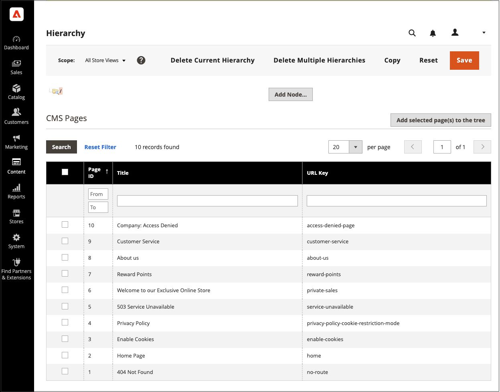

# ページ階層

{{ee-feature}}

ストアページ階層システムを使用すると、コンテンツページを整理し、ページネーション、ナビゲーションおよびメニューを追加できます。 サンプルデータのプライバシーポリシーページは、左側にメニューがあるページの例です。 大量のコンテンツを定期的に公開する場合は、ページ階層を使用してコンテンツを整理し、興味のある記事を見つけやすくすることができます。

ページ階層システムは、ノードを使用して、関連するコンテンツの部分を識別し、コンテンツページを親子関係に整理します。 親ノードは、子ノードやページを含むフォルダーのようなものです。 階層内の各ノードおよびページの相対位置は、 _ツリー_ 構造。 ノードには他のノードやコンテンツページが含まれ、1 つのコンテンツページは親/子または隣接関係の複数のノードや他のコンテンツページに関連付けられます。

{width="600" zoomable="yes"}

## ページ階層の設定

設定により、ページ階層システムとメタデータがアクティブ化され、デフォルトのメニューレイアウトが決定されます。

{width="600" zoomable="yes"}

1. 次の日： _管理者_ サイドバー、移動 **[!UICONTROL Stores]** > _[!UICONTROL Settings]_>**[!UICONTROL Configuration]**.

1. の下の左側のパネル _[!UICONTROL General]_を選択します。**[!UICONTROL Content Management]**.

1. 展開  **[!UICONTROL CMS Page Hierarchy]**  必要な変更を加えます。

1. 完了したら、「 **[!UICONTROL Save Config]**.

| フィールド | 説明 |
|--- |--- |
| [!UICONTROL Enable Hierarchy Functionality] | コンテンツページでのページ階層の使用をアクティベートします。 オプション： `Yes` / `No` |
| [!UICONTROL Enable Hierarchy Metadata] | このオプションを有効にすると、メタデータを階層内のページに関連付けることができます。 オプション： `Yes` / `No` |
| [!UICONTROL Default Layout for Hierarchy Menu] | 既定のメニュースタイルを決定します。 オプション： `Content` / `Left Column` / `Right Column` |

{style="table-layout:auto"}

## 階層ノードの追加

次の例は、関連するコンテンツページへのシンプルなナビゲーションを含むノードを作成する方法を示しています。 ノードにはコンテンツページが関連付けられていませんが、サイトの他の場所で参照できる URL キーが含まれています。

例えば、 _プレスリリース_ 個々のプレスリリースに移動できる 次に、リンクを _会社概要_ ページをノードに追加します。 または、ニュースレターのバックイシューのコレクション用にノードを作成することもできます。

ノードにリンクするには、 [Widget](widgets.md) ツールを使用して CMS 階層ノードリンクを作成し、ウィジェットをコンテンツブロックまたはページに配置します。

{width="600" zoomable="yes"}

### 手順 1：ノードの作成

1. 次の日： _管理者_ サイドバー、移動 **[!UICONTROL Content]** > _[!UICONTROL Elements]_>**[!UICONTROL Hierarchy]**.

   {width="600" zoomable="yes"}

1. グリッドの上にある **[!UICONTROL Add Node...]**.

1. の下 _[!UICONTROL Page Properties]_、**[!UICONTROL Title]**ノードに対して、適切な&#x200B;**[!UICONTROL URL Key]**.

   URL キーは、ノードの一意の Web アドレスを提供します。 すべて小文字にする必要があります。スペースの代わりに、ハイフンを使用して単語を区切ります。

   {width="500" zoomable="yes"}

1. クリック **[!UICONTROL Save]**.

   このノードは、ページの左側にあるツリー内にフォルダーとして表示されます。

### 手順 2：ノードにページを追加する

1. 階層ツリーで、をクリックしてノードを選択します。

1. クリック **[!UICONTROL Add Selected Pages(s) to Tree]**.

   上にスクロールすると、選択した各ページがノードフォルダーの下のツリーに表示されます。

### 手順 3：構造の定義

1. 必要に応じて、ページを適切な位置にドラッグし、メニューでの表示順を反映します。

   {width="500" zoomable="yes"}

1. 階層の上部にあるノードをクリックします。

   The _[!UICONTROL Page Properties]_「 」セクションに、ノードに関する情報が表示されるようになりました。

1. の下 **[!UICONTROL Render Metadata in HTML Head]**、次の操作を実行します。

   {width="400" zoomable="yes"}

   - ノードを階層の最上位として識別するには、 **[!UICONTROL First]** から `Yes`.

   - ページネーションコントロールを表示するには、 **[!UICONTROL Next/Previous]** から `Yes`.

   - 階層内のページを書籍として整理するには、 **[!UICONTROL Enable Chapter/Section]** から `Yes`.

     ノードを本の一部に含めない場合は、デフォルトの `No`.

   - ノードをブックの特定の部分に割り当てるには、 **[!UICONTROL Chapter/Section]** を次のいずれかに変更します。

      - `No`  — ノードをチャプターまたはセクションとして定義しません。
      - `Chapter`  — 現在のノードをチャプターとして割り当てます。
      - `Section`  — 現在のノードをセクションとして割り当てます。
      - `Both`  — 現在のノードをチャプターとセクションの両方として割り当てます。

### 手順 4：ページネーションコントロールの追加

1. の下 _ネストされたページのページネーションオプション_，設定 **[!UICONTROL Enable Pagination]** から `Yes`.

1. の場合 **[!UICONTROL Frame]**」では、ページネーションコントロールに含めるページリンクの数を入力します。

   階層内に、ページネーションコントロールに含めることができるページが他にある場合。

1. の場合 **[!UICONTROL Frame Skip]**&#x200B;をクリックし、次のページネーションリンクセットの前にスキップ（または前にスキップ）するページ数を入力します。

### 手順 5：メニューのレイアウトの選択

ノードをメニューに表示する場合は、次の操作を行います。

1. の下 _ページナビゲーションメニューオプション_，設定 **[!UICONTROL Show in navigation menu]** から `Yes`.

   この設定は、ページ階層に対してナビゲーションメニューを生成するかどうかを決定します。

   {width="300" zoomable="yes"}

1. コンテンツに関するメニューの場所を指定するには、 **[!UICONTROL Menu Layout]**:

   - `Content`  — メニューのレイアウトはコンテンツ内にあります。
   - `Use Default` - [設定](../configuration-reference/general/content-management.md).
   - `Left Column`  — コンテンツの左側にメニューが表示されます。
   - `Right Column`  — コンテンツの右側にメニューが表示されます。

1. メニューに表示する詳細を指定するには、 **[!UICONTROL Menu Detalization]** を次のいずれかに変更します。

   - `Only Children`  — メニューにサブページのみを含めます。
   - `Neighbours and Children`  — 階層内で同じレベルにあるサブページおよびその他のページを含みます。

1. メニューの深さを決定するには、 **[!UICONTROL Maximal Depth]** を設定します。

1. メニューをフォーマットするには、 **[!UICONTROL List Type]**:

   - `Unordered`  — メニューオプションには番号が付いておらず、箇条書きの場合もない場合もあります。 順不同リストタイプのオプション：デフォルト/円/ディスク/四角形
   - `Ordered`  — メニューオプションは番号付きで、大文字と小文字のどちらかの数字、アルファベット、ローマ数字の形式で書式設定できます。

1. 設定 **[!UICONTROL List Style]** を次のいずれかに変更します。

   - `Circle`
   - `Disc`
   - `Square`

1. ノードもナビゲーションメニューに表示する場合は、 _メインナビゲーションメニューオプション_ と設定します。 **[!UICONTROL Show in Navigation menu]** から `Yes`.

   {width="250" zoomable="yes"}

1. クリック **[!UICONTROL Save]**.
