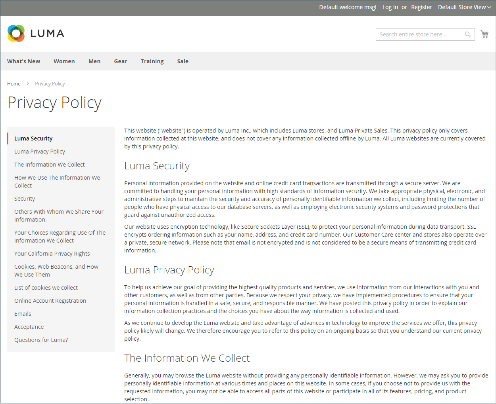

# ページ階層

{{ee-feature}}

ストアページ階層システムを使用すると、コンテンツページを整理し、ページネーション、ナビゲーションおよびメニューを追加できます。 サンプルデータのプライバシーポリシーページは、左側にメニューがあるページの例です。 大量のコンテンツを定期的に公開する場合は、ページ階層を使用してコンテンツを整理し、関心のある記事をユーザーが簡単に見つけられるようにすることができます。

ページ階層システムは、ノードを使用して、関連するコンテンツ部分を識別し、コンテンツページを親子関係に整理します。 親ノードは、子ノードおよびページを含む可能性のあるフォルダーに似ています。 階層内の各ノードとページの相対位置は、_tree_ 構造として表示されます。 ノードには、他のノードやコンテンツページが含まれ、1 つのコンテンツページが、親/子または近隣の関係の複数のノードや他のコンテンツページに関連付けられる場合があります。

{width="600" zoomable="yes"}

## ページ階層の設定

構成設定により、ページ階層システムおよびメタデータがアクティブ化され、デフォルトのメニューレイアウトが決定されます。

{width="600" zoomable="yes"}

1. _管理者_ サイドバーで、**[!UICONTROL Stores]**/_[!UICONTROL Settings]_/**[!UICONTROL Configuration]**に移動します。

1. _[!UICONTROL General]_の下の左パネルで、「**[!UICONTROL Content Management]**」を選択します。

1.  **[!UICONTROL CMS Page Hierarchy]** を展開し、必要な変更を加えます。

1. 完了したら、「**[!UICONTROL Save Config]**」をクリックします。

| フィールド | 説明 |
|--- |--- |
| [!UICONTROL Enable Hierarchy Functionality] | コンテンツページに対してページ階層の使用をアクティベートします。 オプション：`Yes` / `No` |
| [!UICONTROL Enable Hierarchy Metadata] | このオプションを有効にすると、メタデータを階層内のページに関連付けることができます。 オプション：`Yes` / `No` |
| [!UICONTROL Default Layout for Hierarchy Menu] | 既定のメニュースタイルを決定します。 オプション：`Content`/`Left Column`/`Right Column` |

{style="table-layout:auto"}

## 階層ノードの追加

次の例では、関連するコンテンツページへの簡単なナビゲーションを使用してノードを作成する方法を示しています。 ノードにはコンテンツページが関連付けられていませんが、サイトの他の場所で参照できる URL キーがあります。

例えば、個々のプレスリリースに移動できる _プレスリリース_ というノードを作成できます。 次に、「会社情報 _ページのリンクをノードに含めるこ_ ができます。 または、ニュースレターのバックイシューのコレクション用のノードを作成することもできます。

ノードにリンクするには、[Widget](widgets.md) ツールを使用してCMS階層ノードリンクを作成し、ウィジェットをコンテンツブロックまたはページに配置します。

{width="600" zoomable="yes"}

### 手順 1：ノードを作成する

1. _管理者_ サイドバーで、**[!UICONTROL Content]**/_[!UICONTROL Elements]_/**[!UICONTROL Hierarchy]**に移動します。

   {width="600" zoomable="yes"}

1. グリッドの上にある「**[!UICONTROL Add Node...]**」をクリックします。

1. 「_[!UICONTROL Page Properties]_」に、ノードの&#x200B;**[!UICONTROL Title]**と適切な&#x200B;**[!UICONTROL URL Key]**を入力します。

   URL キーは、ノードの一意の web アドレスを提供します。 スペースではなくハイフンを使用して単語を区切り、すべて小文字にする必要があります。

   {width="500" zoomable="yes"}

1. 「**[!UICONTROL Save]**」をクリックします。

   ノードは、ページの左側のツリーにフォルダーとして表示されます。

### 手順 2：ノードへのページの追加

1. 階層ツリーで、ノードをクリックして選択します。

1. 「**[!UICONTROL Add Selected Pages(s) to Tree]**」をクリックします。

   上にスクロールすると、選択した各ページがノードフォルダーの下のツリーに表示されます。

### 手順 3：構造の定義

1. 必要に応じて、ページをメニューに表示する順序を反映する位置にドラッグします。

   {width="500" zoomable="yes"}

1. 階層の最上位にあるノードをクリックします。

   _[!UICONTROL Page Properties]_セクションには、ノードに関する情報が表示されるようになりました。

1. [**[!UICONTROL Render Metadata in HTML Head]**] で、次の操作を行います。

   {width="400" zoomable="yes"}

   - ノードを階層の最上位として識別するには、「**[!UICONTROL First]**」を「`Yes`」に設定します。

   - ページネーションコントロールを表示するには、**[!UICONTROL Next/Previous]** を `Yes` に設定します。

   - 階層内のページをブックとして整理するには、「**[!UICONTROL Enable Chapter/Section]**」を「`Yes`」に設定します。

     ノードをブックの一部として含めない場合は、デフォルトの `No` のままにします。

   - ノードをブックの特定の部分に割り当てるには、**[!UICONTROL Chapter/Section]** を次のいずれかに設定します。

      - `No` - ノードをチャプター/セクションとして定義しません。
      - `Chapter` – 現在のノードをチャプターとして割り当てます。
      - `Section` – 現在のノードをセクションとして割り当てます。
      - `Both` – 現在のノードをチャプターとセクションの両方として割り当てます。

### 手順 4：ページネーションコントロールの追加

1. 「_ネストされたページのページネーションオプション_」で、「**[!UICONTROL Enable Pagination]**」を「`Yes`」に設定します。

1. **[!UICONTROL Frame]**：ページネーションコントロールに含めるページリンクの数を入力します。

   ページネーションコントロールに含めることができるページが階層内にまだある場合。

1. **[!UICONTROL Frame Skip]**：次のページネーションリンクのセットのために前にスキップ（または後ろにスキップ）するページ数を入力します。

### 手順 5：メニューレイアウトの選択

メニューにノードを表示する場合は、次の操作を行います。

1. _ページナビゲーションメニューオプション_ で、「**[!UICONTROL Show in navigation menu]**」を「`Yes`」に設定します。

   この設定により、ページ階層にナビゲーションメニューを生成するかどうかが決まります。

   {width="300" zoomable="yes"}

1. コンテンツに関連するメニューの場所を指定するには、**[!UICONTROL Menu Layout]** のように設定します。

   - `Content` - メニューレイアウトがコンテンツ内にあります。
   - `Use Default` - [configuration](../configuration-reference/general/content-management.md) で指定されたメニュースタイルを使用します。
   - `Left Column` - メニューがコンテンツの左側に表示されます。
   - `Right Column` - メニューがコンテンツの右側に表示されます。

1. メニューに含める詳細の量を指定するには、**[!UICONTROL Menu Detalization]** を次のいずれかに設定します。

   - `Only Children` - メニューにサブページのみを含めます。
   - `Neighbours and Children` – 階層内の同じレベルにあるサブページとその他のページを含みます。

1. メニューの深さを決定するには、含めるレベルの最大数の **[!UICONTROL Maximal Depth]** を入力します。

1. メニューを書式設定するには、**[!UICONTROL List Type]** のいずれかを選択します。

   - `Unordered` - メニューオプションには番号が付けられておらず、箇条書きまたは箇条書きなしで書式設定できます。 順不同リストタイプのオプション：デフォルト/円/ディスク/正方形
   - `Ordered` - メニューオプションには番号が付けられ、大文字または小文字の数字、アルファベット、またはローマ数字の形式を設定できます。

1. **[!UICONTROL List Style]** を次のいずれかに設定します。

   - `Circle`
   - `Disc`
   - `Square`

1. ノードをナビゲーションメニューにも表示する場合は、スクロールして _メインナビゲーションメニューオプション_ を表示し、**[!UICONTROL Show in Navigation menu]** を `Yes` に設定します。

   {width="250" zoomable="yes"}

1. 「**[!UICONTROL Save]**」をクリックします。
