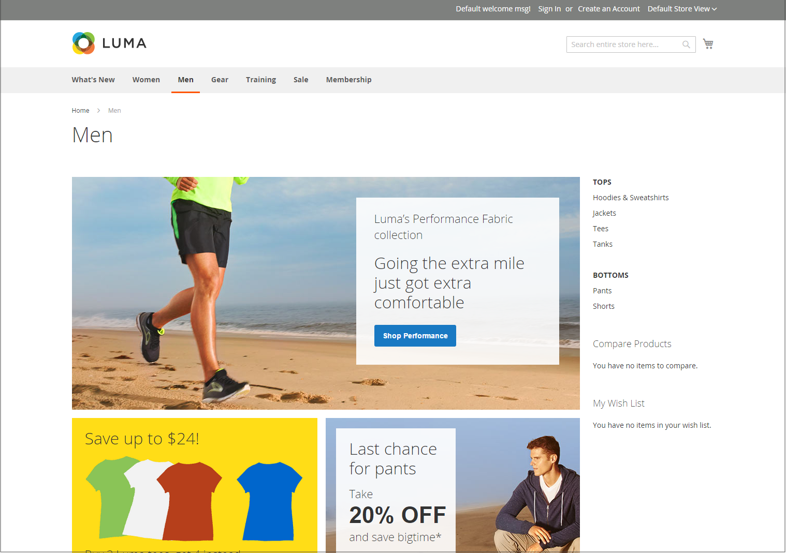

# ストアフロントのレイアウト例

列の寸法は、テーマのスタイルシートによって決まります。 ページのレイアウトに固定のピクセル幅を適用するテーマもあれば、ウィンドウやデバイスの幅に合わせてページを表示するために割合を使用するテーマもあります。

ほとんどのデスクトップテーマでは、メインの列の幅は固定されており、すべてのアクティビティはこの囲まれた領域内で行われます。 画面の解像度によっては、メインの列の両側に空のスペースがあります。

## 1 列

1 列レイアウトのコンテンツ領域は、メイン列の全幅に広がります。 このレイアウトは、大きなバナーやスライダーを持つホームページや、ナビゲーションを必要としないページ（ログインページ、スプラッシュページ、ビデオ、フルページ広告など）でよく使用されます。

{width="700" zoomable="yes"}

## 左側に棒が付いた 2 列

このレイアウトのコンテンツ領域は 2 つの列に分割されています。 メインコンテンツ列は右に、サイドバーは左にフローティングします。

{width="700" zoomable="yes"}

## 右側のバー付き 2 列

このレイアウトは、他の 2 列のレイアウトのミラーイメージです。 今度は、サイドバーが右側にフローティングし、メインコンテンツ列が左側にフローティングします。

{width="700" zoomable="yes"}

## 3 列

3 列のレイアウトには、2 つの側列を持つメインコンテンツ領域があります。 左側のサイドバーとメインコンテンツ列は一緒にラップされ、左側にユニットとしてフロートされます。 もう一方のサイドバーは右側に浮かんでいます。

{width="700" zoomable="yes"}
