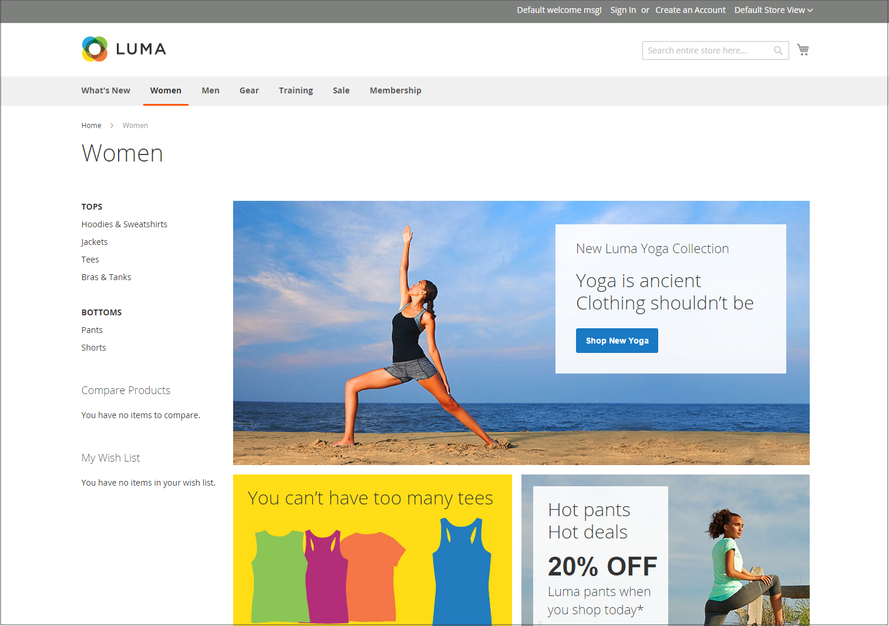

# ストアフロントのレイアウト例

列の寸法は、テーマのスタイルシートによって決まります。 ページレイアウトに固定のピクセル幅を適用するテーマもあれば、ウィンドウやデバイスの幅に合わせてページを調整するためにパーセンテージを使用するテーマもあります。

ほとんどのデスクトップテーマは、メイン列の幅が固定されており、すべてのアクティビティはこの囲まれた領域内で行われます。 画面の解像度に応じて、メイン列の両側に空きスペースがあります。

## 1列

1列のレイアウトのコンテンツ領域は、メイン列の全幅にまたがっています。 このレイアウトは、大きなバナーやスライダーを持つホームページや、ログインページ、スプラッシュページ、ビデオ、フルページ広告など、ナビゲーションを必要としないページによく使用されます。

{width="700" zoomable="yes"}

## 左の棒グラフを持つ2つの列

このレイアウトのコンテンツ領域は2つの列に分かれています。 メインコンテンツ列は右にフロートし、サイドバーは左にフロートします。

{width="700" zoomable="yes"}

## 右側のバーを持つ2つの列

このレイアウトは、他の2列レイアウトのミラーイメージです。 今回は、サイドバーが右に浮かび、メインコンテンツ列が左に浮かびます。

{width="700" zoomable="yes"}

## 三段組

3列のレイアウトには、2つのサイドカラムを持つメインコンテンツ領域があります。 左側のサイドバーとメインコンテンツ列は一緒にラップされ、左側にユニットとして浮動します。 もう一方のサイドバーは右に浮かびます。

{width="700" zoomable="yes"}
