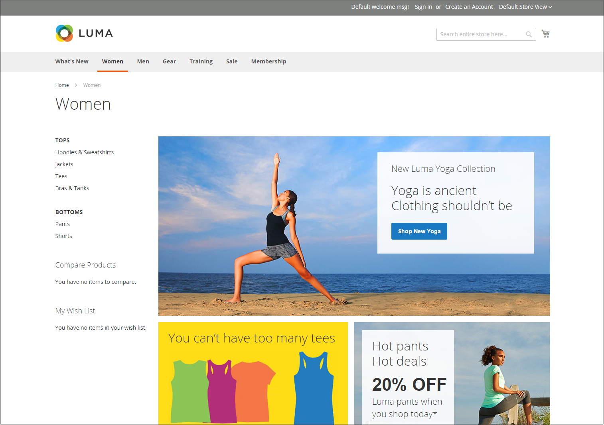

# ストアフロントレイアウトの例

列の寸法は、テーマのスタイルシートによって決まります。 テーマによっては、ページレイアウトに固定のピクセル幅が適用される場合と、ページがウィンドウやデバイスの幅に応答するようにパーセンテージを使用する場合があります。

ほとんどのデスクトップテーマのメイン列の幅は固定されており、すべてのアクティビティはこの囲まれた領域で実行されます。 画面の解像度に応じて、メイン列の各側に空白が表示されます。

## 1 列

1 列レイアウトのコンテンツ領域は、メイン列の全幅に広がります。 このレイアウトは、大きなバナーやスライダーを持つホームページや、ログインページ、スプラッシュページ、ビデオ、フルページ広告など、ナビゲーションを必要としないページによく使用されます。

{width="700" zoomable="yes"}

## 左バー付きの 2 列

このレイアウトのコンテンツ領域は 2 列に分割されます。 メインコンテンツ列は右側にフロートし、サイドバーは左側にフロートします。

{width="700" zoomable="yes"}

## 右バー付きの 2 列

このレイアウトは、他の 2 列レイアウトのミラー画像です。 今回は、サイドバーが右側にフローティングされ、メインコンテンツ列が左側にフローティングされます。

{width="700" zoomable="yes"}

## 3 列

3 列レイアウトには、2 つの側列を持つメインコンテンツ領域があります。 左側のバーとメインコンテンツの列はまとめられ、左側の単位として浮き上がります。 もう一方のサイドバーは右側に浮かびます。

{width="700" zoomable="yes"}
