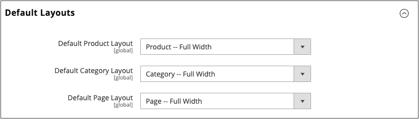
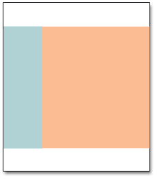

# ページレイアウト

ストア内の各ページのレイアウトは、ページのヘッダー、フッター、コンテンツ領域を定義する個別のセクションつまりコンテナで構成されます。 レイアウトに応じて、各ページには 1 列、2 列、3 列またはそれ以上の列が含まれる場合があります。 レイアウトはページの _平面図_ と考えることができます。また、CMS、製品、カテゴリの各ページのデフォルトとして使用される特定のレイアウトを割り当てることができます。

ページ上では、コンテンツブロックはフロートとなり、[ ページレイアウト ](layout-updates.md) のセクションに従って使用可能なスペースが埋められます。ここで、コンテンツブロックが割り当てられて表示されます。 レイアウトを 3 列から 2 列に変更すると、メイン領域の内容が拡張され、使用可能なスペースが埋められます。 また、未使用のサイドバーに関連付けられているブロックが消えたように見えることにも注意してください。 ただし、3 列のレイアウトを復元すると、ブロックが再び表示されます。 この流動的なアプローチ _リキッドレイアウト_ を使用すると、コンテンツを修正することなくページレイアウトを変更できます。 個々のHTMLページでの作業に慣れている場合、このモジュール型の _構築ブロック_ アプローチには異なる考え方が必要です。

{width="700" zoomable="yes"}

## デフォルトのレイアウトを設定

1. _管理者_ サイドバーで、**[!UICONTROL Stores]**/_[!UICONTROL Settings]_/**[!UICONTROL Configuration]**に移動します。

1. _[!UICONTROL General]_の下の左パネルで、「**[!UICONTROL Web]**」を選択します。

1. 「」を展開し、「**[!UICONTROL Default Layouts]**」セクションを展開します。

   {width="600" zoomable="yes"}

1. 製品ページに使用する **[!UICONTROL Default Product Layout]** を選択します。

   この設定により、製品ページに対してデフォルトで使用されるレイアウトが決まります。

   - `No layout updates` – 製品ページではレイアウトのアップデートを使用できません。
   - `Empty` – 製品ページに空白のレイアウトを使用します。
   - `1 column` – 製品ページに 1 列のレイアウトを使用します。
   - `2 columns with left bar` – 製品ページ用に、左側にサイドバーがある 2 列のレイアウトを使用します。
   - `2 columns with right bar` – 製品ページ用に右側にサイドバーを持つ 2 列のレイアウトを使用します。
   - `3 columns` – 製品ページに対して左右にサイドバーを持つ 3 列のレイアウトを使用します。

   [ ページビルダー ](../page-builder/introduction.md) が有効になっている場合は、追加の全幅オプションを使用できます。 その後、ページビルダーのコンテンツツールを使用して、製品ページのレイアウトをデザインできます。

   - `Page -- Full Width` – 製品ページに _ページ – 全幅_ レイアウトを使用します。
   - `Category -- Full Width` – 製品ページに _カテゴリ – 全幅_ レイアウトを使用します。
   - `Product -- Full Width` - （推奨）製品ページに _製品 – 全幅_ レイアウトを使用します。

1. カテゴリページに使用する **[!UICONTROL Default Category Layout]** を選択します。

   この設定により、カテゴリ ページに既定で使用されるレイアウトが決まります。

   - `No layout updates` - カテゴリのページでは、レイアウトの更新を使用できません。
   - `Empty` - カテゴリページに空白のレイアウトを使用します。
   - `1 column` - カテゴリページに 1 列レイアウトを使用します。
   - `2 columns with left bar` - カテゴリページに対して、左側にサイドバーがある 2 列のレイアウトを使用します。
   - `2 columns with right bar` - カテゴリページに対して、右側にサイドバーを持つ 2 列のレイアウトを使用します。
   - `3 columns` - カテゴリページに対して左右にサイドバーを持つ 3 列のレイアウトを使用します。

   [ ページビルダー ](../page-builder/introduction.md) が有効になっている場合は、追加の全幅オプションを使用できます。 その後、ページビルダーのコンテンツツールを使用して、カテゴリページのレイアウトをデザインできます。

   - `Page -- Full Width` - カテゴリページに _ページ – 全幅_ レイアウトを使用します。
   - `Category -- Full Width` - （推奨）カテゴリページに _カテゴリ – 全幅_ レイアウトを使用します。
   - `Product -- Full Width` - カテゴリページに _製品 – 全幅_ レイアウトを使用します。

1. CMS ページに使用する **[!UICONTROL Default Page Layout]** を選択します。

   この設定により、CMS ページに対してデフォルトで使用されるレイアウトが決まります。

   - `No layout updates` - CMS ページではレイアウトの更新を使用できません。
   - `Empty` - CMS ページに空白のレイアウトを使用します。
   - `1 column` - CMS ページに 1 列レイアウトを使用します。
   - `2 columns with left bar` - CMS ページ用に、左側にサイドバーがある 2 列のレイアウトを使用します。
   - `2 columns with right bar` - CMS ページ用に、右側にサイドバーがある 2 列のレイアウトを使用します。
   - `3 columns` - CMS ページ用に左右にサイドバーを持つ 3 列のレイアウトを使用します。

   [ ページビルダー ](../page-builder/introduction.md) が有効になっている場合は、追加の全幅オプションを使用できます。 その後、ページビルダーのコンテンツツールを使用して、CMS ページのレイアウトをデザインできます。

   - `Page -- Full Width` - （推奨） CMS ページに _ページ – 全幅_ レイアウトを使用します。
   - `Category - Full Width` - CMS ページに _カテゴリ – 全幅_ レイアウトを使用します。
   - `Product - Full Width` - CMS ページに _製品 – 全幅_ レイアウトを使用します。

1. 完了したら、「**[!UICONTROL Save Config]**」をクリックします。

## 標準ページレイアウト

### 1 カラム

{zoomable="yes"}

_[!UICONTROL 1 Column]_レイアウトを使用して、大きな画像や焦点を持つ劇的なホームページを作成できます。 また、ランディングページや、テキスト、画像およびビデオを組み合わせたその他のページにも適しています。

### 左側に棒が付いた 2 列

{zoomable="yes"}

_[!UICONTROL 2 Columns with Left Bar]_レイアウトは、多くの場合、カタログや検索結果のページなど、左側にナビゲーションがあるページに対して使用されます。 また、左側に追加のナビゲーションやサポートコンテンツのブロックが必要なホームページにも最適です。

### 右側のバー付き 2 列

{zoomable="yes"}

レイアウトが _[!UICONTROL 2 Columns with Right Bar]_い場合、メインコンテンツ領域は目を引く画像やバナーを表示するのに十分な大きさになります。 このレイアウトは、多くの場合、右側にサポートコンテンツのブロックが含まれる製品ページにも使用されます。

### 3 列

{zoomable="yes"}

_[!UICONTROL 3 Column]_レイアウトには、ページのメインテキストに十分な幅の中央の列があり、追加のナビゲーションとサポートコンテンツのブロック用のスペースが両側に配置されています。

### 空

{zoomable="yes"}

_[!UICONTROL Empty]_レイアウトを使用して、カスタムページレイアウトを定義できます。
