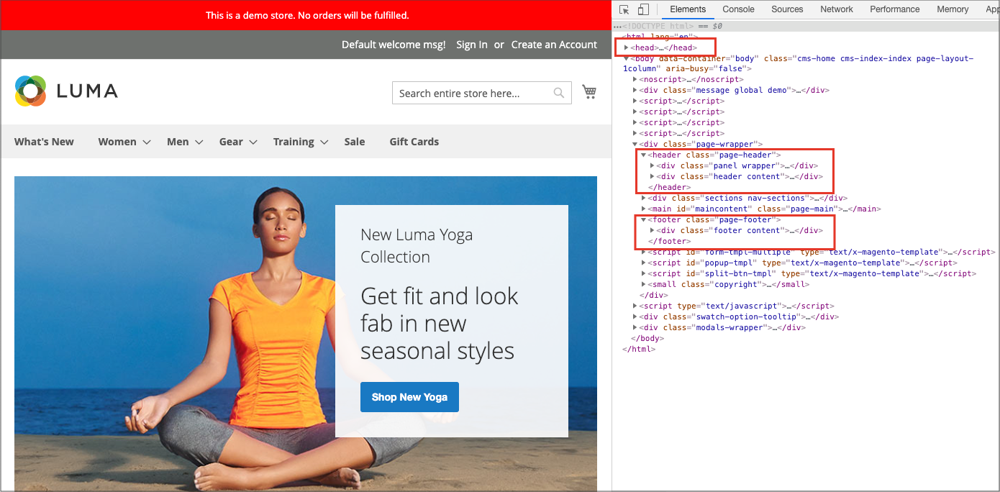
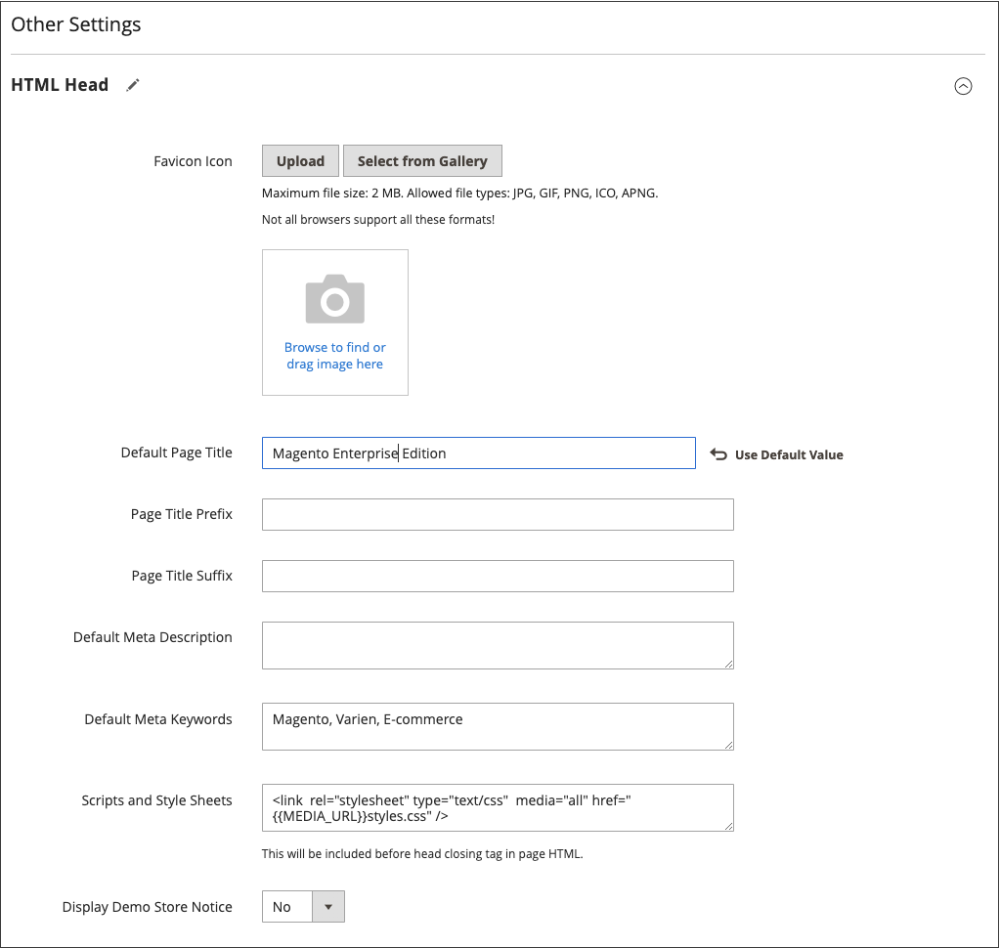
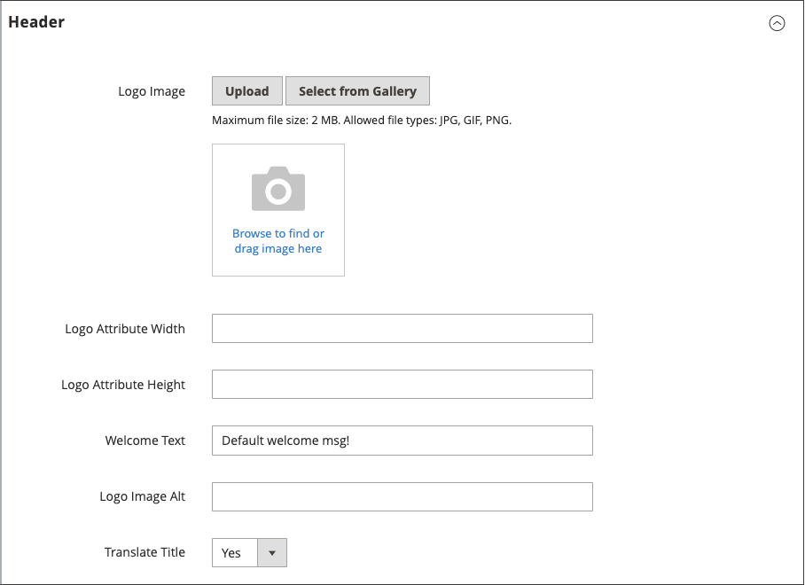
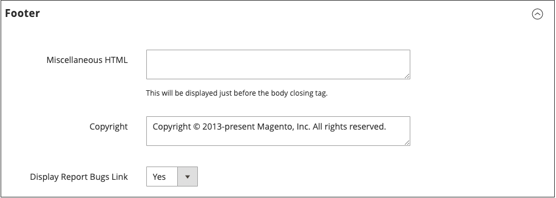

# ページ設定

ページの主なセクションは、標準的なHTML タグのセットによって制御されています。 これらのタグの中には、ページの各セクションで使用されるフォント、色、サイズ、背景色、画像の選択を決定するために使用できるものもあります。 その他の設定では、ヘッダーのロゴやフッターの著作権表示などのページ要素を制御できます。 これらのセクションは、HTML ページの基本構造に対応しており、多くの基本プロパティは管理者から設定できます。

- [HTMLヘッド](#html-head)
- [ヘッダー](#header)
- [フッター](#footer)

{width="700" zoomable="yes"}

## HTMLヘッド

HTML ヘッドセクションの設定は、HTML ページの`<head>` タグに対応しており、各ストアビューに対して設定できます。 このセクションには、ページタイトル、説明、キーワードのメタデータに加えて、ファビコンとその他のスクリプトへのリンクが含まれています。 検索エンジンロボットの手順とストアデモ通知の表示も、この節で設定します。

### HTML ヘッドの設定

1. _管理者_ サイドバーで、**[!UICONTROL Content]** > _[!UICONTROL Design]_>**[!UICONTROL Configuration]**&#x200B;に移動します。

1. 設定するストアビューを見つけ、_[!UICONTROL Action]_&#x200B;列の&#x200B;**[!UICONTROL Edit]**&#x200B;をクリックします。

1. _その他の設定_&#x200B;で、**[!UICONTROL HTML Head]** セクションのを展開します。

   {width="500" zoomable="yes"}

1. 必要に応じて[favicon](../getting-started/storefront-branding.md#add-a-favicon)を更新します。

1. 必要に応じて、ページタイトルの設定を更新します。

   - **[!UICONTROL Default Page Title]**
   - **[!UICONTROL Page Title Prefix]**
   - **[!UICONTROL Page Title Suffix]**

   接尾辞や接頭辞をデフォルトのタイトルと共に使用して、2部または3部のタイトルを作成できます。 接頭辞または接尾辞とデフォルトのタイトルの間の区切り文字として、縦棒またはコロンを追加できます。

1. 検索エンジン最適化（SEO）をサポートし、検索結果から顧客をストアに誘導するのに役立つメタデータを追加または変更します。

   - **[!UICONTROL Default Meta Description]**
   - **[!UICONTROL Default Meta Keywords]**

1. 必要に応じて&#x200B;**[!UICONTROL Scripts and Style Sheets]**&#x200B;を入力します。

   >[!NOTE]
   >
   >[!UICONTROL Scripts and Style Sheets] フィールドに入力されたすべてのJavaScriptは、コンテンツセキュリティポリシー（CSP）の設定でホワイトリストに登録する必要があります。そうしないと、チェックアウトページで実行されません。 詳しくは、[&#x200B; コンテンツセキュリティポリシー](https://developer.adobe.com/commerce/php/development/security/content-security-policies)を参照してください。

1. 必要に応じて、[&#x200B; デモストア通知](../getting-started/storefront-branding.md#set-the-store-demo-notice)を有効または無効にします。

1. 完了したら、**[!UICONTROL Save Configuration]**&#x200B;をクリックします。

### HTML Head フィールドの説明

| フィールド | 範囲 | 説明 |
|--- |--- |--- |
| [!UICONTROL Favicon Icon] | ストアビュー | ブラウザーのアドレスバーとタブに表示される小さなグラフィック画像をアップロードします。 使用可能なファイル形式：ICO、PNG、APNG、GIF、JPG（JPEG）。 すべてのブラウザーがこれらの形式をサポートしているわけではありません。 |
| [!UICONTROL Default Page Title] | ストアビュー | ブラウザーで表示されるときに、各ページのタイトルバーに表示されるタイトル。 デフォルトのタイトルは、個々のページに別のタイトルが指定されていない限り、すべてのページに使用されます。 |
| [!UICONTROL Page Title Prefix] | ストアビュー | タイトルの前に接頭辞を追加して、2部または3部のタイトルを作成できます。 縦棒またはコロンは、接頭辞の末尾に区切り記号として使用して、メインタイトルのテキストと区別できます。 |
| [!UICONTROL Page Title Suffix] | ストアビュー | タイトルの後に接尾辞を追加して、2つまたは3つの部分からなるタイトルを作成できます。 縦棒またはコロンは、接頭辞の末尾に区切り記号として使用して、メインタイトルのテキストと区別できます。 |
| [!UICONTROL Default Meta Description] | ストアビュー | 説明は、検索エンジンのリスト用にサイトの概要を提供します。160文字以下にする必要があります。 |
| [!UICONTROL Default Meta Keywords] | ストアビュー | ストアを表す一連のキーワード。各キーワードはコンマで区切られます。 |
| [!UICONTROL Scripts and Style Sheets] | ストアビュー | 終了`<head>` タグの前にHTMLに含める必要があるスクリプトが含まれています。 例えば、`<body>` タグの前に配置する必要があるサードパーティ JavaScriptは、ここに入力できます。 |
| [!UICONTROL Display Demo Store Notice] | ストアビュー | ページ上部のデモストア通知の表示を制御します。 オプション：`Yes` / `No` |

{style="table-layout:auto"}

## ヘッダー

ヘッダー設定は、ストアロゴへのパスを識別し、ロゴの代替テキストとウェルカムメッセージを指定します。

{width="400" zoomable="yes"}

### ヘッダーの設定

1. _管理者_ サイドバーで、**[!UICONTROL Content]** > _[!UICONTROL Design]_>**[!UICONTROL Configuration]**&#x200B;に移動します。

1. 設定するストアビューを見つけ、_[!UICONTROL Action]_&#x200B;列の&#x200B;**[!UICONTROL Edit]**&#x200B;をクリックします。

1. _その他の設定_&#x200B;で、**[!UICONTROL Header]** セクションのを展開します。

1. ストアビューに必要な変更を行います。

   - [&#x200B; ロゴ &#x200B;](../getting-started/storefront-branding.md#upload-your-logo)設定
   - [&#x200B; ウェルカムメッセージ &#x200B;](../getting-started/storefront-branding.md#change-the-welcome-message)設定

1. 完了したら、**[!UICONTROL Save Configuration]**&#x200B;をクリックします。

### ヘッダーフィールドの説明

| フィールド | 範囲 | 説明 |
|--- |--- |--- |
| [!UICONTROL Logo Image] | ストアビュー | ヘッダーに表示されるロゴへのパスを指定します。 サポートされているファイル形式：PNG、GIF、JPG（JPEG） |
| [!UICONTROL Logo Attribute Width] | ストアビュー | ロゴ画像の幅（ピクセル単位）。 |
| [!UICONTROL Logo Attribute Height] | ストアビュー | ロゴ画像の高さ（ピクセル単位）。 |
| [!UICONTROL Welcome Text] | ストアビュー | ウェルカムメッセージは、ページのヘッダーに表示され、ログインしている顧客の名前が含まれます。 |
| [!UICONTROL Logo Image Alt] | ストアビュー | ロゴに関連付けられている代替テキスト。 |
| [!UICONTROL Translate Title] | ストアビュー | `Page Title`または`Meta Title`を翻訳するかどうかを決定します。 |

{style="table-layout:auto"}

## フッター

フッター設定セクションでは、ページの下部に表示される[著作権通知](../getting-started/storefront-branding.md#change-the-copyright-notice)を更新し、終了`<body>` タグの前に配置する必要があるその他のスクリプトを入力できます。

{width="400" zoomable="yes"}

### フッターの設定

1. _管理者_ サイドバーで、**[!UICONTROL Content]** > _[!UICONTROL Design]_>**[!UICONTROL Configuration]**&#x200B;に移動します。

1. 設定するストアビューを見つけ、_[!UICONTROL Action]_&#x200B;列の&#x200B;**[!UICONTROL Edit]**&#x200B;をクリックします。

1. _その他の設定_&#x200B;で、**[!UICONTROL Footer]** セクションのを展開します。

1. **[!UICONTROL Copyright]**&#x200B;と&#x200B;**[!UICONTROL Miscellaneous HTML]**&#x200B;の設定に必要な変更を加えます。

   >[!NOTE]
   >
   >[!UICONTROL Miscellaneous HTML] フィールドに入力されたすべてのJavaScriptは、コンテンツセキュリティポリシー（CSP）の設定でホワイトリストに登録する必要があります。そうしないと、チェックアウトページで実行されません。 詳しくは、[&#x200B; コンテンツセキュリティポリシー](https://developer.adobe.com/commerce/php/development/security/content-security-policies)を参照してください。

1. 完了したら、**[!UICONTROL Save Configuration]**&#x200B;をクリックします。

## フッターフィールドの説明

| フィールド | 範囲 | 説明 |
|--- |--- |--- |
| [!UICONTROL Miscellaneous HTML] | ストアビュー | 終了`<body>` タグの直前に配置する必要があるサーバーに、その他のスクリプトをアップロードできる入力ボックス。 |
| [!UICONTROL Copyright] | ストアビュー | 各ページの下部に表示される著作権表示。 著作権シンボルを含めるには、次のようにHTMLの文字エンティティ `\&copy;`を使用します。`\&copy; 2021 Commerce Demo Store. All Rights Reserved.` サンプルの著作権表示を必ず自分の著作権表示に置き換えてください。 |
| [!UICONTROL Display Report Bugs Link] | ストアビュー | バグ報告リンク（一部のテーマでサポートされています）が有効か無効かを判断します。 |

{style="table-layout:auto"}
