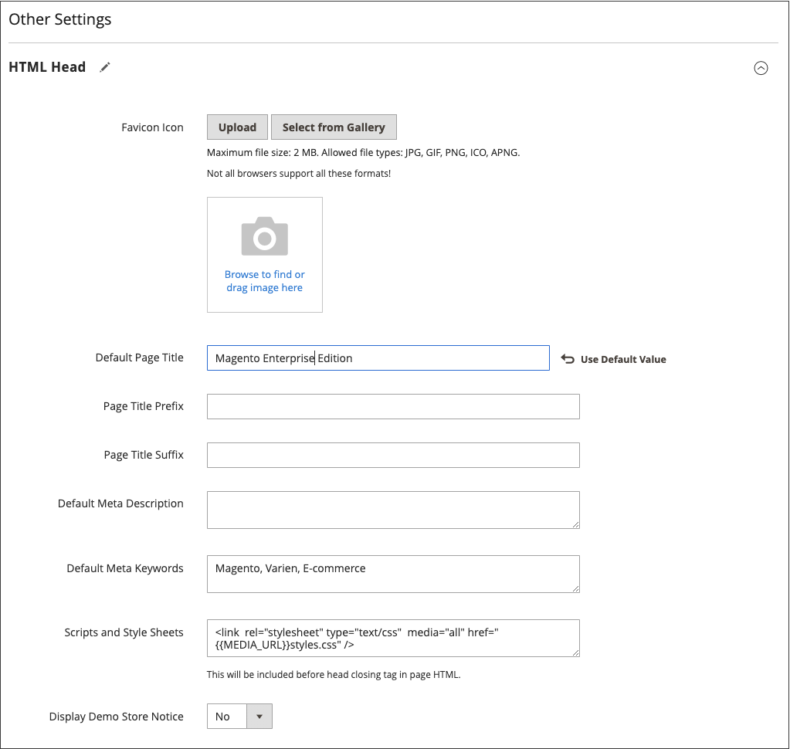
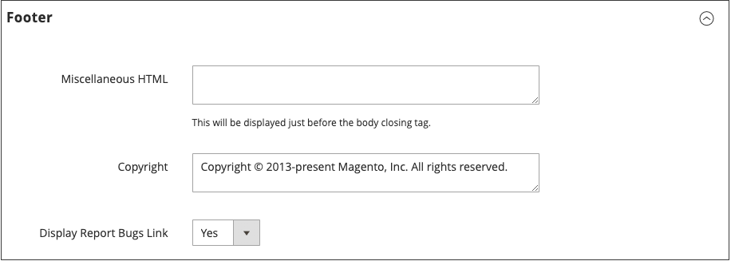

# ページ設定

ページのメインセクションは、一部は、一連の標準HTMLタグで制御されます。 これらのタグの一部は、ページの各セクションで使用されるフォント、色、サイズ、背景色、画像の選択を決定するために使用できます。 その他の設定は、ヘッダーのロゴやフッターの著作権情報などのページ要素を制御します。 これらのセクションはHTMLページの基になる構造に対応しており、多くの基本的なプロパティは管理者から設定できます。

- [HTML頭](#html-head)
- [ヘッダー](#header)
- [フッター](#footer)

{width="700" zoomable="yes"}

## HTML頭

「HTML先頭」セクションの設定は、 `<head>` タグ内に含まれ、HTMLビューごとに設定できます。 このセクションには、ページタイトル、説明、キーワードのメタデータに加えて、 favicon およびその他のスクリプトへのリンクが含まれます。 検索エンジンロボットの手順とストアデモ通知の表示も、この節で設定します。

### HTMLヘッドの設定

1. 次の日： _管理者_ サイドバー、移動 **[!UICONTROL Content]** > _[!UICONTROL Design]_>**[!UICONTROL Configuration]**.

1. 設定するストア表示を見つけ、 **[!UICONTROL Edit]** （内） _[!UICONTROL Action]_列。

1. の下 _その他の設定_、展開  の **[!UICONTROL HTML Head]** 」セクションに入力します。

   {width="500" zoomable="yes"}

1. を更新します。 [favicon](../getting-started/storefront-branding.md#add-a-favicon) 必要に応じて。

1. 必要に応じて、ページタイトル設定を更新します。

   - **[!UICONTROL Default Page Title]**
   - **[!UICONTROL Page Title Prefix]**
   - **[!UICONTROL Page Title Suffix]**

   デフォルトのタイトルのサフィックスやプレフィックスを使用して、2 部または 3 部構成のタイトルを作成できます。 接頭辞または接尾辞とデフォルトのタイトルの間に、縦棒またはコロンを区切り文字として追加できます。

1. 検索エンジン最適化 (SEO) をサポートするメタデータを追加または変更し、検索結果から顧客を貴社のストアに導くのに役立てます。

   - **[!UICONTROL Default Meta Description]**
   - **[!UICONTROL Default Meta Keywords]**

1. 任意を入力 **[!UICONTROL Scripts and Style Sheets]** 必要に応じて。

1. を有効または無効にする [デモストアのお知らせ](../getting-started/storefront-branding.md#set-the-store-demo-notice) 必要に応じて。

1. 完了したら、「 **[!UICONTROL Save Configuration]**.

### HTML先頭フィールドの説明

| フィールド | 範囲 | 説明 |
|--- |--- |--- |
| [!UICONTROL Favicon Icon] | ストア表示 | ブラウザーのアドレスバーおよびタブに表示される小さなグラフィック画像をアップロードします。 許可されるファイルタイプ： ICO、PNG、APNG、GIF、JPG(JPEG)。 一部のブラウザーでは、これらの形式はサポートされていません。 |
| [!UICONTROL Default Page Title] | ストア表示 | ブラウザーで表示したときに各ページのタイトルバーに表示されるタイトル。 個々のページに別のタイトルが指定されていない限り、デフォルトのタイトルはすべてのページで使用されます。 |
| [!UICONTROL Page Title Prefix] | ストア表示 | タイトルの前にプレフィックスを追加して、2 部または 3 部構成のタイトルを作成できます。 縦棒またはコロンは、メインタイトルのテキストと区別するために、プレフィックスの末尾の区切り文字として使用できます。 |
| [!UICONTROL Page Title Suffix] | ストア表示 | タイトルの後にサフィックスを追加して、2 部または 3 部構成のタイトルを作成できます。 縦棒またはコロンは、メインタイトルのテキストと区別するために、プレフィックスの末尾の区切り文字として使用できます。 |
| [!UICONTROL Default Meta Description] | ストア表示 | この説明は、検索エンジンリスト用のサイトのサマリを提供します。160 文字以下にする必要があります。 |
| [!UICONTROL Default Meta Keywords] | ストア表示 | ストアを説明する一連のキーワード。各キーワードはコンマで区切られます。 |
| [!UICONTROL Scripts and Style Sheets] | ストア表示 | 終了の前にHTMLに含める必要があるスクリプトを含みます `<head>` タグを使用します。 例えば、 `<body>` タグをここに入力できます。 |
| [!UICONTROL Display Demo Store Notice] | ストア表示 | ページ上部のデモストア通知の表示を制御します。 オプション： `Yes` / `No` |

{style="table-layout:auto"}

## ヘッダー

ヘッダー設定は、ストアのロゴのパスを識別し、ロゴの代替テキストとようこそメッセージを指定します。

{width="400" zoomable="yes"}

### ヘッダーの設定

1. 次の日： _管理者_ サイドバー、移動 **[!UICONTROL Content]** > _[!UICONTROL Design]_>**[!UICONTROL Configuration]**.

1. 設定するストア表示を見つけ、 **[!UICONTROL Edit]** （内） _[!UICONTROL Action]_列。

1. の下 _その他の設定_、展開  の **[!UICONTROL Header]** 」セクションに入力します。

1. ストア表示に必要な変更を行います。

   - [ロゴ](../getting-started/storefront-branding.md#upload-your-logo) 設定
   - [ようこそメッセージ](../getting-started/storefront-branding.md#change-the-welcome-message) 設定

1. 完了したら、「 **[!UICONTROL Save Configuration]**.

### ヘッダーフィールドの説明

| フィールド | 範囲 | 説明 |
|--- |--- |--- |
| [!UICONTROL Logo Image] | ストア表示 | ヘッダーに表示されるロゴのパスを示します。 サポートされるファイルタイプ：PNG、GIF、JPG(JPEG) |
| [!UICONTROL Logo Attribute Width] | ストア表示 | ロゴイメージの幅をピクセル単位で指定します。 |
| [!UICONTROL Logo Attribute Height] | ストア表示 | ロゴイメージの高さをピクセル単位で指定します。 |
| [!UICONTROL Welcome Text] | ストア表示 | ようこそメッセージは、ページのヘッダーに表示され、ログインした顧客の名前が含まれます。 |
| [!UICONTROL Logo Image Alt] | ストア表示 | ロゴに関連付けられている代替テキスト。 |
| [!UICONTROL Translate Title] | ストア表示 | を `Page Title` または `Meta Title` 翻訳する必要があります。 |

{style="table-layout:auto"}

## フッター

フッター設定セクションでは、 [著作権表示](../getting-started/storefront-branding.md#change-the-copyright-notice) ページの下部に表示され、終了タグの前に配置する必要があるその他のスクリプトを入力します。 `<body>` タグを使用します。

{width="400" zoomable="yes"}

### フッターの設定

1. 次の日： _管理者_ サイドバー、移動 **[!UICONTROL Content]** > _[!UICONTROL Design]_>**[!UICONTROL Configuration]**.

1. 設定するストア表示を見つけ、 **[!UICONTROL Edit]** （内） _[!UICONTROL Action]_列。

1. の下 _その他の設定_、展開  の **[!UICONTROL Footer]** 」セクションに入力します。

1. 必要に応じて、 **[!UICONTROL Copyright]** および **[!UICONTROL Miscellaneous HTML]** 設定。

1. 完了したら、「 **[!UICONTROL Save Configuration]**.

## フッターフィールドの説明

| フィールド | 範囲 | 説明 |
|--- |--- |--- |
| [!UICONTROL Miscellaneous HTML] | ストア表示 | 閉じる直前に配置する必要があるその他のスクリプトをサーバーにアップロードできる入力ボックス `<body>` タグを使用します。 |
| [!UICONTROL Copyright] | ストア表示 | 各ページの下部に表示される著作権情報。 著作権記号を含めるには、HTML文字エンティティ `\&copy;` 次のように指定します。 `\&copy; 2021 Commerce Demo Store. All Rights Reserved.` サンプルの著作権情報は、必ず独自のものに置き換えてください。 |
| [!UICONTROL Display Report Bugs Link] | ストア表示 | バグレポートのリンク（一部のテーマでサポート）を有効または無効にするかどうかを指定します。 |

{style="table-layout:auto"}
