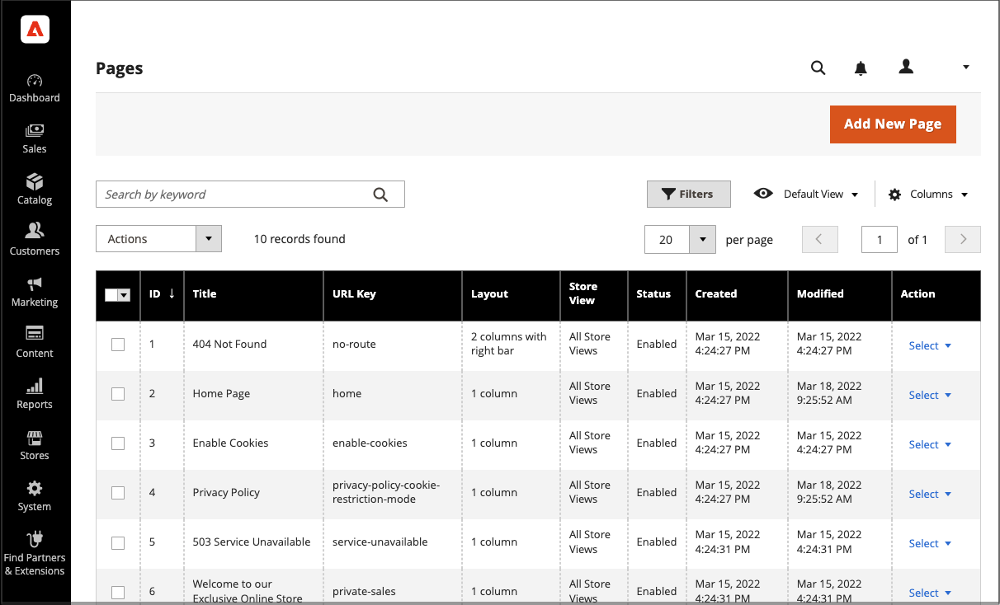
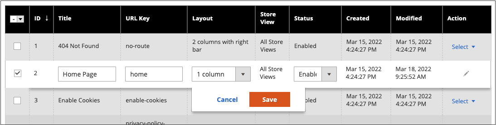
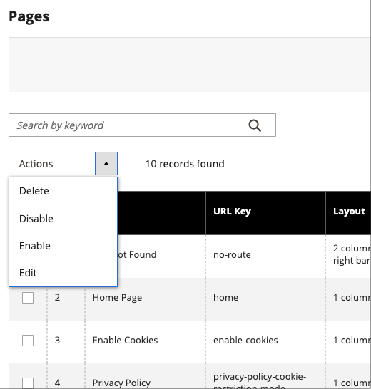
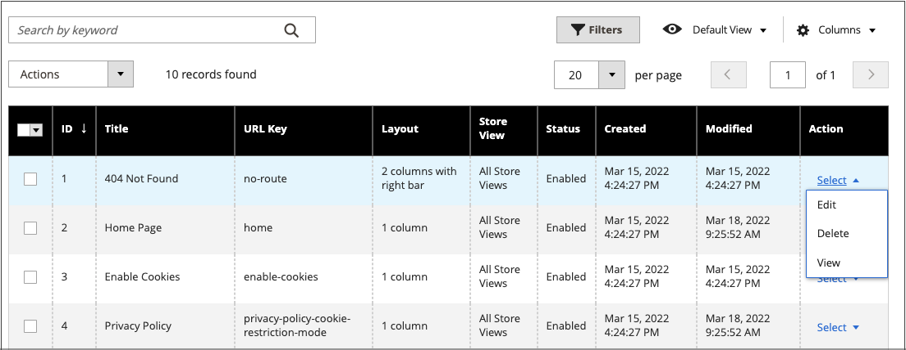
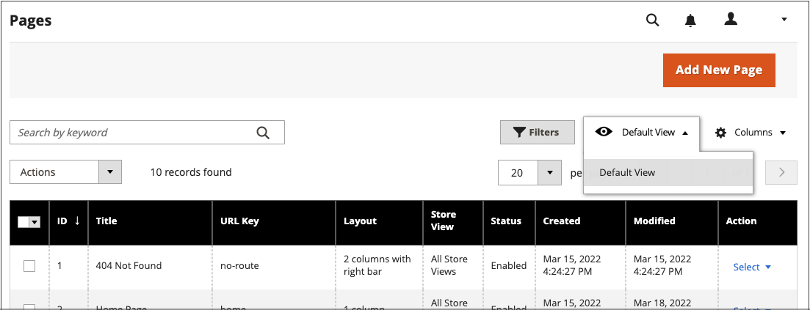
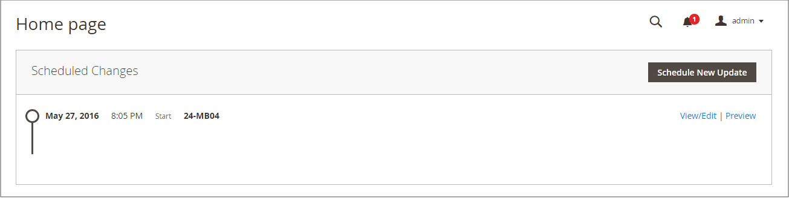

# ページワークスペースのコントロール

ページワークスペースには、必要なページをすばやく見つけるためのツールや、個々のページまたは複数のページでルーチンメンテナンスを実行するためのコマンドが含まれています。 また、グリッドからページプロパティを素早く更新することもできます。

{width="700" zoomable="yes"}

## ページプロパティを素早く更新

1. _管理者_ サイドバーで、**[!UICONTROL Content]** > _[!UICONTROL Elements]_>**[!UICONTROL Pages]**&#x200B;に移動します。
1. グリッドの任意の行をクリックします。

   {width="600" zoomable="yes"}

   複数のレコードを選択するには、更新する各行のチェックボックスを選択します。

1. 次のいずれかのプロパティを更新します。

   - **[!UICONTROL Title]**
   - **[!UICONTROL URL Key]**
   - **[!UICONTROL Status]**
   - **[!UICONTROL Layout]**

1. 完了したら、**[!UICONTROL Save]**&#x200B;をクリックします。

## Workspaceコントロール

| 制御 | 説明 |
|--- |--- |
| [!UICONTROL Add New Page] | ページを追加します。 |
| [!UICONTROL Search] | 現在のフィルターに基づいてカタログ検索を開始します。 |
| [!UICONTROL Actions] | リスト内の選択した項目に適用できるすべてのアクションを一覧表示します。 1つのページまたは複数のページにアクションを適用するには、アクションの対象となる各レコードの最初の列にあるチェックボックスを選択します。 オプション：`Delete` / `Disable` / `Enable` / `Edit` |
| [!UICONTROL Select] | 最初の列のヘッダーのコントロールを使用して、アクションのターゲットとして複数のレコードを選択できます。 選択する各レコードの最初の列のチェックボックスを選択します。 オプション：`Select All` / `Deselect All` |
| [!UICONTROL Save Edits] | 選択したレコードに現在のアクションを適用します。 |
| [!UICONTROL Edit] | レコードを編集モードで開きます。 行の任意の場所をクリックすると、同じことを達成できます。 |

{style="table-layout:auto"}

## 列

| 列 | 説明 |
|--- |--- |
| [!UICONTROL Select] | 最初の列のチェックボックスは、複数のレコードを選択するために使用されます。 オプション：`Select All` / `Deselect All` |
| [!UICONTROL ID] | IDは、各ページに割り当てられる増分番号です。 |
| [!UICONTROL Title] | ページの上部に表示されるタイトル。 |
| [!UICONTROL URL Key] | URL キーはファイル名に似ており、URL内のページを識別します。 |
| [!UICONTROL Layout] | メインコンテンツ領域の右または左にサイドバーが表示されるページを指定します。 オプション：`1 column` / `2 columns with left bar` / `2 columns with right bar` / `3 columns` / `Empty` |
| [!UICONTROL Store View] | ページを特定のストアビューに関連付けるために使用します。 |
| [!UICONTROL Status] | ページがオンラインかオフラインかを示します。 オプション：`Enabled` / `Disabled` |
| [!UICONTROL Created] | ページの作成日。 |
| [!UICONTROL Modified] | ページが最後に変更された日付。 |
| [!UICONTROL Action] | 個々のレコードに適用できるアクションは次のとおりです。 **[!UICONTROL Edit]**- ページを編集モードで開きます。 **[!UICONTROL Delete]** - ページを削除します。 **[!UICONTROL View]**- プレビューモードでページを表示します。 |

{style="table-layout:auto"}

## その他の列

| 列 | 説明 |
|--- |--- |
| [!UICONTROL Custom design from/to] | 選択したデザインがページに適用される開始日と終了日を指定します。  （Magento Open Sourceのみ）。 |
| [!UICONTROL Custom Theme] | ページにカスタムテーマを適用します |
| [!UICONTROL Custom Layout] | ページのカスタムレイアウトを指定します |
| [!UICONTROL Meta Title] | ページのMeta タイトル |
| [!UICONTROL Meta Keywords] | ページのメタキーワード |
| [!UICONTROL Meta Description] | ページのメタディスクリプション |

{style="table-layout:auto"}

## ページ検索

_[!UICONTROL Pages]_&#x200B;グリッドの左上にある検索ボックスを使用して、キーワードで特定のページを検索できます。 より高度な検索を行うには、複数のパラメーターで[&#x200B; フィルター](../getting-started/admin-grid-controls.md)検索を行うことができます。

### キーワードで検索

1. ページ検索ボックスに検索語を入力します。

1. 結果を表示するには、検索（）アイコンをクリックします。

   結果には、キーワードを含むすべてのページが含まれます。

### 検索結果のフィルタリング

1. 必要に応じて、**[!UICONTROL Clear All]**&#x200B;をクリックして、以前の検索条件をクリアします。

1. 検索フィルターの選択範囲を表示するには、「**[!UICONTROL Filters]** !（[Funnel アイコン &#x200B;](../assets/icon-filter-search.png)）」タブをクリックします。

1. 検索するページを説明するために、必要な数のフィルターを実行します。

1. **[!UICONTROL Apply Filters]**&#x200B;をクリックして結果を表示します。

### フィルターを検索

| フィルター | 説明 |
|--- |--- |
| [!UICONTROL ID] | ページレコード IDで検索をフィルタリングします。 |
| [!UICONTROL Title] | ページタイトルに基づいて検索をフィルタリングします。 |
| [!UICONTROL URL Key] | URL キーで検索をフィルタリングします。 |
| [!UICONTROL Created] | ページが作成された日付で検索をフィルタリングします。 |
| [!UICONTROL Modified] | ページが最後に変更された日付に基づいて検索をフィルタリングします。 |
| [!UICONTROL Store View] | ストアビューに基づいて検索をフィルタリングします。 オプション：`All available` / `Store Views` |
| [!UICONTROL Layout] | ページレイアウトに基づいて検索をフィルタリングします。 オプション：`1 column` / `2 columns with left bar` / `2 columns with right bar` / `3 columns` / `Empty` |
| [!UICONTROL Status] | ページステータスで検索をフィルタリングします。 オプション：`Disabled` / `Published` |
| [!UICONTROL Custom design from / to] | 選択したデザインがページに適用される開始日と終了日で検索をフィルタリングします。  （Magento Open Sourceのみ）。 |
| [!UICONTROL Asset] | ページタイトルアセットによる検索のフィルタリング |
| [!UICONTROL Custom Layout] | カスタムレイアウトに基づいて検索をフィルタリングします。 オプション：`1 column` / `2 columns with left bar` / `2 columns with right bar` / `3 columns` / `Empty` / `Page -- Full Width` / `Category -- Full Width` / `Product -- Full Width` |
| [!UICONTROL Custom Theme] | カスタムテーマに基づいて検索をフィルタリングします。 既定のオプション：`Magento Blank` / `Magento Luma` |
| [!UICONTROL Meta Keywords] | ページのメタキーワードに基づいて検索をフィルタリングします。 |
| [!UICONTROL Meta Title] | ページのメタタイトルに基づいて検索をフィルタリングします。 |
| [!UICONTROL Meta Description] | ページのメタディスクリプションに基づいて検索をフィルタリングします。 |

{style="table-layout:auto"}

### 検索ツール

| ツール | 説明 |
|--- |--- |
| [!UICONTROL Apply Filters] | 検索結果にすべてのフィルターを適用します。 |
| [!UICONTROL Cancel] | 現在の検索をキャンセルします。 |
| [!UICONTROL Clear All] | すべての検索フィルターを消去します。 |

{style="table-layout:auto"}

## ページアクション

ページは編集、無効化、有効化、削除できます。 個々のページにアクションを適用するには、最初の列のチェックボックスを選択します。 すべてのページを選択または選択解除するには、列の上部にある選択コントロールを使用します。

{width="400" zoomable="yes"}

### 単体アクション

右端の&#x200B;_[!UICONTROL Action]_&#x200B;列を使用して、次のいずれかのアクションを個々のページに適用します。

- [!UICONTROL Edit] - ページを編集モードで開きます
- [!UICONTROL Delete] - ページを削除します（確認が必要）
- [!UICONTROL View] - ストアフロントで直接ページを開きます

{width="600" zoomable="yes"}

### マス操作

左上隅の&#x200B;_[!UICONTROL Action]_&#x200B;セレクターを使用して、選択した複数のページに同時に次のいずれかのアクションを適用します。

- [!UICONTROL Delete] - ページを削除します（確認が必要）
- [!UICONTROL Disable] - ストアフロントのページを無効にします
- [!UICONTROL Enable] - ストアフロントのページを有効にします
- [!UICONTROL Edit] – 編集モードでグリッドの列を開きます（**[!UICONTROL Title]**、**[!UICONTROL URL Key]**、**[!UICONTROL Layout]**、および&#x200B;**[!UICONTROL Status]**）

## ページグリッドレイアウト

列の選択とグリッド内の順序は、好みに応じて変更できます。 新しい列の配置を維持するには、ビューとして保存します。

### 列の選択範囲を変更する

右上隅の&#x200B;_列_ （）コントロールをクリックし、次の操作を行います。

- グリッドに追加する任意の列のチェックボックスをオンにします。

- グリッドから削除する列のチェックボックスをオフにします。

### 列の移動

1. 列のヘッダーをクリックして保持します。

1. 列を新しい位置にドラッグして解除します。

### ビューを保存

1. _表示_ （）コントロールをクリックし、**[!UICONTROL Save View As]**&#x200B;をクリックします。

1. ビューの名前を入力します。

1. ビューを保存するには、_矢印_ （）をクリックします。

   ビューの名前が現在のビューとして表示されます。

### ビューを変更

_表示_ （）コントロールをクリックし、次のいずれかの操作を行います。

- 使用するビューを選択します。

- 編集（）アイコンをクリックし、ビュー名を更新して、ビューの名前を変更します。

  {width="600" zoomable="yes"}を持つビューコントロールに表示されます

## 予定された変更

{{ee-feature}}

ページの変更はスケジュールどおりに適用でき、他のコンテンツの変更とグループ化することも可能です。 スケジュールされたページの変更に基づいてキャンペーンを作成したり、既存のキャンペーンに変更を適用したりできます。 詳細については、[&#x200B; コンテンツ ステージング &#x200B;](content-staging.md)を参照してください。

ページの変更とキャンペーンの編集に関するスケジュールを設定する場合は、次の点に注意してください。

- すべてのスケジュールされた更新は連続して適用されます。つまり、任意のエンティティは1つのポイントで1つのスケジュールされた更新のみを持つことができます。 スケジュールされた更新は、その時間枠内のすべてのストアビューに適用されます。 その結果、エンティティは、異なるストアビューに対して異なるスケジュールされた更新を同時に行うことはできません。 現在のスケジュールされた更新の影響を受けない、すべてのストアビュー内のすべてのエンティティ属性値は、以前のスケジュールされた更新の値ではなく、デフォルト値から取得されます。

- キャンペーンが複数のページにリンクされている場合、キャンペーンは[&#x200B; コンテンツステージングダッシュボード &#x200B;](content-staging-dashboard.md)からのみ編集できます。

- アクティブなキャンペーンが最初に終了日なしで作成された場合、そのキャンペーンを後で編集して終了日を含めることはできません。 この場合、重複する施策を作成し、必要な終了日を入力する必要があります。

- キャンペーンの開始日と終了日は、各web サイトのローカルタイムゾーンから変換される&#x200B;**_default_**&#x200B;管理者タイムゾーンを使用して定義する必要があります。 複数のタイムゾーンに複数のweb サイトを持ち、米国のタイムゾーンに基づいて施策を開始したい場合の例を考えてみましょう。 この場合、ローカルのタイムゾーンごとに個別の更新をスケジュールし、各ローカル web サイトのタイムゾーンからデフォルトの管理者のタイムゾーンに変換する&#x200B;**[!UICONTROL Start Date]**&#x200B;と&#x200B;**[!UICONTROL End Date]**&#x200B;を設定する必要があります。

- 製品のアップデートのために変更をスケジュールし、プレビューすることができます。 詳しくは、[更新のスケジュール設定](content-staging-scheduled-update.md)を参照してください。

>[!NOTE]
>
>[!UICONTROL Custom Design Update] タブは Adobe Commerceで削除されました。ページ上で直接変更することはできません。 これらのアクティベーションのスケジュールされた更新を作成する必要があります。

{width="600" zoomable="yes"}

