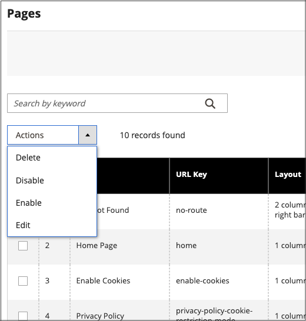

# ページワークスペースのコントロール

ページワークスペースには、必要なページをすばやく見つけるのに役立つツールと、個々のページまたは複数のページで定期的なメンテナンスを実行するコマンドが含まれています。 また、グリッドからページのプロパティをすばやく更新することもできます。

{width="700" zoomable="yes"}

## ページのプロパティをすばやく更新

1. 次の日： _管理者_ サイドバー、移動 **[!UICONTROL Content]** > _[!UICONTROL Elements]_>**[!UICONTROL Pages]**.
1. グリッド内の任意の行をクリックします。

   {width="600" zoomable="yes"}

   複数のレコードを選択するには、更新する各行のチェックボックスをオンにします。

1. 次のいずれかのプロパティを更新します。

   - **[!UICONTROL Title]**
   - **[!UICONTROL URL Key]**
   - **[!UICONTROL Status]**
   - **[!UICONTROL Layout]**

1. 完了したら、「 **[!UICONTROL Save]**.

## Workspace のコントロール

| 制御 | 説明 |
|--- |--- |
| [!UICONTROL Add New Page] | ページを追加します。 |
| [!UICONTROL Search] | 現在のフィルターに基づいてカタログ検索を開始します。 |
| [!UICONTROL Actions] | リスト内の選択した項目に適用できるすべてのアクションをリストします。 1 つのページまたは複数のページにアクションを適用するには、アクションの対象となる各レコードの最初の列にあるチェックボックスをオンにします。 オプション： `Delete` / `Disable` / `Enable` / `Edit` |
| [!UICONTROL Select] | 最初の列のヘッダーのコントロールを使用して、複数のレコードをアクションのターゲットとして選択できます。 選択する各レコードの最初の列のチェックボックスをオンにします。 オプション： `Select All` / `Deselect All` |
| [!UICONTROL Save Edits] | 選択したレコードに現在のアクションを適用します。 |
| [!UICONTROL Edit] | レコードを編集モードで開きます。 行の任意の場所をクリックすることで、同じことを実行できます。 |

{style="table-layout:auto"}

## 列

| 列 | 説明 |
|--- |--- |
| [!UICONTROL Select] | 最初の列のチェックボックスを使用して、複数のレコードを選択します。 オプション： `Select All` / `Deselect All` |
| [!UICONTROL ID] | ID は、各ページに割り当てられる増分番号です。 |
| [!UICONTROL Title] | ページの上部に表示されるタイトル。 |
| [!UICONTROL URL Key] | URL キーはファイル名に似ており、URL 内のページを識別します。 |
| [!UICONTROL Layout] | ページをメインコンテンツ領域の右または左にサイドバーと共に表示するかどうかを指定します。 オプション： `1 column` / `2 columns with left bar` / `2 columns with right bar` / `3 columns` / `Empty` |
| [!UICONTROL Store View] | ページを特定のストアビューに関連付けるために使用します。 |
| [!UICONTROL Status] | ページがオンラインかオフラインかを示します。 オプション： `Enabled` / `Disabled` |
| [!UICONTROL Created] | ページが作成された日付。 |
| [!UICONTROL Modified] | ページが最後に変更された日付。 |
| [!UICONTROL Action] | 個々のレコードに適用できるアクションには、次のものがあります。 **[!UICONTROL Edit]**— ページを編集モードで開きます。 **[!UICONTROL Delete]**  — ページを削除します。 **[!UICONTROL View]**— ページをプレビューモードで表示します。 |

{style="table-layout:auto"}

## その他の列

| 列 | 説明 |
|--- |--- |
| [!UICONTROL Custom design from/to] | 選択したデザインが製品ページに適用される際の開始日と終了日を指定します |
| [!UICONTROL Custom Theme] | カスタムテーマをページに適用します |
| [!UICONTROL Custom Layout] | ページのカスタムレイアウトを決定します |
| [!UICONTROL Meta Title] | ページのメタタイトル |
| [!UICONTROL Meta Keywords] | ページのメタキーワード |
| [!UICONTROL Meta Description] | ページのメタ説明 |

{style="table-layout:auto"}

## ページ検索

検索ボックス ( _[!UICONTROL Pages]_grid は、キーワードで特定のページを検索するために使用できます。 より詳細な検索では、次のことが可能です。 [フィルター](../getting-started/admin-grid-controls.md) 複数のパラメーターによる検索。

### キーワードで検索

1. ページ検索ボックスに検索語句を入力します。

1. 結果を表示するには、「検索」() アイコンをクリックします。

   結果には、そのキーワードを含むすべてのページが含まれます。

### 検索結果のフィルタリング

1. 必要に応じて、 **[!UICONTROL Clear All]** をクリックして、前の検索条件をクリアします。

1. 検索フィルターの選択を表示するには、 **[!UICONTROL Filters]** !([ファネルアイコン](../assets/icon-filter-search.png))」タブに表示されます。

1. 必要に応じて、検索するページを説明するフィルターをいくつでも入力します。

1. クリック **[!UICONTROL Apply Filters]** をクリックして結果を表示します。

### 検索フィルター

| フィルター | 説明 |
|--- |--- |
| [!UICONTROL ID] | ページレコード ID で検索をフィルターします。 |
| [!UICONTROL Title] | ページタイトルに基づいて検索をフィルタリングします。 |
| [!UICONTROL URL Key] | URL キーで検索をフィルタリングします。 |
| [!UICONTROL Created] | ページの作成日で検索をフィルタリングします。 |
| [!UICONTROL Modified] | ページが最後に変更された日付に基づいて検索をフィルターします。 |
| [!UICONTROL Store View] | ストア表示に基づいて検索をフィルタリングします。 オプション： `All available` / `Store Views` |
| [!UICONTROL Layout] | ページレイアウトに基づいて検索をフィルターします。 オプション： `1 column` / `2 columns with left bar` / `2 columns with right bar` / `3 columns` / `Empty` |
| [!UICONTROL Status] | ページのステータスに基づいて検索をフィルターします。 オプション： `Disabled` / `Published` |
| [!UICONTROL Custom design from / to] | 選択したデザインが製品ページに適用された開始日と終了日で検索をフィルターします |
| [!UICONTROL Asset] | ページタイトルアセットで検索をフィルタリング |
| [!UICONTROL Custom Layout] | カスタムレイアウトに基づいて検索をフィルタリングします。 オプション： `1 column` / `2 columns with left bar` / `2 columns with right bar` / `3 columns` / `Empty` / `Page -- Full Width` / `Category -- Full Width` / `Product -- Full Width` |
| [!UICONTROL Custom Theme] | カスタムテーマに基づいて検索をフィルタリングします。 デフォルトのオプション： `Magento Blank` / `Magento Luma` |
| [!UICONTROL Meta Keywords] | ページのメタキーワードに基づいて検索をフィルタリングします。 |
| [!UICONTROL Meta Title] | ページのメタタイトルに基づいて検索をフィルタリングします。 |
| [!UICONTROL Meta Description] | ページのメタ説明に基づいて検索をフィルタリングします。 |

{style="table-layout:auto"}

### 検索ツール

| ツール | 説明 |
|--- |--- |
| [!UICONTROL Apply Filters] | すべてのフィルターを検索結果に適用します。 |
| [!UICONTROL Cancel] | 現在の検索をキャンセルします。 |
| [!UICONTROL Clear All] | すべての検索フィルタをクリアします。 |

{style="table-layout:auto"}

## ページアクション

ページは、編集、無効化、有効化および削除できます。 アクションを個々のページに適用するには、最初の列のチェックボックスをオンにします。 すべてのページを選択または選択解除するには、列の上部にある選択コントロールを使用します。

{width="400" zoomable="yes"}

### 単一アクション

以下を使用します。 _[!UICONTROL Action]_」列を使用して、次のいずれかのアクションを個々のページに適用できます。

- [!UICONTROL Edit]  — ページを編集モードで開きます
- [!UICONTROL Delete]  — ページを削除します（確認が必要です）
- [!UICONTROL View]  — ストアフロントで直接ページを開きます

{width="600" zoomable="yes"}

### マスアクション

次のいずれかの操作を、選択した複数のページに同時に適用する場合は、 _[!UICONTROL Action]_左上隅のセレクター：

- [!UICONTROL Delete]  — ページを削除します（確認が必要です）
- [!UICONTROL Disable]  — ストアフロントのページを無効にします。
- [!UICONTROL Enable]  — ストアフロントのページを有効にします
- [!UICONTROL Edit]  — グリッドの列を編集モードで開きます (**[!UICONTROL Title]**, **[!UICONTROL URL Key]**, **[!UICONTROL Layout]**、および **[!UICONTROL Status]**)

## ページグリッドレイアウト

グリッド内の列の選択と順序は、好みに応じて変更できます。 新しい列の配置を維持するには、ビューとして保存します。

### 列の選択を変更

右上隅で、 _列_ () を制御し、以下の操作を実行します。

- グリッドに追加する列のチェックボックスをオンにします。

- グリッドから削除する列のチェックボックスをオフにします。

### 列の移動

1. 列のヘッダーをクリックして保持します。

1. 列を新しい位置にドラッグし、離します。

### ビューの保存

1. 次をクリック： _表示_ () をクリックし、 **[!UICONTROL Save View As]**.

1. ビューの名前を入力します。

1. ビューを保存するには、 _矢印_ () をクリックします。

   ビューの名前が現在のビューとして表示されます。

### 表示を変更する

次をクリック： _表示_ () をクリックし、次のいずれかの操作をおこないます。

- 使用するビューを選択します。

- ビューの名前を変更するには、「編集」() アイコンをクリックし、名前を更新します。

  {width="600" zoomable="yes"}

## 予定されている変更

{{ee-feature}}

ページの変更はスケジュールに従って適用し、他のコンテンツの変更と共にグループ化できます。 ページに対する予定された変更に基づいてキャンペーンを作成したり、変更を既存のキャンペーンに適用したりできます。 詳しくは、 [コンテンツのステージング](content-staging.md).

>[!NOTE]
>
>スケジュールされたすべての更新が連続して適用されます。つまり、どのエンティティでも、一度に 1 つのスケジュールされた更新のみを持つことができます。 スケジュールされた更新は、その期間内のすべてのストアビューに適用されます。 その結果、異なるストアビューに対して、エンティティが異なるスケジュール済み更新を同時に持つことはできません。 現在のスケジュール済み更新の影響を受けない、すべてのストア表示内のすべてのエンティティ属性値は、以前のスケジュール済み更新の値ではなく、デフォルト値から取得されます。

{width="600" zoomable="yes"}

>[!NOTE]
>
>キャンペーンの開始日と終了日は、 **_デフォルト_** 管理者タイムゾーン。各 Web サイトのローカルタイムゾーンから変換されます。 異なるタイムゾーンに複数の Web サイトがあり、米国のタイムゾーンに基づいてキャンペーンを開始したい場合を考えてみましょう。 この場合、ローカルタイムゾーンごとに個別に更新をスケジュールし、 **[!UICONTROL Start Date]** および **[!UICONTROL End Date]** を各ローカル web サイトのタイムゾーンからデフォルトの管理タイムゾーンに変換します。

また、製品のアップデートに関する変更をスケジュールおよびプレビューすることもできます。 詳しくは、 [更新のスケジュール](content-staging-scheduled-update.md).
