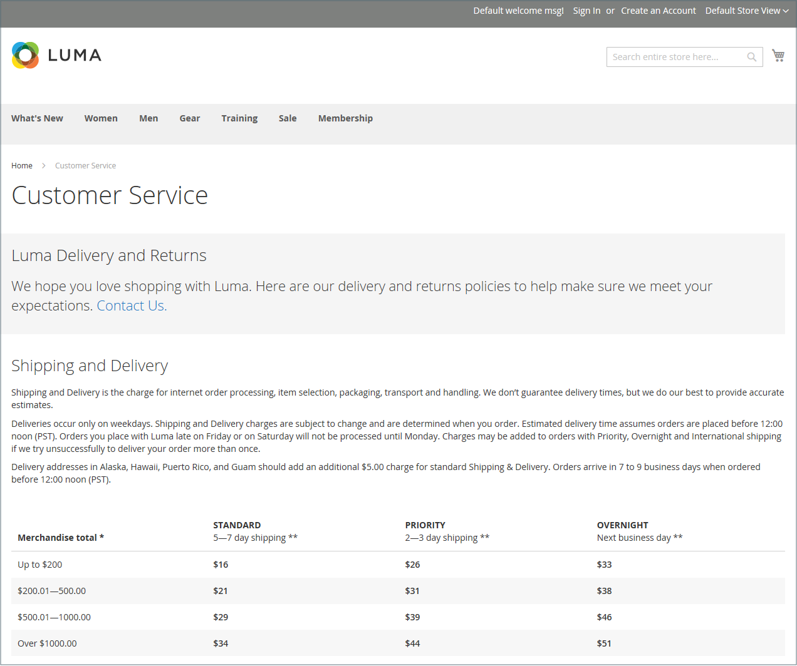
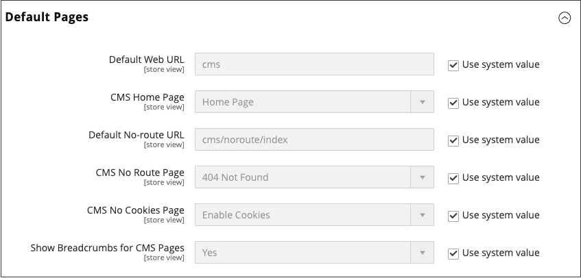

# ページ

コンテンツは、店舗のあらゆる製品と同様に、賞味期限の観点から表示できます。 ソーシャルメディアのコンテンツの有効期限が 24 時間未満であることをご存知ですか？ 作成するコンテンツの有効期限の可能性は、リソースを投資する場所を決定するのに役立ちます。

保存期限が長いコンテンツは、と呼ばれることもあります _エバーグリーンコンテンツ_. エバーグリーンコンテンツの例としては、顧客の成功事例や、 _方法_ 説明およびよくある質問（FAQ）です。 これに対し、生鮮食品のコンテンツには、イベント、業界ニュース、プレスリリースなどが含まれます。

{width="700" zoomable="yes"}

## コアコンテンツページ

この [!DNL Commerce] デモストアには、作業を開始するのに役立つコアコンテンツページの例があります。 これらのページはすべて、ニーズに合わせて変更できます。 ストア内の次のページを見て、コンテンツがメッセージ、音声、ブランドを伝えていることを確認します。

### ホーム

デモ [ホーム](../getting-started/storefront.md#home-page) ページには、バナー、画像カルーセル、リンク付きの静的ブロック、新製品のリストが含まれています。

### プライバシーポリシー

ストア [プライバシーポリシー](../getting-started/privacy-policy.md) ページは、独自の情報で更新する必要があります。 ベストプラクティスとして、プライバシーポリシーは、会社が収集する情報の種類とその使用方法を顧客に説明する必要があります。

### 404 が見つかりません

404 Page Not Found ページは、ページが見つからないときに返される応答コードに対して命名されます。 URL リダイレクトを使用すると、このページが表示される回数が減ります。 ただし、必要な場合は、この機会を利用して、顧客が興味を持つ可能性のある製品へのリンクを提供する方がよいでしょう。

### アクセス拒否

{{b2b-feature}}

この [アクセス拒否](../b2b/account-company-roles-permissions.md) ページが表示されるのは、会社のユーザーに割り当てられた権限によってページへのアクセスが禁止されている場合です。

### Cookie を有効にする

この [Cookie を有効にする](../getting-started/compliance-cookie-law.md) ページが表示されるのは、サイトの訪問者のブラウザーで cookie が有効になっていない場合です。 このページでは、最も一般的なブラウザーで cookie を有効にする手順を、イラストを使って順を追って説明します。

### サービスを利用できません

この [503 サービスを利用できません](../configuration-reference/general/general.md) ページには、サーバーが使用できない場合に返される応答コードの名前が付けられます。

### 会社情報

「会社概要」ページは、ストアのフッターからリンクされています。 画像、ビデオ、プレスリリースおよびアナウンスへのリンクを含めることができます。 サンプルページの右側に画像があり、ページの終わりを示す装飾画像があります。

### 顧客サービス

Customer Service ページは、ページ階層内の別のノードです。 ページ上の 2 つのヘッダーには、顧客がヘッダーをクリックした場合にのみ表示されるコンテンツがあります。

{width="700" zoomable="yes"}

## デフォルトページの設定

この _デフォルトページ_ 設定は、に関連付けられるランディングページを決定します [ベース URL](../stores-purchase/store-urls.md) および対応するホームページ。 また、次の場合に表示するページも決定します _ページが見つかりません_ エラーが発生し、 [パンくずリスト](../catalog/navigation-breadcrumb-trail.md) 各ページの上部に表示されます。

1. 日 _Admin_ サイドバー、に移動  **[!UICONTROL Stores]** > _[!UICONTROL Settings]_>**[!UICONTROL Configuration]**.

1. の下の左パネルで _[!UICONTROL General]_、を選択&#x200B;**[!UICONTROL Web]**.

1. を展開  この **[!UICONTROL Default Pages]** セクション。

   {width="500" zoomable="yes"}

   | フィールド | [範囲](../getting-started/websites-stores-views.md#scope-settings) | 説明 |
   |--- |--- |--- |
   | [!UICONTROL Default Web URL] | ストア表示 | ベース URL に関連付けられているランディングページを示します。 デフォルトでは、このフィールドはに設定されています。 `cms` からページを示します [!DNL Commerce] コンテンツ管理システム また、ブログなど、別のタイプのランディングページを使用することもできます。 例えば、サーバーにブログがインストールされている場合 `magento/blog`フォルダー名を入力できます `blog` ページ選択への相対パスとして使用されます。 |
   | [!UICONTROL CMS Home Page] | ストア表示 | ストアのホームページを選択するには、リストから CMS ページを選択するだけです。 デフォルトでは、CMS のホームページには、ストアで使用可能な CMS ページの選択全体が一覧表示されます。 |
   | [!UICONTROL Default No-route URL] | ストア表示 | には、の場合に表示されるデフォルトのページの URL が含まれます。 `404 Page not Found` エラーが発生しました。 デフォルト値はです `cms/noroute/index`. |
   | [!UICONTROL CMS No Route Page] | ストア表示 | 404 ページが見つからないというエラーが発生した場合に表示する特定の CMS ページを識別します。 デフォルトページはです。 `404 Not Found`. |
   | [!UICONTROL CMS No Cookies Page] | ストア表示 | ブラウザーで Cookie が有効になっていない場合に表示される特定の CMS ページを識別します。 このページでは、cookie が使用される理由と、各ブラウザーで cookie を有効にする方法について説明します。 デフォルトページはです。 `Enable Cookies`. |
   | [!UICONTROL Show Breadcrumbs for CMS Pages] | ストア表示 | カタログ内のすべての CMS ページにパンくずリストを表示するかどうかを決定します。 オプション： `Yes` / `No` |

   {style="table-layout:auto"}

1. の場合 **[!UICONTROL Default Web URL]**&#x200B;でフォルダーの相対パスを入力します [!DNL Commerce] ランディングページを含むインストール。

   デフォルト設定 `cms`。から取得されるページを示します。 [!DNL Commerce] コンテンツ管理システム

   >[!NOTE]
   >
   >特定のストアを表示するには、をクリアします **[!UICONTROL Use Default]** の横にあるチェックボックス _[!UICONTROL Default Web URL]_、およびその他の変更するデフォルト設定です。

1. を設定 **[!UICONTROL CMS Home Page]** をホームページとして使用する CMS ページに追加します。 次のように、その他に作成されたページがホームページとして使用される場合があります。

   - 限定オンラインストアへようこそ
   - 報酬ポイント
   - 会社情報
   - 顧客サービス
   - Cookie を有効にする
   - プライバシーポリシー
   - 会社：アクセスが拒否されました

1. の場合 **[!UICONTROL Default No-route URL]**&#x200B;でフォルダーの相対パスを入力します [!DNL Commerce] 次の場合にページがリダイレクトされるインストール _404 ページが見つかりません_ エラーが発生しました。

   デフォルト値はです `cms/index/noRoute`.

1. を設定 **[!UICONTROL CMS No Route Page]** に設定します。 _404 ページが見つかりません_ エラーが発生しました。

1. を設定 **[!UICONTROL CMS No Cookies Page]** を参照してください。 このページでは、cookie が使用される理由と、各ブラウザーで cookie を有効にする方法について説明します。 デフォルトページはです。 `Enable Cookies`.

1. パンくずリストをすべての CMS ページの上部に表示する場合は、を設定します **[!UICONTROL Show Breadcrumbs for CMS Pages]** 対象： `Yes`.

1. 完了したら、 **[!UICONTROL Save Config]**.
