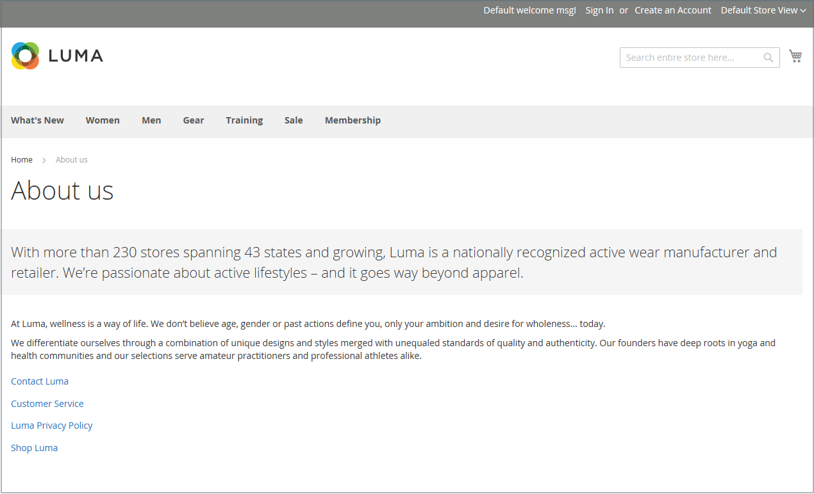
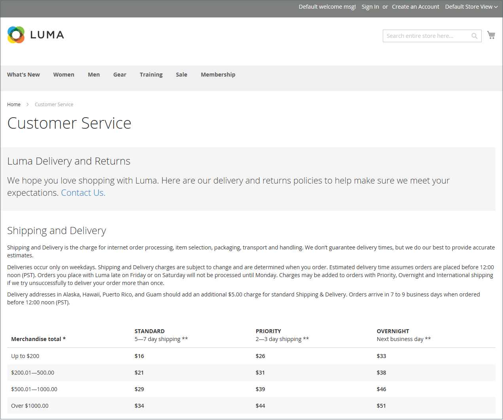
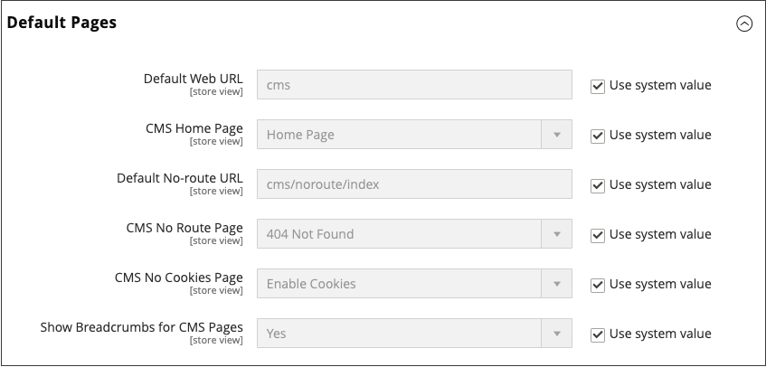

# ページ

コンテンツは、実店舗のあらゆる商品と同様に、その貯蔵寿命の観点から見ることができます。 ソーシャルメディアコンテンツの賞味期限が24時間未満であることをご存知ですか？ 作成したコンテンツの潜在的な賞味期限は、リソースをどこに投資するのかを決定するのに役立ちます。

賞味期限の長いコンテンツは、_常緑コンテンツ_&#x200B;と呼ばれることもあります。 エバーグリーンコンテンツの例には、カスタマーサクセスストーリー、_ハウツー_&#x200B;の手順、よくある質問（FAQ）などがあります。 一方、自然界で腐敗しやすいコンテンツには、イベント、業界ニュース、プレスリリースなどがあります。

{width="700" zoomable="yes"}に含まれている会社概要ページ

## コアコンテンツページ

[!DNL Commerce] デモ ストアには、開始に役立つコア コンテンツ ページの例があります。 これらのページはすべて、ニーズに合わせて変更できます。 ストアで次のページを確認し、コンテンツがメッセージ、トーン、ブランドを伝えるものであることを確認します。

### ホーム

デモ [&#x200B; ホーム &#x200B;](../getting-started/storefront.md#home-page) ページには、バナー、画像カルーセル、リンクを含むいくつかの静的ブロック、および新製品のリストが含まれています。

### プライバシーポリシー

ストア [&#x200B; プライバシーポリシー](../getting-started/privacy-policy.md) ページは、独自の情報で更新する必要があります。 ベストプラクティスとして、プライバシーポリシーでは、自社が収集する情報の種類と、その使用方法を顧客に説明する必要があります。

### 404が見つかりません

404 Page Not Found ページは、ページが見つからない場合に返される応答コードの名前が付けられます。 URL リダイレクトは、このページが表示される回数を減らします。 しかし、必要な場合は、顧客が興味を持ちそうな商品へのリンクを提供する機会を利用することをお勧めします。

### アクセス拒否

{{b2b-feature}}

会社ユーザーに割り当てられた権限によってページへのアクセスが禁止されている場合、[&#x200B; アクセスが拒否](../b2b/account-company-roles-permissions.md) ページが表示されます。

### Cookieを有効にする

サイトの訪問者がブラウザーでCookieを有効にしていない場合、「[Cookieを有効にする](../getting-started/compliance-cookie-law.md)」ページが表示されます。 このページでは、最も人気のあるブラウザーでCookieを有効にするための手順を示す説明を提供します。

### サービスを利用できません

[503 Service Unavailable](../configuration-reference/general/general.md) ページは、サーバーが利用できないときに返される応答コードの名前が付けられます。

### アドビについて

About Us ページは、ストアのフッターからリンクされています。 画像、動画、プレスリリースへのリンク、お知らせなどを含めることができます。 サンプルページの右側には画像が表示され、ページの終わりを示す装飾的な画像が表示されます。

### カスタマーサービス

カスタマーサービス ページは、ページ階層内の別のノードです。 ページ上のふたつのヘッダーには、顧客がヘッダーをクリックしたときにのみ表示されるコンテンツがあります。

{width="700" zoomable="yes"}

## デフォルトページの設定

_デフォルトページ_&#x200B;設定により、[&#x200B; ベース URL](../stores-purchase/store-urls.md)と対応するホームページに関連付けられているランディングページが決定されます。 また、_ページが見つかりません_ エラーが発生した場合に表示されるページと、各ページの上部に[&#x200B; パンくずリスト &#x200B;](../catalog/navigation-breadcrumb-trail.md)が表示されるかどうかを判断します。

1. _管理者_ サイドバーで、**[!UICONTROL Stores]** > _[!UICONTROL Settings]_>**[!UICONTROL Configuration]**&#x200B;に移動します。

1. _[!UICONTROL General]_&#x200B;の下の左側のパネルで、**[!UICONTROL Web]**&#x200B;を選択します。

1. **[!UICONTROL Default Pages]** セクションのを展開します。

   {width="500" zoomable="yes"}

   | フィールド | [範囲](../getting-started/websites-stores-views.md#scope-settings) | 説明 |
   |--- |--- |--- |
   | [!UICONTROL Default Web URL] | ストアビュー | ベース URLに関連付けられているランディングページを示します。 デフォルトでは、このフィールドは[!DNL Commerce] コンテンツ管理システムのページを示すために`cms`に設定されています。 また、ブログなど、別の種類のランディングページを使用することもできます。 例えば、ブログが`magento/blog`のサーバーにインストールされている場合、フォルダー名`blog`をページの選択に対する相対パスとして入力できます。 |
   | [!UICONTROL CMS Home Page] | ストアビュー | ストアのホームページを選択するには、リストからCMSページを選択します。 デフォルトでは、CMS ホームページには、ストアで使用可能なCMS ページの選択全体が一覧表示されます。 |
   | [!UICONTROL Default No-route URL] | ストアビュー | `404 Page not Found` エラーが発生したときに表示する既定のページのURLが含まれます。 デフォルト値は`cms/noroute/index`です。 |
   | [!UICONTROL CMS No Route Page] | ストアビュー | 404 Page Not Found エラーが発生した場合に表示する特定のCMS ページを指定します。 既定のページは`404 Not Found`です。 |
   | [!UICONTROL CMS No Cookies Page] | ストアビュー | ブラウザーでCookieが有効になっていないときに表示される特定のCMS ページを識別します。 このページでは、Cookieが使用される理由と、各ブラウザーでそれらを有効にする方法について説明します。 既定のページは`Enable Cookies`です。 |
   | [!UICONTROL Show Breadcrumbs for CMS Pages] | ストアビュー | カタログ内のすべてのCMS ページにパンくずリストが表示されるかどうかを指定します。 オプション：`Yes` / `No` |

   {style="table-layout:auto"}

1. **[!UICONTROL Default Web URL]**&#x200B;の場合、ランディングページを含む[!DNL Commerce] インストールのフォルダーへの相対パスを入力します。

   既定の設定である`cms`は、[!DNL Commerce] コンテンツ管理システムのページを示します。

   >[!NOTE]
   >
   >特定のストアビューの場合、_[!UICONTROL Default Web URL]_&#x200B;の横にある&#x200B;**[!UICONTROL Use Default]**&#x200B;チェックボックスをオフにし、その他のデフォルト設定を変更します。

1. ホームページとして使用するCMS ページに&#x200B;**[!UICONTROL CMS Home Page]**&#x200B;を設定します。 他の作成されたページは、以下のようなホームページとして使用できます。

   - 排他的なオンラインストアへようこそ
   - 報酬ポイント
   - アドビについて
   - カスタマーサービス
   - Cookieを有効にする
   - プライバシーポリシー
   - 会社：アクセス拒否

1. **[!UICONTROL Default No-route URL]**&#x200B;の場合、_404 Page Not Found_ エラーが発生したときにページがリダイレクトされる[!DNL Commerce] インストールのフォルダーへの相対パスを入力します。

   デフォルト値は`cms/index/noRoute`です。

1. 「**[!UICONTROL CMS No Route Page]**」を、_404 Page Not Found_」エラーが発生したときに表示されるCMS ページに設定します。

1. ブラウザーでCookieが無効になっている場合に表示されるCMS ページに&#x200B;**[!UICONTROL CMS No Cookies Page]**&#x200B;を設定します。 このページでは、Cookieが使用される理由と、各ブラウザーでそれらを有効にする方法について説明します。 既定のページは`Enable Cookies`です。

1. パンくずリストをCMSのすべてのページの上部に表示する場合は、**[!UICONTROL Show Breadcrumbs for CMS Pages]**&#x200B;を`Yes`に設定します。

1. 完了したら、**[!UICONTROL Save Config]**&#x200B;をクリックします。
