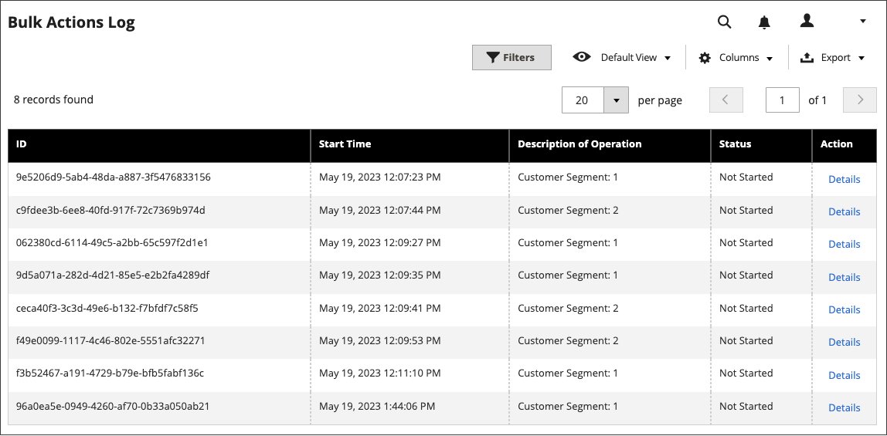

# デザイン変更のスケジュール

テーマデザインの変更を事前にスケジュールし、ビジネスサイクルやイベントに応じて適用できます。 スケジュールされたデザインの変更は、季節的な変更やプロモーションに利用したり、バリエーションを追加するためだけに利用することができます。

{width="700" zoomable="yes"}

## スケジュールされたデザイン変更の追加

1. _管理者_ サイドバーで、**[!UICONTROL Content]** > _[!UICONTROL Design]_>**[!UICONTROL Schedule]**に移動します。

1. **[!UICONTROL Add Design Change]**&#x200B;をクリックします。

   {width="600" zoomable="yes"}

1. 変更を適用するストアビューに&#x200B;**[!UICONTROL Store]**&#x200B;を設定します。

1. 使用するテーマまたはテーマのバリエーションに&#x200B;**[!UICONTROL Custom Design]**&#x200B;を設定します。

1. **[!UICONTROL Date From]**&#x200B;と&#x200B;**[!UICONTROL Date To]**&#x200B;の場合、_カレンダー_ （）アイコンをクリックして、変更が有効な期間の開始値と終了値を選択します。

1. 完了したら、**[!UICONTROL Save]**&#x200B;をクリックします。

## スケジュールされたデザイン変更の編集

1. _管理者_ サイドバーで、**[!UICONTROL Content]** > _[!UICONTROL Design]_>**[!UICONTROL Schedule]**に移動します。

1. 編集する項目を選択します。

1. 必要な変更を加えます。

1. 完了したら、**[!UICONTROL Save]**&#x200B;をクリックします。

## 予定されたデザイン変更の削除

1. _管理者_ サイドバーで、**[!UICONTROL Content]** > _[!UICONTROL Design]_>**[!UICONTROL Schedule]**に移動します。

1. 削除する項目を選択します。

1. ページ上部のボタンバーで、**[!UICONTROL Delete]**&#x200B;をクリックします。

1. アクションを確認するには、**[!UICONTROL OK]**&#x200B;をクリックします。
