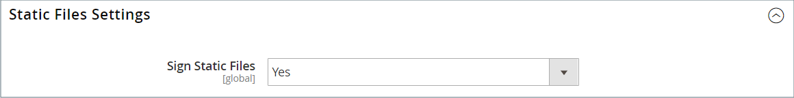

# テーマアセット

_静的ファイル_ は、テーマで使用される CSS、フォント、画像、JavaScriptなどのアセットの集まりです。 静的ファイルの場所は、[ ベース URL](../stores-purchase/store-urls.md) 設定で指定します。 各静的ファイルの URL にデジタル署名を追加して、ブラウザーが新しいバージョンが使用可能かどうかを検出できるようにします。 署名がブラウザーキャッシュに保存されている署名と異なる場合は、ファイルの新しいバージョンが使用されます。

標準インストールの場合、テーマに関連付けられたアセットは、[!DNL Commerce] ルートの下の次の場所にある `web` フォルダーに整理されます。

`[commerce_root]/app/design/frontend/Magento/[theme_name]/web`

## 静的ファイル URL へのデジタル署名の追加

1. _管理者_ サイドバーで、**[!UICONTROL Stores]**/_[!UICONTROL Settings]_/**[!UICONTROL Configuration]**に移動します。

1. 左側のパネルで「**[!UICONTROL Advanced]**」を展開し、「**[!UICONTROL Developer]**」を選択します。

1. 「」を展開し、「**[!UICONTROL Static Files Settings]**」セクションを展開します。

   {width="500" zoomable="yes"}

1. **[!UICONTROL Sign Static Files]** を `Yes` に設定します。

1. 完了したら、「**[!UICONTROL Save Config]**」をクリックします。

| ファイルタイプ | 説明 |
|--- |--- |
| CSS | スキンに関連付けられている視覚的なスタイル設定をコントロールします。 サーバー上の場所の例：`[commerce]/app/design/frontend/Magento/[theme]/web/css` |
| フォント | テーマで使用できるフォントを指定します。 サーバー上の場所：`[commerce]/app/design/frontend/Magento/[theme]/web/fonts` |
| 画像 | ボタン、背景テクスチャなど、テーマで使用されるグラフィカルアセットを提供します。 サーバー上の場所の例：`[commerce]/app/design/frontend/Magento/[theme]/web/images` |
| JS | テーマ固有のJavaScript ルーチンと呼び出し可能な関数。 サーバー上の場所の例：`[commerce]/app/design/frontend/Magento/[theme]/web/js` |

{style="table-layout:auto"}

## CSS ファイルの結合

サイトを最適化しページの読み込み時間を短縮する取り組みの一環として、別々の CSS ファイルを 1 つの圧縮ファイルに結合することで、それらのファイルの数を減らすことができます。 結合された CSS ファイルを開くと、1 つの連続したテキストストリームが表示され、改行が削除されます。 結合ファイルは編集できないので、開発モードが終了し、CSS に頻繁に変更を加えなくなるまで待つことをお勧めします。

>[!NOTE]
>
>CSS ファイルは、[ 開発者モード ](../systems/developer-tools.md#operation-modes) で作業している場合にのみ _管理_ パネルから結合できます。

1. _管理者_ サイドバーで、**[!UICONTROL Stores]**/_[!UICONTROL Settings]_/**[!UICONTROL Configuration]**に移動します。

1. 左側のパネルで、を **[!UICONTROL Advanced]** して「**[!UICONTROL Developer]**」を選択します。

1. 「」を展開し、「**[!UICONTROL CSS Settings]**」セクションを展開します。

   {width="500" zoomable="yes"}

   これらの設定オプションについて詳しくは、[ 設定リファレンス ](../configuration-reference/advanced/developer.md#css-settings) の _CSS 設定_ を参照してください。

1. **[!UICONTROL Merge CSS Files]** を `Yes` に設定します。

1. 完了したら、「**[!UICONTROL Save Config]**」をクリックします。

## JavaScript ファイルの結合

複数のJavaScript ファイルを 1 つの圧縮ファイルに結合して、ページの読み込み時間を短縮できます。 結合されたJavaScript ファイルを開くと、1 つの連続したテキストストリームが表示され、改行が削除されます。 開発プロセスが完了し、コードにエラーが含まれていない場合は、ファイルの結合を検討してください。

>[!NOTE]
>
>JavaScriptのファイルは、[ 開発者モード _で作業している場合にのみ_ 管理 ](../systems/developer-tools.md#operation-modes) パネルから結合できます。

1. _管理者_ サイドバーで、**[!UICONTROL Stores]**/_[!UICONTROL Settings]_/**[!UICONTROL Configuration]**に移動します。

1. 左側のパネルで、を **[!UICONTROL Advanced]** して「**[!UICONTROL Developer]**」を選択します。

1. 「」を展開し、「**[!UICONTROL JavaScript Settings]**」セクションを展開します。

   {width="600" zoomable="yes"}

   これらの設定オプションについて詳しくは、{Configuration Reference](../configuration-reference/advanced/developer.md#javascript-settings) の _0}JavaScript設定_ を参照してください。[

1. **[!UICONTROL Merge JavaScript Files]** を `Yes` に設定します。

1. 完了したら、「**[!UICONTROL Save Config]**」をクリックします。
